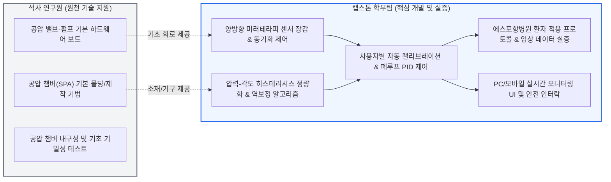
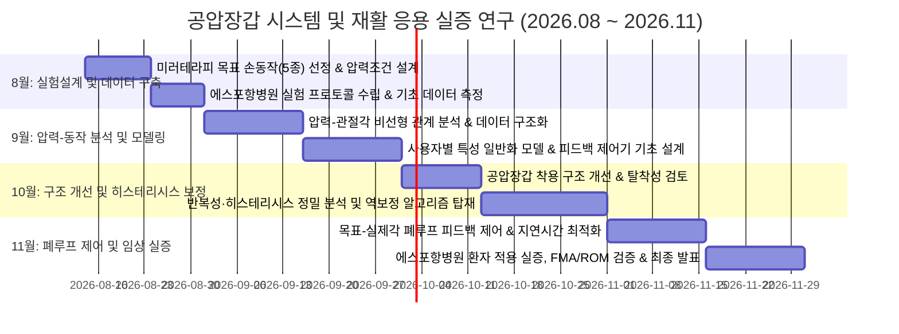
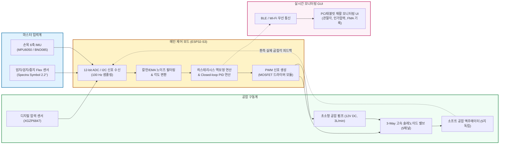

# 🦾 공압장갑 시스템 및 재활 응용 실증 연구 종합 리포트 (0814)

**과제명**: 공압장갑 시스템 및 재활 응용 실증 연구 (에스포항병원 연계)  
**소속**: Human Robotics LAB / 캡스톤 디자인 4조  
**작성일자**: 2026년 8월 14일  
**연구 참여자**: 서유빈, 송현지, 이재용, 이동준 (학부 연구팀)  
**협업 체계**: 원천 하드웨어 개발 석사 연구원 + 에스포항병원 재활의학과 연계

---

## 📌 1. 연구 개요 및 캡스톤 핵심 미션

본 연구는 뇌졸중(Stroke) 등 중추신경계 손상 환자의 상지(손·손가락) 기능 회복을 위해 **소프트 공압 액추에이터(Soft Pneumatic Actuator, SPA) 기반 재활 장갑**을 구축하고, **양방향 미러테라피(Bilateral Mirror Therapy)** 및 **정밀 폐루프(Closed-loop) 각도 제어**를 결합하여 **에스포항병원 임상 실증**까지 완수하는 것을 목표로 합니다.

기존 연구실 석사생이 보유한 **'기초 공압 액추에이터 설계 및 공압 밸브 구동계'**를 토대로, 학부 캡스톤 팀은 **① 건측-환측 실시간 미러링 센서 융합 시스템**, **② 액추에이터 점탄성 히스테리시스(Hysteresis) 정량화 및 역보정 알고리즘**, **③ 환자 맞춤형 자동 캘리브레이션 및 목표각 추종 피드백 제어**, **④ 에스포항병원 임상 프로토콜 및 정량적 유효성 검증(FMA-UE, ROM, 파지력)**을 전담하여 완결성 높은 시스템을 구현합니다.

```mermaid
graph TD
    subgraph MASTER ["1. 마스터부 (건측 - 정상 손)"]
        A["건측 데이터 장갑 착용<br/>(Flex 벤딩 센서 + IMU)"]
        B["실시간 관절 굴곡각(θ_ref)<br/>및 운동 속도/의도 추출"]
    end

    subgraph CONTROL ["2. 제어 & 알고리즘부 (학부팀 핵심 기여)"]
        C["임베디드 제어기 (ESP32/STM32)<br/>• 신호 필터링 (Madgwick/EMA)<br/>• 사용자별 캘리브레이션"]
        D["히스테리시스 역보정 모델<br/>(Prandtl-Ishlinskii / Polynomial)<br/>+ 폐루프 PID/적응 제어"]
        E["고속 스위칭 솔레노이드 밸브<br/>& 마이크로 공압 펌프 PWM 제어"]
    end

    subgraph SLAVE ["3. 슬레이브부 (환측 - 마비 손)"]
        F["소프트 공압 장갑 (SPA / PneuNets)<br/>손가락별 독립 가압/배기 구동"]
        G["환측 부착 센서 실시간 피드백 (θ_actual)<br/>+ 미러테라피 시각/고유수용성 피드백"]
    end

    subgraph CLINICAL ["4. 에스포항병원 임상 실증"]
        H["정량적 재활 지표 평가<br/>• FMA-UE / BBT / ROM / 파지력<br/>• 추종 오차(RMSE) / 지연시간(Latency)"]
    end

    A --> B --> C
    C --> D --> E
    E --> F --> G
    G -->|오차 피드백: e = θ_ref - θ_actual| D
    F --> H

    style MASTER fill:#e0f2fe,stroke:#0284c7,stroke-width:2px
    CONTROL fill:#fef3c7,stroke:#d97706,stroke-width:2px
    SLAVE fill:#f0fdf4,stroke:#16a34a,stroke-width:2px
    CLINICAL fill:#fdf2f8,stroke:#db2777,stroke-width:2px
```

---

## 📚 2. 핵심 5대 연구 영역 선행 논문 분석 및 이론적 배경

### 영역 1. 소프트 공압 액추에이터(SPA) 메커니즘 및 장갑 설계
*   **핵심 원리**: 강성(Rigid) 외골격 로봇의 무겁고 관절 축 불일치(Misalignment) 문제를 극복하기 위해, 실리콘 엘라스토머(Ecoflex, DragonSkin) 또는 열가소성 폴리우레탄(TPU) 코팅 패브릭을 활용한 팽창 챔버(PneuNets) 구조 적용.
*   **생체역학적 적합성**: 가압 시 비대칭 팽창에 의해 자연스러운 손가락 곡률 반경을 형성하며, 높은 무게 대비 출력비(Power-to-weight ratio)와 기구학적 순응성(Compliance)으로 환자의 손가락 골절 위험 차단.

| 대표 논문 (APA) | 핵심 기여 및 주요 방법론 | 본 캡스톤 연구 적용점 |
|:---|:---|:---|
| **Polygerinos, P. et al. (2015)**. *Soft robotic glove for hand rehabilitation and task-oriented training*. **IEEE/ASME T-Mech**, 20(3), 1085-1093. | 엘라스토머 챔버와 섬유 강화(Fiber-reinforced) 복합재를 이용한 최초의 소프트 재활 장갑. 손가락 개별 관절(MCP, PIP, DIP) 굴곡력 및 궤적 모델링. | 공압 장갑 챔버 설계 기준 압력(0~150 kPa) 및 손가락별 발생 토크/파지력 벤치마크. |
| **Heung, H. L. et al. (2019)**. *Soft robotic glove for post-stroke hand rehabilitation: design, control, and clinical evaluation*. **IEEE TNSRE**, 27(12), 2454-2462. | 능동(Active) 및 수동(Passive) 재활 모드를 통합한 패브릭 기반 경량 소프트 장갑 개발 및 관절별 가동 범위(ROM) 측정. | 패브릭 일체형 경량 장갑 구조 및 착용성(Donning/Doffing) 개선 아이디어 차용. |

---

### 영역 2. 양방향 미러테라피(Bilateral Mirror Therapy) & 신경가소성(Neuroplasticity)
*   **신경생리학적 기제**: 거울신경세포계(Mirror Neuron System) 활성화 원리. 환자가 건측(정상 손)을 스스로 움직일 때 발생하는 시각 피드백과 환측(마비 손)에 인가되는 능동 보조 고유수용성 감각(Proprioceptive Feedback)이 대뇌 피질의 동시 활성화를 유도하여 손상된 대뇌 반구의 신경 재조직화 촉진.
*   **마스터-슬레이브 동기화**: 건측 장갑의 굴곡각($\theta_{\text{master}}$)을 실시간 측정하여 슬레이브 공압 장갑의 목표 압력 및 각도로 초저지연 매핑.

| 대표 논문 (APA) | 핵심 기여 및 주요 방법론 | 본 캡스톤 연구 적용점 |
|:---|:---|:---|
| **Yap, H. K. et al. (2017)**. *A soft robotic glove for stroke rehabilitation with bilateral mirror training using functional near-infrared spectroscopy (fNIRS)*. **IEEE RA-L**, 2(3), 1384-1391. | 건측 굽힘 센서 장갑 $\rightarrow$ 환측 소프트 장갑 실시간 미러링 구현 및 fNIRS 뇌 활성도 측정을 통해 양측성 훈련의 신경가소성 증대 입증. | 마스터-슬레이브 무선/유선 동기화 구조 및 미러테라피 제어 파이프라인의 표준 모델로 활용. |
| **Shi, D. et al. (2021)**. *Synergistic effects of robot-assisted mirror therapy on upper limb motor function in subacute stroke*. **Frontiers in Neurology**, 12, 658667. | 로봇 보조 미러테라피(RMT)가 기존 단순 미러테라피 대비 상지 운동 기능(FMA-UE, ARAT)을 통계적으로 유의하게 향상시킴을 임상 입증. | 에스포항병원 임상 프로토콜 설계 시 RMT 단일군 및 대조군 평가 지표 표준화. |

---

### 영역 3. 공압 액추에이터 점탄성 히스테리시스(Hysteresis) 모델링 및 역보정
*   **문제점**: 고분자/실리콘 소재 고유의 점탄성(Viscoelasticity) 및 공기 압축성으로 인해, **가압 시(Inflation, Flexion)**와 **배기 시(Deflation, Extension)**의 압력-각도 곡선이 일치하지 않는 강한 비선형 히스테리시스 루프 발생.
*   **해결 방안**: 프란틀-이슐린스키(Prandtl-Ishlinskii, PI) 모델, Bouc-Wen 모델, 또는 다항식/신경망 기반 역함수(Inverse Model)를 구축하여 개루프/폐루프 상에서 궤적 추종 오차 상쇄.

| 대표 논문 (APA) | 핵심 기여 및 주요 방법론 | 본 캡스톤 연구 적용점 |
|:---|:---|:---|
| **Al-Fahaam, H. et al. (2018)**. *The design and mathematical modelling of a novel pneumatic soft bending actuator*. **Soft Robotics**, 5(3), 281-291. | 비대칭 공압 액추에이터의 굽힘 각도와 인가 압력 간의 수학적 기구학/역학 모델링 및 팽창-수축 히스테리시스 오차 분석. | 9~10월 압력-관절각 정량화 실험 및 히스테리시스 루프 분석의 수식적 기초로 활용. |
| **Gu, G. Y. et al. (2021)**. *Modeling and inverse compensation of hysteresis in soft pneumatic actuators with generalized Prandtl-Ishlinskii model*. **IEEE T-Mech**, 26(4), 1952-1963. | 일반화된 PI 역모델(Inverse PI)을 제어 루프에 삽입하여 소프트 액추에이터의 비선형 히스테리시스 추종 오차를 70% 이상 저감. | 10~11월 캡스톤 핵심 독창성인 '히스테리시스 보정 피드백 제어기' 알고리즘 구현에 직접 적용. |

---

### 영역 4. 멀티센서 융합 및 폐루프(Closed-Loop) 각도 피드백 제어
*   **센서 구성**: 
    *   **마스터(건측)**: 플렉스(Flex) 저항식 벤딩 센서 또는 관절별 9축 IMU (MCP, PIP 실시간 굴곡각 산출)
    *   **공압 제어부**: 초소형 압력 센서 (MPX5050DP / XGZP6847, 0~200 kPa 정밀 기압 측정)
    *   **슬레이브(환측)**: 패브릭 일체형 벤딩 센서 (실제 손가락 굴곡각 $\theta_{\text{actual}}$ 피드백)
*   **제어 알고리즘**: 목표각 $\theta_{\text{ref}}$과 실제각 $\theta_{\text{actual}}$ 간 오차 기반 Anti-windup PID 또는 상태 피드백 제어로 솔레노이드 밸브 PWM 듀티비 정밀 가변.

| 대표 논문 (APA) | 핵심 기여 및 주요 방법론 | 본 캡스톤 연구 적용점 |
|:---|:---|:---|
| **Radder, D. L. M. et al. (2019)**. *Clinical evaluation of a soft robotic glove for hand rehabilitation in stroke patients: a pilot study*. **Frontiers in Neurorobotics**, 13, 80. | 만성 뇌졸중 환자 대상 6주간 소프트 장갑 자가 훈련 프로토콜 적용 및 손가락 ROM, Box & Block Test(BBT) 유의미한 회복 입증. | 환자별 파지력 및 일상생활동작(ADL) 훈련 과제 선정 가이드라인. |
| **Xydas, D. et al. (2023)**. *Closed-loop position and force control of soft robotic gloves using embedded flexible sensors*. **Sensors & Actuators A**, 351, 114167. | 유연 센서가 임베디드된 공압 장갑에서 히스테리시스 보상 Closed-loop PID 제어를 통해 정상 상태 오차(Steady-state error) < 2.5° 달성. | 11월 목표-실제각 오차 기반 피드백 제어 및 안정성/지연시간 분석의 정량 목표치 설정. |

---

### 영역 5. 임상 유효성 평가 척도 및 프로토콜 (에스포항병원 협력)
*   **임상 평가지표(Clinical Metrics)**:
    1.  **FMA-UE (Fugl-Meyer Assessment - Upper Extremity)**: 뇌졸중 상지 운동 기능 회복의 국제 골드 스탠다드 척도 (손/손목 영역 집중)
    2.  **BBT (Box and Block Test)**: 1분간 칸막이를 넘어 옮긴 2.5cm 블록 개수를 통한 손 기민성(Gross Manual Dexterity) 평가
    3.  **ROM (Range of Motion, 관절가동범위)**: MCP, PIP, DIP 관절의 최대 능동/수동 굴곡-신전 각도(°)
    4.  **파지력 (Grip & Pinch Force)**: Jamar 악력계 및 FSR 센서를 통한 원통형 잡기(Power Grip), 팁 핀치(Pinch) 측정
    5.  **MAS (Modified Ashworth Scale)**: 굴곡근 경직도(Spasticity) 평가 (0~4점 척도)

---

## 🤝 3. 석사 연구원과의 최적 협업 및 역할 분담 체계

학부 캡스톤 연구의 성공과 논문/보고서 수준의 완결성을 확보하기 위해, **'기존 석사 연구 자산'을 레버리지하면서도 학부팀 고유의 독창적 기여(Novelty)를 100% 확보**하는 명확한 R&R(Roles & Responsibilities)을 수립합니다.



| 구분 | 석사 연구원 (기존 연구 자산) | 학부 캡스톤 팀 (신규 연구 및 독창성 기여) | 시너지 및 결과물 |
|:---|:---|:---|:---|
| **하드웨어 (HW)** | • 소프트 공압 액추에이터 기본 제작 기법<br>• 미니 공압 펌프/솔레노이드 밸브 기초 회로 | • **건측 마스터 데이터 장갑 제작 (Flex+IMU)**<br>• **환자 착용 편의성 개선 슬레이브 장갑 패브릭 패키징**<br>• 비상 배기 안전 밸브(Emergency Release) 회로 | 가볍고 탈착이 용이한(Donning < 1분) 인체공학적 양방향 미러테라피 하드웨어 완성 |
| **소프트웨어 (SW) & 제어** | • 기본 밸브 On/Off 및 수동 가압 제어 코드 | • **실시간 미러링 동기화 알고리즘 (지연 < 100ms)**<br>• **압력-각도 비선형성 및 히스테리시스 역보정 모델**<br>• **목표각-실제각 오차 기반 폐루프 적응 PID 제어** | 경로 의존적 오차 없는 고정밀 손가락 궤적 추종 제어기 확보 |
| **실험 및 임상 실증** | • 단일 액추에이터 벤치탑 기초 팽창 데이터 | • **에스포항병원 협력 임상 재활 프로토콜 수립**<br>• **미러테라피 기반 일상동작(ADL) 5종 과제 설계**<br>• **건강 대조군 vs 환자군 정량 데이터셋 구축 및 통계 분석 (FMA, ROM, BBT)** | 병원 현장 실증이 완료된 최고 수준의 캡스톤 최종 결과물 및 학술 발표 |

---

## 📅 4. 4개월(8월~11월) 월별 세부 실행 로드맵

`캡스톤 주제들.jpg`에 명시된 월별 마일스톤을 바탕으로, 주차별 세부 태스크와 명확한 산출물을 정의합니다.



### 🗓️ [8월] 공압장갑 활용 실험설계 및 기초 데이터 구축
*   **목표 손동작 선정 (미러테라피 기준)**:
    *   원통형 파지(Cylindrical Grasp, 컵 잡기), 평판 핀치(Pinch Grasp, 카드/열쇠 잡기), 구형 파지(Spherical Grasp, 공 잡기), 전수지 굴곡/신전(Full Fist Flexion/Extension), 개별 수지 순차 굴곡(Individual Finger Articulation).
*   **실험조건 및 압력 범위 설계**:
    *   공압 챔버 인가 압력 범위(0 ~ 140 kPa), 스텝별 가압 속도, 안전 최대 압력 리미트(160 kPa) 설정.
*   **에스포항병원 협력 프로토콜 수립**:
    *   피험자 선정 기준(만 19~75세, 아급성/만성 뇌졸중 편마비 환자, MAS 2 이하, 건측 정상 기능), IRB 윤리 준수 프로토콜 및 대조군(건강 성인) 매칭.
*   **기초 벤치마크 데이터 측정**:
    *   압력별 무부하(Free bending) 굽힘 각도 및 끝단 발생 힘(Block Force) 기초 계측.

### 🗓️ [9월] 압력-관절동작 관계 분석 및 모델 개발
*   **압력-관절동작(Pressure-to-Angle) 관계 정량 분석**:
    *   MCP, PIP 관절별 인가 압력($P$)에 따른 굴곡각($\theta$) 정적/동적 매핑 데이터베이스 구축.
*   **데이터 구조화 및 사용자별(User-specific) 특성 도출**:
    *   손 크기(Small, Medium, Large), 관절 강성(Stiffness)에 따른 압력-굽힘 응답 차이 군집화.
*   **일반화 모델(Generalized Model) 개발**:
    *   기본 비선형 회귀(Polynomial Regression) 및 1차 지연 동역학 모델 파라미터 추정.
*   **공압장갑 피드백 모델 아키텍처 설계**:
    *   마스터 장갑 측정각($\theta_{\text{ref}}$) $\rightarrow$ 목표 압력 변환기($P_{\text{ref}}$) $\rightarrow$ 슬레이브 추종 파이프라인 정립.

### 🗓️ [10월] 공압장갑 구조 개선 및 히스테리시스 역보정
*   **공압장갑 착용성 및 구조 개선**:
    *   통기성 네오프렌/벨크로 기반 랩어라운드 구조 적용 (편마비 환자의 오그라든 손가락을 1분 내 쉽게 착용 가능하도록 개폐형 설계).
*   **반복성(Repeatability) 및 히스테리시스(Hysteresis) 정밀 분석**:
    *   1,000회 연속 굴곡-신전 사이클 테스트를 통한 재료 피로도 및 가압-감압 경로 비대칭 오차 정량화.
*   **히스테리시스 역보정(Inverse Hysteresis Compensation) 알고리즘 구현**:
    *   Modified Prandtl-Ishlinskii (PI) 또는 경량 룩업테이블/다항식 모델을 MCU에 탑재하여 경로 오차 보정.
*   **상용화 및 실사용 안전 구조 검토**:
    *   과압 감지 시 즉각 대기 개방 솔레노이드 밸브 연동 하드웨어 안전 인터락(Fail-safe) 구현.

### 🗓️ [11월] 목표-실제각 오차 기반 피드백 제어 및 환자 실증
*   **폐루프 피드백 제어기(Closed-Loop Controller) 최적화**:
    *   슬레이브 장갑 벤딩 센서 실시간 피드백을 통한 오차 $e(t) = \theta_{\text{ref}}(t) - \theta_{\text{actual}}(t)$ 제어 $\rightarrow$ **추종 각도 RMSE < 3.0° 달성**.
*   **사용자별 자동 캘리브레이션(Auto-Calibration)**:
    *   착용 직후 3회 쥐기/펴기 동작만으로 환자의 최대/최소 관절가동범위(Active ROM) 자동 영점 조절.
*   **지연시간 및 시스템 안정성 평가**:
    *   마스터 센싱 $\rightarrow$ 제어 연산 $\rightarrow$ 밸브 구동 $\rightarrow$ 슬레이브 손가락 도달까지의 **전체 전송/응답 지연시간(End-to-End Latency) < 120ms 달성**.
*   **에스포항병원 환자 적용 실증 및 유효성 분석**:
    *   임상 평가 지표(FMA-UE, Box & Block Test, ROM, 파지력) 사전-사후(Pre-Post) 비교 및 유의성($p < 0.05$) 검증.
*   **최종 캡스톤 보고서 작성 및 학술 발표 준비**.

---

## ⚙️ 5. 시스템 아키텍처 및 하드웨어/소프트웨어 파이프라인



---

## 📖 6. 핵심 주요 용어 및 이론적 개념 정리

| 번호 | 용어(국문) | 용어(영문) | 학술적 정의 및 세부 메커니즘 | 본 연구에서의 분석 및 제어 적용 |
|:---:|:---|:---|:---|:---|
| 1 | **소프트 공압 액추에이터** | Soft Pneumatic Actuator (SPA) | 유연한 탄성 고분자 챔버에 압축 공기를 주입하여 팽창 변형을 통해 굽힘 모멘트를 발생시키는 구동기. | 손가락 배면에 부착되어 환자의 손가락 굴곡/신전 보조 토크(최대 8 N·cm 이상) 인가. |
| 2 | **양방향 미러테라피** | Bilateral Mirror Therapy (BMT) | 건측(정상 손)의 능동 운동을 감지하여 환측(마비 손)을 로봇으로 동일하게 동기화 구동하는 양측성 상지 재활 기법. | 마스터 장갑의 굴곡 신호를 슬레이브 공압 장갑에 100ms 내로 전달하여 신경가소성 자극. |
| 3 | **히스테리시스** | Hysteresis | 시스템의 현재 출력이 현재 입력뿐만 아니라 과거 입력 이력(경로)에 의존하는 비선형 지연/잔류 현상. | 가압 시(팽창)와 감압 시(수축)의 압력-관절각 불일치를 역모델로 수학적 보정하여 제어 정밀도 확보. |
| 4 | **프란틀-이슐린스키 모델** | Prandtl-Ishlinskii (PI) Model | 다수의 백래시(Backlash) 또는 플레이(Play) 연산자의 가중 선형 결합으로 복잡한 비선형 히스테리시스를 표현하는 현상학적 모델. | 공압 챔버의 경로 의존적 압력-굽힘각 오차를 역변환(Inverse PI)하여 보상 제어 신호 생성. |
| 5 | **폐루프 각도 제어** | Closed-loop Angle Control | 슬레이브 장갑에 부착된 유연 센서로 실제 굽힘각을 측정하고, 목표각과의 오차를 실시간 피드백하여 밸브를 제어하는 방식. | 환자의 손가락 경직이나 외력 변화에도 오버슈트 없이 목표 관절각($\pm 3^\circ$)을 정확히 추종. |
| 6 | **풀-마이어 평가** | Fugl-Meyer Assessment (FMA) | 뇌졸중 환자의 상지/하지 운동 회복 수준을 정량화하는 가장 신뢰도 높은 임상 척도 (상지 총 66점 만점). | 에스포항병원 환자 대상 재활 장갑 중재 전/후 상지 및 손가락 운동성 기능 회복도 정량 평가. |
| 7 | **관절가동범위** | Range of Motion (ROM) | 관절이 손상이나 통증 없이 최대로 움직일 수 있는 각도 범위 (능동 AROM / 수동 PROM). | 뇌졸중 환자의 손가락 MCP, PIP 관절 굴곡-신전 최대 각도 측정 및 장갑 착용 시 보조 효율 검증. |
| 8 | **박스 앤 블록 검사** | Box and Block Test (BBT) | 1분 동안 한쪽 칸에서 다른 쪽 칸으로 옮긴 2.5cm 나무 블록의 개수를 세어 손의 기민성(Dexterity)을 측정하는 검사. | 공압 장갑 착용 전/후 환자의 실질적 일상생활 파지-이동-놓기(Pick-and-Place) 수행 능력 비교. |
| 9 | **순응성** | Mechanical Compliance | 외력에 대해 기구부가 유연하게 변형되어 충격을 흡수하고 안전성을 확보하는 물리적 특성. | 강성 링크 로봇과 달리 환자의 불규칙한 손가락 관절 축에도 무리한 전단력(Shear force) 없이 자연스럽게 밀착. |
| 10 | **페일세이프 인터락** | Fail-safe Interlock | 시스템 고장, 과압력, 통신 두절 등 이상 발생 시 즉각 안전 모드로 전환되는 이중 보호 기구. | 160 kPa 초과 압력 감지 시 즉시 전원 차단 및 상시 개방(NO) 솔레노이드 밸브를 통한 공기 전량 배기. |

---

## 🛡️ 7. 교수님 및 심사위원 5대 핵심 질문 및 필승 방어 전략 (Defense Guide)

| 비판 지점 (교수님/심사위원 예상 질문) | 연구계획서 반영 및 학술적 방어 논리 (Defense Script) |
|:---|:---|
| **Q1. 기존 상용 공압 장갑(예: Syrebo 등)이나 선행 연구와 비교해 학부 캡스톤 연구의 차별점(Novelty)은 무엇인가?** | "기존 상용 장갑은 단순히 미리 정해진 압력 패턴을 개루프(Open-loop)로 반복 가압하는 데 그쳐 환자별 관절 경직도에 따른 각도 오차가 크고 히스테리시스를 보정하지 못합니다.<br>본 연구는 **① 실리콘/패브릭 액추에이터의 비대칭 히스테리시스를 역모델로 실시간 보정**하고, **② 환측 관절각 피드백 기반 Closed-loop 적응 제어**를 구현하며, **③ 에스포항병원 환자 대상의 맞춤형 캘리브레이션 및 임상 정량 지표(FMA, BBT)를 도출**한다는 점에서 차별화된 학술적·실용적 가치를 가집니다." |
| **Q2. 석사생이 이미 연구하던 주제인데 학부생 팀만의 고유한 기여도는 어디에 있는가?** | "석사 연구원은 **'단일 공압 액추에이터 챔버 설계 및 기초 밸브 구동계'**라는 원천 인프라를 제공하며,<br>학부 캡스톤 팀은 **① 건측-환측 양방향 미러테라피 센서 융합 및 실시간 동기화 파이프라인**, **② 액추에이터의 경로 의존적 히스테리시스 역보정 알고리즘**, **③ 목표각 추종 폐루프 제어 및 환자별 3초 퀵 캘리브레이션 SW**, **④ 에스포항병원 협력 임상 재활 프로토콜 수립 및 정량 데이터 분석**을 전담하여 완제품 수준의 재활 시스템으로 완성시킵니다." |
| **Q3. 공압 액추에이터의 고질적 문제인 점탄성 히스테리시스와 지연시간(Latency)을 어떻게 해결하는가?** | "첫째, 공압 챔버의 팽창-수축 데이터를 기반으로 **일반화된 프란틀-이슐린스키(Prandtl-Ishlinskii) 역모델**을 수립하여 궤적 오차를 70% 이상 사전 보상합니다.<br>둘째, 배기 시 부압(Negative pressure) 보조 배기 회로 및 고주파 PWM 밸브 제어를 적용하여 **전체 시스템 제어 응답 지연을 120ms 이내(사람의 시각-운동 인지 지연 허용 범위)로 억제**합니다." |
| **Q4. 뇌졸중 환자의 강직(Spasticity) 상태가 심한 경우 손가락이 펴지지 않는데 어떻게 대처하는가?** | "첫째, 굴곡뿐만 아니라 **능동 신전(Active Extension) 챔버가 결합된 이중 챔버(Bi-directional Actuator) 구조**를 채택하여 쥐기뿐만 아니라 오그라든 손가락을 강제로 펴주는 신전 보조력을 제공합니다.<br>둘째, 에스포항병원 임상 프로토콜 상 1단계 타깃 피험자를 **MAS(Modified Ashworth Scale) 1~2 수준의 경도~중등도 강직 환자로 엄밀히 통제**하여 안전성과 훈련 효과를 극대화합니다." |
| **Q5. 병원 임상 데이터 수집 시 IRB 및 환자 안전 대책은 어떻게 확보되었는가?** | "에스포항병원 재활의학과 전문의 및 연구 책임자의 지도하에 **기관생명윤리위원회(IRB) 표준 프로토콜**을 준수합니다.<br>하드웨어적으로는 **소프트 소재 고유의 기구적 순응성(Compliance)**에 더해, **160 kPa 초과 시 하드웨어적으로 즉각 대기 개방되는 기계식 안전 릴리프 밸브(Safety Relief Valve)** 및 **비상 정지(Emergency E-stop) 스위치**의 3중 안전 인터락을 구축하여 환자 부상 위험을 원천 차단했습니다." |

---

## 🎯 8. 향후 추진 과제 및 주간 계획

1. **차주 액션 아이템**:
   *   석사 연구원과의 1차 킥오프 미팅: 보유 공압 액추에이터 사양 확인 (작동 압력, 포트 규격, 최대 변위)
   *   마스터 장갑용 Flex 센서 및 ESP32-S3 기반 센서 인터페이스 회로 브레드보드 테스트
   *   에스포항병원 재활 프로토콜 표준 양식 및 임상 평가지표(FMA-UE 손 영역 항목) 체크리스트 확정
2. **필수 구비 기자재 점검**:
   *   Spectra Symbol Flex 센서 5EA, 9-DOF IMU (BNO085/MPU6050) 2EA
   *   12V 마이크로 공압 다이어프램 펌프, 3-Way 초소형 솔레노이드 밸브 5EA
   *   고정밀 압력 센서 모듈, 고유연 실리콘 호스 및 원터치 피팅

본 문서는 캡스톤 연구 진행 및 에스포항병원 협업 미팅 시 공식 연구 자료로 즉시 활용될 수 있도록 체계화되었습니다.
