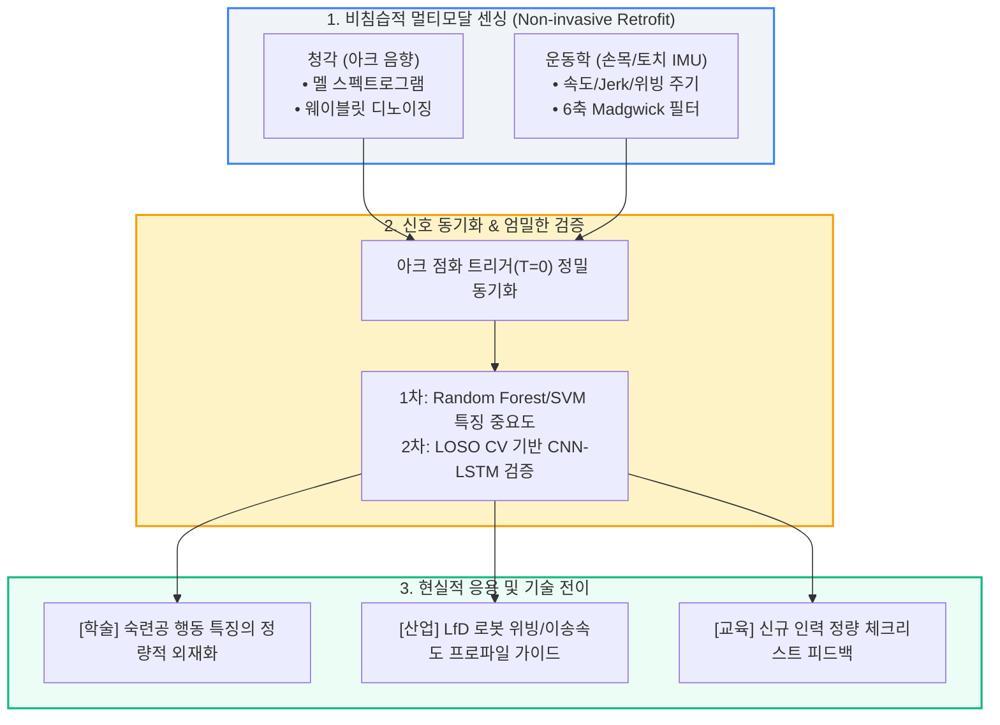

# 📚 용접 인공지능 및 센서 퓨전 최신 연구동향 및 방어 전략 리포트 (2024~2026)

본 리포트는 캡스톤 프로젝트의 이론적 배경 및 학술적 독창성(Novelty)을 완벽하게 입증하고, 교수님 및 심사위원의 비판적 질문을 사전에 완벽히 방어하기 위해 **'아크 음향 분석', 'IMU 모션 기반 숙련도 정량화', '멀티모달 센서 퓨전', '교시 학습(LfD)'** 4대 핵심 분야와 **심사위원 5대 핵심 방어 전략**을 집대성한 결과입니다.

---

## 1. 아크 음향(Acoustic) 신호 처리 및 딥러닝 최신 동향

숙련 용접공이 "소리만 듣고도 아크 안정성과 용입 상태를 감지하는" 암묵지를 AI로 모사하는 연구는 2024~2026년 들어 신호 처리와 신경망 구조 양측에서 비약적으로 발전했습니다.

*   **신호 변환 기법의 정밀화 (Mel-Spectrogram vs Wavelet)**
    *   **멜 스펙트로그램 (Mel-Spectrogram)**: 사람 청각의 비선형 인지 특성(Mel Scale)을 반영하여 음향 에너지를 2D 이미지로 압축. CNN 전이학습(Transfer Learning) 및 정상/불량 용입 상태의 전반적 패턴 분류를 위한 *de facto 표준(Standard)*으로 정립됨.
    *   **웨이블릿 변환 (Wavelet Transform)**: 단시간 푸리에 변환(STFT)의 시간-주파수 해상도 한계를 극복. 스패터 발생, 기공(Porosity) 생성, 순간 아크 단락 등 **밀리초(ms) 단위의 급격한 과도 신호(Transient Spikes)**를 정밀 포착하는 데 필수적으로 활용됨.
*   **최신 딥러닝 아키텍처 (2024~2025)**
    *   **CNN-SK (동적 선택 커널 네트워크, Zheng et al., 2024)**: 고정된 합성곱 필터 대신 주파수 대역별 특성에 맞춰 다중 커널 크기를 동적으로 선택하는 구조 도입 → CMT 및 GMAW 환경에서 용입 분류 정확도 대폭 향상.
    *   **SIMNet & DMAW-Net (2024~2025)**: STFT 음향 특징과 주의집중(Attention) 메커니즘을 결합하여, 산업 현장의 가혹한 배경 소음 속에서도 유효 아크 신호만 분리해 실시간(60 FPS급)으로 결함을 추정.

---

## 2. IMU 모션 분석 및 숙련도 정량화 기술

고가의 광학식 모션캡처(Vicon 등) 장비 없이, 저비용·웨어러블 **9-DOF IMU(가속도·자이로·지자기)** 센서만으로 작업자의 손목·토치 움직임을 분석하는 연구가 산업 현장과 직결되며 급부상하고 있습니다.

*   **숙련자(Expert) vs 비숙련자(Novice)의 운동학적 지표 차이**
    *   **속도 균일성 및 Jerk (가가속도)**: 초보자는 토치를 이동할 때 미세한 떨림(Tremor)과 급격한 가감속을 보여 Jerk 수치가 높게 나타나며, 숙련자는 등속도 이동(Constant Travel Speed)을 유지함.
    *   **위빙 패턴의 주기성 (Weaving Periodicity)**: 숙련자는 토치를 좌우로 흔드는 위빙 동작 시 일정한 주파수 대역(주기적 스펙트럼 피크)을 형성하나, 초보자는 궤적 이탈 및 불규칙성이 뚜렷함.
*   **고정밀 모션 추적의 돌파구 (2025 최신 동향)**
    *   **IMU-SLAM 융합 및 드리프트 보정 (MDPI, 2025)**: IMU 센서의 고질적 문제인 '적분 오차(Drift)'를 용접 특유의 주기적 위빙 궤적을 이용해 상쇄시킴으로써, 별도 카메라 없이도 **3.8mm 수준의 고정밀 위치 추적 오차(RMSE)**를 달성.
    *   **다단계 숙련도 분류 (Pribadi & Shinoda, 2025)**: 시계열 모션 데이터를 CNN-LSTM으로 학습하여 6단계 용접 숙련도를 **97.69%**의 정확도로 자동 분류.

---

## 3. 멀티모달 센서 퓨전 (Multimodal Sensor Fusion)의 패러다임

단일 센서(시각, 청각, 모션 단독)의 취약점을 상호 보완하기 위해 여러 이종 데이터를 융합하는 연구가 차세대 스마트 제조의 핵심 테마로 자리 잡았습니다.

*   **크로스 모달 어텐션 (Cross-Modal Attention, 2024~2025)**
    *   **M2WPR-Net (2024)**: 시각(용융지 풀 이미지)과 음향(아크 사운드) 신호를 Dual-stream 백본으로 추출한 후, 양방향 Cross-Attention을 통해 아크 빛 반사(Glare)나 소음이 심한 순간에도 상호 보완적으로 비드 폭과 결함을 실시간 추정.
*   **🔥 본 캡스톤 연구의 독창성 (Key Novelty)**
    *   > [!IMPORTANT]
        > **기존 연구의 한계**: 현재 발표된 멀티모달 센서 퓨전 연구의 95% 이상은 **'기계/로봇의 상태 모니터링(Vision + Current/Voltage + Sound)'**에 국한되어 있습니다.
        > **본 연구의 차별성**: 본 프로젝트는 **'인간 작업자의 운동학(IMU 모션)'과 '그 결과로 방출되는 아크 음향(Sound)'을 동시 융합**합니다. 즉, 기계 진단이 아닌 **'인간의 감각-운동 행동 특징(Sensorimotor Behavioral Feature)'을 최초로 정량화**한다는 점에서 학술적/실용적 가치가 독보적입니다.

---

## 4. 로봇 교시 학습 (Learning from Demonstration, LfD) 연계성

추출된 숙련공의 암묵지 데이터가 어떻게 미래 자동화 시스템으로 전이(Skill Transfer)되는지를 보여주는 응용 분야입니다.

*   **LfD의 발전 흐름 (2024~2025 Roadmap)**
    *   기존 티칭 펜던트(Teach Pendant)를 이용한 수동 좌표 입력 방식에서 벗어나, **숙련공이 용접을 시연하면 로봇이 궤적과 제어 파라미터를 모방 학습(Behavior Cloning)**하는 기술로 전환.
    *   다품종 소량 생산(Mass Customization) 체제에서 비정형 곡면이나 복잡 형상 용접을 위한 필수 기술로 주목받음.
*   **본 연구 데이터의 현실적 활용 가치**
    *   로봇의 3D 절대 위치(XYZ)를 무리하게 생성하는 대신, **'최적 위빙 주기·진폭' 및 '등속도 이송 속도 프로파일(Velocity Profile)'**로 변환하여 LfD 제어 알고리즘의 핵심 입력 파라미터로 제공.

---

## 🛡️ 5. 심사위원(교수님) 5대 비판 지점 및 완벽 방어 전략 (Defense Guide)

| 비판 지점 (교수님 공격) | 연구계획서 반영 및 필승 방어 멘트 (Defense) |
| :--- | :--- |
| **Q1. 단순 물리량 측정인데 왜 거창하게 '암묵지'라고 부르는가?** | "암묵지 전체가 아닌, 숙련공의 감각-운동 피드백 중 **'토치 조작 안정성(모션)'과 '아크 상태 일관성(음향)'이라는 2가지 핵심 행동 지표(Behavioral Feature)를 추출하여 외재화**하는 것으로 범위를 명확히 한정했습니다." |
| **Q2. 전기(전압/전류) 센서 놔두고 왜 노이즈 심한 마이크를 쓰는가?** | "전압/전류 센서는 용접기 내부 회로를 개조해야 하는 침습적(Invasive) 한계가 있습니다. 반면 마이크와 IMU는 기존 모든 용접기에 즉각 탈부착 가능한 **'비침습적·외장형 범용(Non-invasive Retrofit) 솔루션'**으로서의 독보적인 현장 호환성을 지닙니다." |
| **Q3. 비숙련자가 아예 용접을 못 해서 데이터가 끊기지 않겠는가?** | "완전 무경험자가 아닌, **기초 안전 및 아크 발생 훈련(30분)을 이수하여 10초 이상 아크 유지가 가능한 초급 훈련생**으로 대조군을 통제하여 연속 시계열 데이터 결손을 원천 차단했습니다." |
| **Q4. 슬라이딩 윈도우 증강 시 데이터 누수(Data Leakage)로 가짜 정확도가 나오지 않는가?** | "무작위 분할(Random Split)을 엄격히 배제하고, 미학습 피험자 데이터로만 최종 성능을 평가하는 **피험자 분리 교차 검증(Leave-One-Subject-Out, LOSO CV)**을 필수 적용하여 과적합 없는 순수 일반화 성능을 도출합니다." |
| **Q5. IMU만으로 로봇 궤적(LfD)을 어떻게 만드는가? 절대좌표가 없지 않은가?** | "로봇의 3D 절대 위치(XYZ)를 생성하는 것이 아니라, 로봇의 모션 플래너에 입력될 **'최적 위빙 주기·진폭' 및 '등속도 이송 프로파일(Velocity Profile)'**을 제공하는 LfD 보조 파라미터로 역할을 명확히 규정했습니다." |

---

### 📊 종합 연구 체계도 (Mermaid Diagram)

