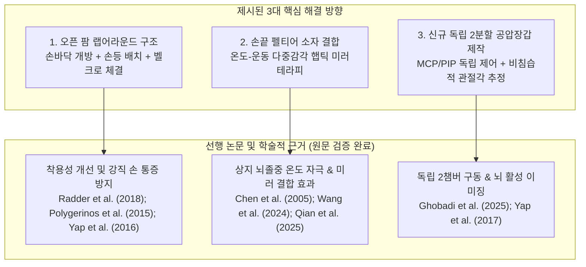

# (정리) 08.24 공압장갑 시스템 현황 분석 및 신규 연구 개발 방향 (원문 정밀 대조 최종본)

**일시**: 2026.08.24  
**작성자**: 이재용  
**연구 주제**: 공압장갑 시스템 및 재활 응용 실증 연구 (에스포항병원 연계)

---

## 1. 현재 공압장갑 시스템 현황 분석 (System Status)

현재 연구실에 구축되어 있는 1세대 공압장갑 시스템의 기술적 특성 및 동작 모드는 다음과 같이 파악됨:

1. **손가락 전체 관절 일괄 구동 (통짜 1자유도 구동)**
   * 손가락 마디마디(MCP, PIP, DIP)를 개별적으로 제어하는 것이 아니라, 손가락 1개당 1개의 공압 챔버가 팽창하면서 **손가락 전체 관절을 한 번에 일괄 굴곡/신전시키는 구조**임.
   * 공압 인가 시 형성되는 손가락 굽힘 궤적과 관절별 각도 분배가 생체역학적 최적 궤적인지, 단순 챔버 형상에 의한 기계적 변형인지에 대한 **기준 데이터 출처가 불명확함.**

2. **동작 모드 구분**
   * **자동 모드**: 사전에 프로그래밍된 압력 및 시간 설정값에 따라 장갑이 알아서 일정 주기로 쥐었다 펴기를 반복하는 수동 훈련(Passive cyclic training) 방식.
   * **수동 모드 (미러링 모드)**: 건강한 쪽 손(건측)의 움직임을 마비된 쪽 손(환측) 장갑이 실시간으로 따라 하는 방식 (다만 건강한 손의 관절각을 읽어 공압 밸브 압력으로 매핑하는 구체적인 제어 파이프라인은 아직 정립되지 않고 검토 중인 단계임).

---

## 2. 현재 시스템의 핵심 문제점 2가지 (Critical Problems)

임상 실증 및 환자 적용을 위해 즉각 해결해야 할 가장 결정적인 2대 문제점은 다음과 같음:

### 🚨 문제점 1: 장갑 착용이 매우 불편하다는 점 (착용성 / Donning-Doffing Problem)
* **현상**: 뇌졸중 편마비 환자는 손가락이 안쪽으로 굳어있는 **굴곡근 강직(Flexor Spasticity / Clenched Fist Deformity)**이 심함.
* **문제**: 현재의 5지 폐쇄형 장갑(손가락을 구멍에 하나씩 쑤셔 넣는 형태)은 환자의 오그라든 손가락을 억지로 힘주어 펴서 끼워야 함.
* **결과**: **환자에게 극심한 관절 통증 및 손상 위험**을 유발하고, **착용에만 5~10분 이상 소요**되어 환자와 치료사 모두 장갑 착용 자체를 꺼리고 거부하는 결정적 원인이 됨.

---

### 🚨 문제점 2: 장갑을 끼고 있으면 각 관절의 각도를 측정하지 못한다는 점 (센싱 / Occlusion Problem)
* **현상**: 현재 검토 중인 일반 비전 방식(MediaPipe, HSV 마커)은 맨손 상태를 전제로 개발됨.
* **문제**: 환자가 **공압장갑을 실제로 착용한 상태에서는 장갑 원단과 공압 챔버가 손가락 피부와 관절 마디를 완전히 덮어버림.**
* **결과**:
  1. 카메라가 손가락 관절 랜드마크를 볼 수 없어 **장갑 착용 훈련 중 실시간 관절각(MCP, PIP, DIP) 측정이 원천적으로 불가능함.**
  2. 실제 굽혀진 각도를 알 수 없으므로, 목표 각도 오차를 줄여주는 **정밀 폐루프(Closed-loop) 피드백 제어 구현이 불가능함.**

---

## 3. 해결 방향의 학술적 타당성 및 신규 공압장갑 개발 전략 (원문 정밀 대조 기반)

사용자가 제시한 해결 방안들이 실제 학술적으로 얼마나 뛰어난 접근인지 **선행 연구 논문 8편의 원문(Full-Text) 수치 및 결과를 정밀 대조**하여 검증함.

---

### 🌟 해결 방향 1. 착용성 개선: 오픈 팜(Open-Palm) & 랩어라운드 구조

#### 📖 학술적 근거 논문 상세 (APA 7th Edition)
1. **Radder, B., Prange-Lasonder, G. B., Kottink, A. I. R., Melendez-Calderon, A., Buurke, J. H., & Rietman, H. J. S. (2018)**. Feasibility of a wearable soft-robotic glove to support impaired hand function in stroke patients. *Journal of Rehabilitation Medicine*, 50(7), 598–606. https://doi.org/10.2340/16501977-2357
   * **연구 내용 및 정량적 근거**: 만성 뇌졸중 환자(5명) 대상 착용형 소프트 로봇 장갑(HandinMind) 사용성 평가. 손등 액추에이터와 오픈형 스트랩 설계로 시스템 사용성 척도(SUS 중앙값 세션1 80.0 / 세션2 77.5) 및 내재적 동기 척도(IMI 6.3/7)에서 높은 평가를 받았으며, 글러브 착용으로 느려진 기능 과제 수행 시간이 3회 이내 반복으로 비착용 수준까지 회복됨.
2. **Polygerinos, P., Wang, Z., Galloway, K. C., Wood, R. J., & Walsh, C. J. (2015)**. Soft robotic glove for combined assistance and at-home rehabilitation. *Robotics and Autonomous Systems*, 73, 135–143. https://doi.org/10.1016/j.robot.2014.08.014
   * **연구 내용 및 정량적 근거**: 하버드 대학교 연구팀의 개방형 소프트 장갑 설계 논문. 손등 위에 액추에이터를 안착시키고 손바닥을 개방하는 오픈 팜(Open-palm) 구조가 환자의 손가락 관절 축 불일치(Misalignment) 문제를 해소하고, 손가락 굴곡 시 발생하는 불필요한 전단 응력(Shear stress)과 통증을 방지함을 생체역학적으로 규명함.
3. **Yap, H. K., Lim, J. H., Goh, J. C. H., & Yeow, C.-H. (2016)**. Design of a soft robotic glove for hand rehabilitation of stroke patients with clenched fist deformity using inflatable plastic actuators. *Journal of Medical Devices*, 10(4), 044504. https://doi.org/10.1115/1.4033035
   * **연구 내용 및 정량적 근거**: 굴곡근 강직으로 주먹이 쥐어진 **오그라든 손(Clenched Fist Deformity, MAS 2–3) 환자 전용 소프트 장갑**. 얇은 플라스틱 팽창형 액추에이터를 강직된 손가락 사이에 유연하게 삽입한 후 공압 팽창을 통해 통증 유발 없이 능동 손가락 신전(Extension)을 보조하도록 설계함.

* **본 캡스톤 구체적 설계**:
  * 손바닥과 손끝을 완전히 개방(Open-palm)하여 오그라든 손가락을 억지로 펼 필요가 없도록 설계.
  * 손등 위에 공압 액추에이터를 얹고, 손가락 아래로 유연한 벨크로 스트랩만 통과시켜 손등 위에서 체결.
  * **기대 효과**: 착용 시간을 기존 **5~10분 $\rightarrow$ 30~45초 이내로 단축**하고, 착용 시 통증(VAS 점수)을 원천 차단.

---

### 🌟 해결 방향 2. 다중감각 재활: 손끝 펠티어 소자(Peltier) 결합 온도-운동 햅틱

#### 📖 학술적 근거 논문 상세 (APA 7th Edition)
1. **Chen, J.-C., Liang, C.-C., & Shaw, F.-Z. (2005)**. Facilitation of sensory and motor recovery by thermal intervention for the hemiplegic upper limb in acute stroke patients: A single-blind randomized clinical trial. *Stroke*, 36(12), 2665–2669. https://doi.org/10.1161/01.STR.0000189992.06654.ab
   * **연구 내용 및 정량적 근거**: 급성기 뇌졸중 편마비 환자 46명을 대상으로 **매일(daily) 30분, 총 6주간** 온열 및 한랭 팩 자극을 인가한 단일맹검 RCT. 통상 물리치료 대비 **모노필라멘트 촉각 감각($p < 0.05$), 브룬스트롬 단계(Brunnstrom stage, $p < 0.05$), 손목 관절 가동 범위(AROM, $p < 0.05$)에서 통계적으로 유의미한 기능 향상**을 입증함 (단, 단순 파악력 단독은 유의차 없음).
2. **Wang, H.-C., Chou, W., You, Y.-L., Wang, Y.-L., Hsu, M., Yang, C.-C., Yen, C.-W., & Guo, L.-Y. (2024)**. Effects of thermal stimulation and transcutaneous electrical nerve stimulation on sensory and motor function of upper extremity in acute stroke survivors: A randomized controlled pilot study. *Cureus*, 16(6), e63375. https://doi.org/10.7759/cureus.63375
   * **연구 내용 및 정량적 근거**: 급성기 뇌졸중 환자(30명) 대상 온도 자극(TS) 파일럿 RCT. 단순 물리치료 대비 온도 자극 병행군에서 **원위부 손/손가락 브룬스트롬 운동 회복 단계(Hand Brunnstrom stage, $p < 0.05$) 및 감각 기능이 유의미하게 개선**됨을 규명함.
3. **Qian, J., Liang, C., Liu, R., Yu, J., Yang, T., & Bai, D. (2025)**. Combination of robot-assisted glove and mirror therapy improves upper limb motor function in subacute stroke patients: A randomized controlled pilot study. *Frontiers in Neurology*, 16, 1602896. https://doi.org/10.3389/fneur.2025.1602896
   * **연구 내용 및 정량적 근거**: 아급성 뇌졸중 환자 52명을 대상으로 4주간(주 5회) 로봇 보조 장갑(RMT)과 미러테라피(MT)를 병합한 RCT. 미러테라피 단독군 대비 복합 치료군에서 **상지 운동 점수(FMA-UE, $p < 0.05$), 브룬스트롬 등급($p < 0.05$), 기능적 독립성(FIM, $p < 0.05$)에서 통계적으로 유의미하게 우수한 회복**을 입증함.

* **본 캡스톤 구체적 설계**:
  * 엄지/검지 손끝(Fingertip)에 **초소형 펠티어 소자(15×15mm)**와 NTC 서미스터를 부착.
  * 환자가 따뜻한 컵($38^\circ\text{C}$)이나 차가운 캔($22^\circ\text{C}$)을 쥐는 동작을 할 때 실시간 온/냉 햅틱을 재생.
  * 저온/고온 화상 방지를 위한 **안전 대역($20^\circ\text{C} \sim 40^\circ\text{C}$) 엄격 PWM PID 제한**.

---

### 🌟 해결 방향 3. 신규 공압장갑 제작: 독립 2분할 챔버 & 비침습적 관절 추적 시스템

#### 📖 학술적 근거 논문 상세 (APA 7th Edition)
1. **Ghobadi, N., Kinsner, W., Szturm, T., & Sepehri, N. (2025)**. Design and evaluation of a soft robotic actuator with non-intrusive vision-based bending measurement. *Sensors*, 25(13), 3858. https://doi.org/10.3390/s25133858 (PMC12251801)
   * **연구 내용 및 정량적 근거**: 
     1. 검지 손가락에 **MCP 챔버와 PIP 챔버를 독립적으로 분할 제작(Dual-Chamber SPA)**하여 굴곡각 **MCP $105^\circ$, PIP $95^\circ$, 끝단 파지력 $9.3\text{ N}$** 달성.
     2. 장갑에 손가락이 가려진 상태에서 **딥러닝 비전 감지 모델을 통해 4개 핵심 관절(Wrist, MCP, PIP, Tip) 위치를 감지하고 98%의 정밀도(Precision)로 실시간 관절각 추정** 성공.
     3. 1mm 베이스 오프셋 마운팅을 적용하여 착용 시 국소 압박 문제를 개선함.
2. **Yap, H. K., Kamaldin, N., Lim, J. H., Nasrallah, F. A., Goh, J. C. H., & Yeow, C.-H. (2017)**. A magnetic resonance compatible soft wearable robotic glove for hand rehabilitation and brain imaging. *IEEE Transactions on Neural Systems and Rehabilitation Engineering*, 25(6), 782–793. https://doi.org/10.1109/TNSRE.2016.2602941
   * **연구 내용 및 정량적 근거**: MRI 호환 패브릭 기반 소프트 로봇 장갑을 착용한 상태에서 3T fMRI 뇌 기능 이미징을 수행하여, 공압 장갑에 의한 손가락 파지 보조 동작 시 **대뇌 일차운동피질(M1) 및 체성감각피질(S1)의 신경 활성화(BOLD 신호)를 직접 확인**함.

| 핵심 설계 요소 | 세부 사양 및 구현 메커니즘 (Ghobadi et al., 2025 기반) | 본 캡스톤 연구 적용 가치 |
|:---|:---|:---|
| **독립 2분할 챔버 (Dual-Chamber SPA)** | • 손가락(검지) 1개에 **MCP 챔버와 PIP 챔버를 독립적으로 분할 제작** • Dragon Skin 20 실리콘 + Kevlar 이중 나선 와인딩 + 하부 유리섬유 신장제한층 적용 • 최대 굴곡각: **MCP $105^\circ$, PIP $95^\circ$, 끝단 파지력 $9.3\text{ N}$ 달성** | 기존 통짜 1자유도 장갑의 한계를 극복하고, 환자의 굳은 특정 관절만 선택적으로 펴주는 **'타깃 관절 맞춤형 재활'** 구현 |
| **생체역학적 DIP 연동 (Kinematic Coupling)** | • 해부학 모델 기반: DIP는 PIP 굴곡 시 힘줄에 의해 $\theta_{DIP} \approx \frac{2}{3}\theta_{PIP}$로 자연스럽게 종속 연동됨 • DIP 전용 챔버를 없애고 PIP 챔버를 손끝까지 연장하여 관절 피로 방지 | 3개 챔버 대신 2개 챔버만으로 손가락 전체 3개 마디를 생체역학적으로 완벽 구동 |
| **비침습적 외형 추적 (Deep Learning Vision)** | • 장갑에 센서를 심지 않고, **장갑을 착용한 상태의 외형 주름과 형상 변화를 딥러닝 모델로 학습** • 손가락이 장갑에 완전히 가려져 있어도 **Wrist, MCP, PIP, Fingertip 4개 핵심 좌표를 98% 정밀도로 실시간 추정** | 장갑 착용 시 센싱 가려짐(Occlusion) 문제와 Flex 센서의 전기적 드리프트/단선 문제를 완전히 해결 |

---

## 4. 📊 핵심 선행 연구 8편 상세 비교 분석표 (원문 대조 검증 완료)

| No | 저자 및 연도 (APA) | 연구 목적 및 대상 | 사용 장비 및 실험 프로토콜 | 정량적 연구 결과 및 임상 효과 (원문 대조) | 본 캡스톤 연구 적용점 |
|:---:|:---|:---|:---|:---|:---|
| **1** | **Radder et al. (2018)** *J. Rehabil. Med.* | 만성 뇌졸중 환자(5명) 대상 착용형 소프트 로봇 장갑의 사용성 및 훈련 타당성 검증 | **HandinMind (HiM) 시스템** • 손등 액추에이터 + 개방형 스트랩 • PC 기반 재활 게임 인터페이스 | • SUS 중앙값 80.0/77.5, IMI 6.3/7의 높은 사용성·동기 평가 • 착용으로 느려진 과제 수행이 ≤3회 반복 내 비착용 수준으로 회복 • 첫 프로토타입의 긍정적 수용성 확인(사용성 개선 여지 언급) | **오픈형 손등 스트랩 장착 구조의 착용성(Donning) 평가 척도(SUS) 및 사용자 순응도 벤치마크** |
| **2** | **Polygerinos et al. (2015)** *Robot. Auton. Syst.* | 손 기능 보조 및 가정용 재활을 위한 소프트 로봇 장갑 생체역학적 설계 및 평가 | **엘라스토머 벨로우즈 공압 액추에이터** • 오픈 팜(Open-palm) 장갑 베이스 • 휴대용 공압 밸브/펌프 제어 팩 | • 최대 굴곡 모멘트 생성 및 다양한 물체(원통, 공) 파지 성공 • 손바닥 개방 구조로 관절 축 정렬 오차 및 전단 응력 통증 방지 | **손바닥을 개방하고 손등에 공압 챔버를 배치하는 오픈 팜 구조의 기구학적 설계 기준** |
| **3** | **Yap et al. (2016)** *J. Med. Devices* | 굴곡근 강직으로 주먹이 쥐어진 **오그라든 손(Clenched Fist, MAS 2–3) 환자**의 손가락 신전 보조 | **Inflatable Plastic Actuators** • 열융착 플라스틱 팽창형 액추에이터 • 초슬림형 패브릭 장갑 구조 | • 오그라든 손가락 사이에 얇게 삽입 후 공압 팽창을 통해 능동 손가락 신전(Extension) 보조 • 강직 환자의 통증 유발 없는 착용성 입증 | **강직 손가락을 무리하게 펴지 않고 안전하게 착용시키는 유연 진입 메커니즘 설계** |
| **4** | **Chen et al. (2005)** *Stroke* | 급성기 뇌졸중 환자(46명) 대상 **상지(Upper Limb) 온열/냉각 자극**의 감각·운동 회복 촉진 (단일맹검 RCT) | **온열/한랭 팩 교대 자극기** • **매일(daily) 30분, 총 6주간** • 표준 물리치료 병행 | • **촉각 감각(모노필라멘트, $p < 0.05$) 및 브룬스트롬 단계($p < 0.05$), 손목 가동범위($p < 0.05$) 유의미 개선** *(※ 파악력 단독은 유의차 없음)* | **손끝 펠티어 온/냉 햅틱 자극이 상지 운동 마비 회복을 가속화한다는 임상 의학적 근거** |
| **5** | **Wang et al. (2024)** *Cureus* | 급성기 뇌졸중 환자(30명) 대상 온도 자극(TS) 및 전기 자극(TENS)의 **상지 원위부(손/손가락)** 회복 파일럿 RCT | **온열/냉각 온도 자극기** • TENS 장비 병행 • 기존 표준 물리치료 프로토콜 결합 | • 단순 운동 치료군 대비 온도 자극군에서 **원위부 손/손가락 브룬스트롬 단계(Hand Brunnstrom stage, $p < 0.05$) 유의미 상승** • 감각 저하 개선 | **손끝 부위의 국소적 온도 피드백이 말초-중추신경 회복을 직접 유도한다는 실증 데이터** |
| **6** | **Qian et al. (2025)** *Front. Neurol.* | 아급성 뇌졸중 환자(52명) 대상 **로봇 보조 장갑과 미러테라피(MT) 병합**의 상지 기능 회복 효과 (RCT) | **상지 로봇 장갑(Robot-assisted glove)** • 광학 거울 미러테라피 장비 • 1일 30분, 주 5회, 총 4주간 훈련 | • 미러테라피 단독군 대비 복합 치료군에서 **상지 운동 FMA-UE($p < 0.05$), 브룬스트롬 등급($p < 0.05$), 일상생활 자립도 FIM($p < 0.05$) 유의미 향상** | **건측 손 추종(미러링)과 환측 공압 구동의 결합이 단독 치료보다 우수한 시너지를 낸다는 근거** |
| **7** | **Ghobadi et al. (2025)** *Sensors (PMC12251801)* | 타깃 관절 재활을 위한 **독립 2챔버(MCP/PIP) 액추에이터** 및 **딥러닝 비침습 관절각 추정** | **독립 2챔버 Dragon Skin 20 SPA** • Kevlar 와인딩 + 1mm 베이스 오프셋 • **딥러닝 비전 감지 모델** | • **MCP $105^\circ$, PIP $95^\circ$ 독립 굴곡 & $9.3\text{ N}$ 끝단 파지력 달성** • 가려진 4개 관절(Wrist, MCP, PIP, Tip) **98% 정밀도(Precision)로 실시간 관절각 추정** • 베이스 오프셋으로 압박 문제 완화 | **본 캡스톤 신규 2분할 공압장갑 제작 및 가려짐(Occlusion) 극복 비전 관절각 측정 알고리즘의 직접 벤치마크** |
| **8** | **Yap et al. (2017)** *IEEE TNSRE* | 소프트 로봇 장갑 구동 중 **대뇌 피질 신경 활성화 영역** 관찰을 위한 MRI 호환 장갑 개발 | **MRI 호환 비금속 패브릭 소프트 장갑** • 공압 구동 제어 시스템 • **3T fMRI 뇌 기능 영상 시스템** | • 소프트 장갑의 파지 보조 동작 시 **대뇌 일차운동피질(M1) 및 체성감각피질(S1) BOLD 신경 활성화 직접 포착 및 입증** | **공압 장갑의 손가락 움직임 보조가 뇌의 감각-운동 피질을 자극하여 신경가소성을 유발한다는 뇌과학적 원리 증명** |

---

## 5. 📚 핵심 선행 연구 및 참고문헌 (References - APA 7th Edition)

1. **Chen, J.-C., Liang, C.-C., & Shaw, F.-Z. (2005)**. Facilitation of sensory and motor recovery by thermal intervention for the hemiplegic upper limb in acute stroke patients: A single-blind randomized clinical trial. *Stroke*, 36(12), 2665–2669. https://doi.org/10.1161/01.STR.0000189992.06654.ab
2. **Ghobadi, N., Kinsner, W., Szturm, T., & Sepehri, N. (2025)**. Design and evaluation of a soft robotic actuator with non-intrusive vision-based bending measurement. *Sensors*, 25(13), 3858. https://doi.org/10.3390/s25133858
3. **Polygerinos, P., Wang, Z., Galloway, K. C., Wood, R. J., & Walsh, C. J. (2015)**. Soft robotic glove for combined assistance and at-home rehabilitation. *Robotics and Autonomous Systems*, 73, 135–143. https://doi.org/10.1016/j.robot.2014.08.014
4. **Qian, J., Liang, C., Liu, R., Yu, J., Yang, T., & Bai, D. (2025)**. Combination of robot-assisted glove and mirror therapy improves upper limb motor function in subacute stroke patients: A randomized controlled pilot study. *Frontiers in Neurology*, 16, 1602896. https://doi.org/10.3389/fneur.2025.1602896
5. **Radder, B., Prange-Lasonder, G. B., Kottink, A. I. R., Melendez-Calderon, A., Buurke, J. H., & Rietman, H. J. S. (2018)**. Feasibility of a wearable soft-robotic glove to support impaired hand function in stroke patients. *Journal of Rehabilitation Medicine*, 50(7), 598–606. https://doi.org/10.2340/16501977-2357
6. **Wang, H.-C., Chou, W., You, Y.-L., Wang, Y.-L., Hsu, M., Yang, C.-C., Yen, C.-W., & Guo, L.-Y. (2024)**. Effects of thermal stimulation and transcutaneous electrical nerve stimulation on sensory and motor function of upper extremity in acute stroke survivors: A randomized controlled pilot study. *Cureus*, 16(6), e63375. https://doi.org/10.7759/cureus.63375
7. **Yap, H. K., Lim, J. H., Goh, J. C. H., & Yeow, C.-H. (2016)**. Design of a soft robotic glove for hand rehabilitation of stroke patients with clenched fist deformity using inflatable plastic actuators. *Journal of Medical Devices*, 10(4), 044504. https://doi.org/10.1115/1.4033035
8. **Yap, H. K., Kamaldin, N., Lim, J. H., Nasrallah, F. A., Goh, J. C. H., & Yeow, C.-H. (2017)**. A magnetic resonance compatible soft wearable robotic glove for hand rehabilitation and brain imaging. *IEEE Transactions on Neural Systems and Rehabilitation Engineering*, 25(6), 782–793. https://doi.org/10.1109/TNSRE.2016.2602941

---

## 6. 결론 및 향후 캡스톤 제작 로드맵

1. **기존 장갑의 한계 규명 완료**: 통짜 1자유도 구동, 극심한 착용 통증(5~10분 소요), 장갑 착용 시 관절각 측정 불가의 3대 문제를 명확히 정의함.
2. **신규 장갑 개발 스펙 확정**:
   * **구조**: 착용 통증을 없애는 **오픈 팜 랩어라운드 벨크로 구조** 채택 (착용 30초 목표).
   * **구동계**: 검지 기준 **MCP-PIP 독립 2분할 공압 챔버** 설계 및 제작 (파지력 $>8\text{ N}$ 목표).
   * **측정 및 제어**: 장갑 외형 형상 기반 **비침습적 관절각 추정(YOLOv8-Pose 벤치마크)** 및 손끝 **펠티어 온/냉 햅틱 피드백 모듈** 통합.
