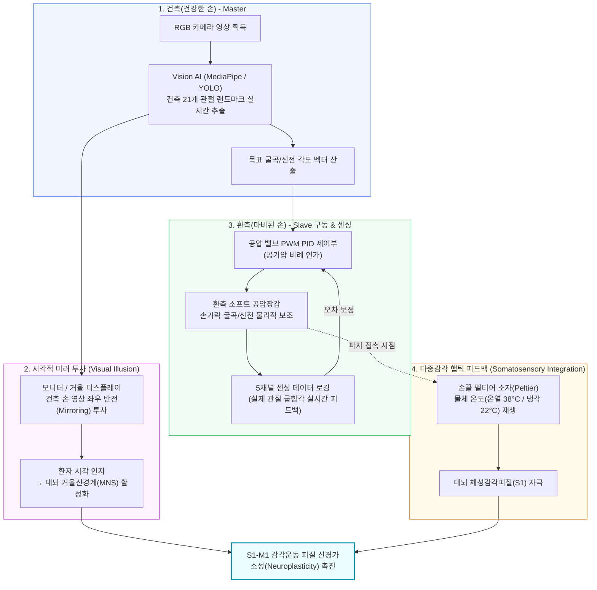
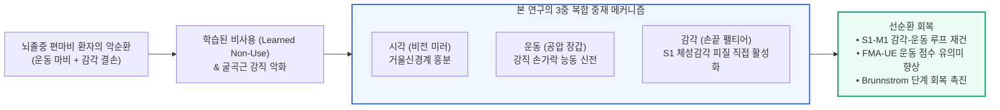

# (정리) 08.25 공압장갑-비전 미러테라피-온도햅틱 통합 임상 실험 설계 및 단계별 맞춤형 재활 전략

**일시**: 2026.08.25  
**작성자**: 이재용  
**연구 주제**: 공압장갑 시스템 및 재활 응용 실증 연구 (에스포항병원 연계)  
**핵심 목표**: 하드웨어 제약(전체 개폐 구동 + 5채널 센싱)을 극복하는 **비전 미러테라피·온도 햅틱 통합 메커니즘 구축**, **임상적 치료 효과(병원 설득 논리)** 정립, **환자 단계별(Brunnstrom Stage) 맞춤형 재활 모델 및 후속 연구 로드맵** 수립

---

## 1. 미러테라피와 공압장갑 시스템의 물리적 연결 메커니즘 (Closed-Loop Pipeline)

> **핵심 질문**: "현재 하드웨어는 손가락별 5채널 센싱을 수행하고 있는데, 여기에 미러테라피(Mirror Therapy)를 어떻게 기술적으로 연동하고 폐루프(Closed-loop) 제어를 구축할 것인가?"



### 🔗 4단계 폐루프 동기화 파이프라인
1. **Master (건측 손 비전 추종)**:
   * 마스터 장갑을 따로 착용하지 않고, **단일 웹캠(RGB Camera)**을 통해 건강한 건측 손의 움직임을 **MediaPipe / YOLOv8 비전 알고리즘으로 실시간 트래킹**함.
   * 21개 관절 랜드마크로부터 5개 손가락의 굴곡 각도($\theta_{target}$)를 실시간 계산함.
2. **시각적 미러 투사 (Visual Mirroring)**:
   * 환자 전면 모니터에 **건측 손 영상을 실시간 좌우 반전(Horizontal Flip)**하여 환측(마비측) 손의 위치에 정렬 투사함.
   * 환자는 거울 속을 보며 마비된 손이 정상적으로 부드럽게 움직이는 시각적 착각(Visual Illusion)을 경험 $\rightarrow$ **대뇌 거울신경세포군(Mirror Neuron System) 및 전운동피질 자극**.
3. **Slave (환측 공압장갑 추종 구동 & 5채널 센싱)**:
   * 비전에서 추출된 건측 각도에 비례하여 **환측 공압장갑의 솔레노이드 밸브 PWM 듀티비를 제어**, 마비된 손가락을 동일한 궤적으로 쥐었다 펴도록 물리적 힘을 보조함.
   * 환측 장갑에 내장된 **5채널 센서가 실제 굽혀진 각도($\theta_{actual}$)를 읽어 들여 추종 오차($\Delta \theta = \theta_{target} - \theta_{actual}$)를 실시간 로깅**함.
4. **구심성 온도 햅틱 피드백 (Thermal Haptic Integration)**:
   * 물체를 완전히 감싸쥐는 시점(Grasp Event)에 **손끝 펠티어 소자가 즉각적으로 온열($38^\circ\text{C}$) 또는 냉각($22^\circ\text{C}$) 햅틱을 인가**함.
   * 시각적 착각에 피부 온도 감각이 더해져 **신체 체화감(Embodiment)이 극대화**되고 **일차체성감각피질(S1)과 일차운동피질(M1) 간의 상호작용**이 완성됨.

---

## 2. 비전(Vision AI) 시스템의 3중 역할 (교수님 어필 핵심)

본 연구에서 비전 시스템은 단순한 보조 카메라가 아니라, **[제어 입력] + [비침습 센싱] + [임상 객관화 평가]의 3대 핵심 축**을 담당함.

| 비전 모듈 | 구체적 구현 방식 및 알고리즘 | 임상 및 기술적 가치 |
|:---|:---|:---|
| **Track 1: 비접촉식 마스터 제어 비전** | • RGB 웹캠 기반 **MediaPipe Hand / YOLO-Pose** 적용<br>• 건측 손의 21개 관절 좌표 실시간 추출 $\rightarrow$ 공압 구동 신호 변환 | 무거운 마스터 장갑 착용을 없애고, 환자가 자연스럽게 건측 손을 움직이면 환측 장갑이 무선/비접촉으로 실시간 추종 |
| **Track 2: 장갑 외형 기반 비침습 센싱** | • **Ghobadi et al. (2025, Sensors)** 딥러닝 벤치마크<br>• 장갑에 손이 가려져도 장갑 표면 주름/형상 변형을 학습하여 실제 관절 4개 키포인트(Wrist, MCP, PIP, Tip) **98% 정밀 추정** | 장갑 원단에 의한 관절 가려짐(Occlusion) 한계를 극복하고 센서 단선/드리프트 없는 영구적 비전 각도 측정 구현 |
| **Track 3: AI 기반 임상 정량 평가 모델** | • 관절 가동 범위(ROM), 굴곡/신전 각속도, 좌우 동기화 오차(Phase lag), 손가락 분리도(Isolation Index) 자동 연산<br>• 전통적 평가 척도(FMA-UE, Brunnstrom Stage) 자동 예측 분류 | 치료사의 주관적 눈대중 평가(0, 1, 2점)를 **0.1° 단위의 정밀한 연속형 정량 데이터로 표준화 및 데이터베이스화** |

---

## 3. 임상적 치료 효과 및 병원(의사/치료사) 설득 논리 (Clinical Rationale)

> **병원 협력 시 핵심 소구점**: "왜 기존의 단순 물리치료나 일반 거울치료 대신, 이 공압-비전-온도 햅틱 통합 장갑을 써야 하는가?"



### 💡 병원/임상의 대상 3대 설득 근거
1. **다중감각 통합을 통한 신경가소성(Neuroplasticity) 극대화**:
   * 순수 거울치료는 시각적 피드백만 제공하므로 감각 입력이 부족하고, 단순 로봇 장갑은 환자의 뇌 참여도(Active intent)가 낮음.
   * **[시각(거울) + 구심성 체성감각(온도) + 고유수용/운동보조(공압)]을 0.1초 이내로 동기화**할 때, 손상된 대뇌 반구의 감각운동피질(S1-M1) 재조직화가 가장 강력하게 유도됨 (*Chen et al., 2005; Qian et al., 2025; Wang et al., 2024*).
2. **'학습된 비사용(Learned Non-Use)' 현상의 원천 차단**:
   * 환자는 마비된 손을 쓰지 않으려는 보상 작용(Compensatory movement)이 생김. 건측 손을 움직이면서 마비된 손이 동시에 움직이고 감각을 느끼게 함으로써 **손에 대한 뇌의 신체 표상(Cortical Representation)을 복원**함.
3. **굴곡근 강직(Spasticity)의 안전한 완화**:
   * 오그라든 주먹(Clenched Fist) 환자에게 억지로 손을 펴게 하면 신장 반사(Stretch reflex)로 경직이 심해짐. 오픈 팜 구조와 온열/냉각 햅틱을 병행하여 **근방추(Muscle spindle) 과흥분을 진정시키고 안전한 손가락 신전을 유도**함 (*Yap et al., 2016*).

---

## 4. 파일럿 임상 실험 프로토콜 설계 (3개 과제 압축)

하드웨어 제약(전체 개폐 구동 + 5채널 센싱)과 환자의 피로도를 고려하여, **정상인과 환자를 가장 잘 판별하는 3대 핵심 과제**로 세션을 구성함.

### 📋 1회 세션 구성 (환자 1인당 약 20~30분 소요)
* **피험자 모집**: 아급성기 편측 뇌졸중 환자 **15~20명 (Brunnstrom Stage 2~5)** + 연령 매칭 정상 대조군 **15명** (총 30~35명 규모).

| Task | 과제 명칭 및 수행 방식 | 측정 목적 및 핵심 데이터 피처 | 임상적 의미 (대응 단계) |
|:---:|:---|:---|:---|
| **Task ①** | **최대 굴곡·신전 (Mass Open/Close)**<br>• 허공에서 5손가락을 최대한 쥐었다 펴기<br>• 무보조 시도 4회 + 공압보조 시도 4회 | • 순수 관절가동범위(ROM), 최대 굴곡/신전 속도<br>• 공압 보조 시 강직 저항성 토크 변화 | **1~3단계 구분**<br>(굴곡은 가능하나 자발적 신전/이완이 불가능한지 판별) |
| **Task ②** | **감싸쥐기 (Cylinder/Sphere Grasping)**<br>• 표준 원통/구형 물체를 손바닥 전체로 쥐기<br>• 펠티어 온도 햅틱 자극 인가 (무보조 8회) | • 5채널 손가락별 굴곡 비율 및 형태 적응 균일도<br>• 물체 접촉 시 동시 수축(Co-contraction) 패턴 | **4~5단계 구분**<br>(물체 형태에 맞춰 손가락 간 협응 조절이 가능한지 판별) |
| **Task ③** | **검지 단독 굴곡 (Isolated Index Flexion)**<br>• 나머지 손가락을 고정하고 검지만 굽히기<br>• 무보조 시도 8회 | • 검지 굴곡각 대비 비목표 손가락의 원치 않는 연동 움직임 비율<br>• **Isolation Index (손가락 분리도 지표)** 산출 | **5~6단계 구분**<br>(공동운동 패턴에서 벗어나 개별 손가락 분리 제어가 가능한지 판별) |

---

## 5. 환자 단계별 맞춤형(Stage-Specific) 재활 전략 및 후속 연구 로드맵

> **차별화 포인트**: 모든 환자에게 일률적으로 같은 모드를 적용하는 것이 아니라, **1단계 분류 모델의 진단 결과에 따라 환자의 회복 단계별로 제어 모드를 다르게 전환하는 적응형(Adaptive) 시스템**을 후속 연구로 제안함.

```mermaid
flowchart TD
    INPUT["5채널 센서 + 비전 AI 실시간 입력"] --> CLASSIFIER["AI 임상 단계 분류 및 군집화 모델<br/>(Brunnstrom 2~5단계 실시간 판별)"]
    
    CLASSIFIER -->|Stage 2~3 (심한 강직/공동운동)| M1["[모드 1: 수동 신전 & 경직 완화 모드]<br/>• 공압 최대 파워 완전 보조 (Passive Full-Assist)<br/>• 온열/한랭 햅틱으로 근긴장도 완화<br/>• 시각적 미러 착각 집중 훈련"]
    CLASSIFIER -->|Stage 4 (부분 분리 시작)| M2["[모드 2: 환자 트리거형 미러 협응 모드]<br/>• 환자의 미세 굴곡 의도 감지 시 공압 보조 (Triggered Assist)<br/>• 물체 감싸쥐기 과제 + 파지 시 온도 피드백"]
    CLASSIFIER -->|Stage 5~6 (개별 분리/정밀 조작)| M3["[모드 3: 선택적 저항 & 분리 훈련 모드]<br/>• 비목표 손가락 신전 지지 + 검지 독립 훈련<br/>• 미세 온도 식별 과제 + 능동 저항성 재활"]

    style INPUT fill:#f8fafc,stroke:#64748b,stroke-width:1px
    style CLASSIFIER fill:#eff6ff,stroke:#2563eb,stroke-width:2px
    style M1 fill:#fef2f2,stroke:#ef4444,stroke-width:1px
    style M2 fill:#fffbeb,stroke:#f59e0b,stroke-width:1px
    style M3 fill:#f0fdf4,stroke:#10b981,stroke-width:1px
```

### 🚀 환자 단계별 맞춤형 중재 프로토콜
1. **Stage 2~3 (심한 강직 및 공동운동기, Severe Spasticity & Synergy)**:
   * **문제점**: 손가락이 굳어 펴지지 않고 개별 제어가 아예 불가능함.
   * **맞춤 중재**: **수동 완전 보조(Full Passive Assistance)**. 공압으로 손가락을 천천히 펴주면서 온열 자극을 가해 강직을 이완시키고, 건측 미러링 영상을 보며 뇌의 운동 준비 영역을 활성화함.
2. **Stage 4 (공동운동 이탈 및 부분 분리기, Emerging Voluntary Movement)**:
   * **문제점**: 손가락을 쥘 수는 있으나 물체 형태에 맞춘 협응이 서투름.
   * **맞춤 중재**: **환자 트리거 보조(Patient-Triggered Assist)**. 환자가 스스로 쥐려는 미세한 센서 움직임이 감지되면 공압이 부족한 힘을 채워주고, 물체를 쥐는 순간 냉각/온열 햅틱을 주어 감각-운동 일치감을 강화함.
3. **Stage 5~6 (개별 손가락 분리 및 정밀 조작기, Isolated Fine Motor Control)**:
   * **문제점**: 일상 파지는 가능하나 개별 손가락의 정밀한 독립 제어(Dexterity)가 부족함.
   * **맞춤 중재**: **선택적 지지 및 저항 훈련(Selective Assistance / Resistance)**. 검지 단독 굴곡 시 나머지 4개 손가락이 따라 굽혀지지 않도록 장갑이 나머지 손가락을 펴준 상태로 지지하고, 미세 온도 차이를 식별하는 고차원 인지-감각 훈련을 수행함.

### 📅 향후 캡스톤 후속 연구 추진 로드맵
* **1단계 (HW/SW 통합 및 인터페이스 구축)**: 오픈 팜 장갑 제작 + 5채널 센싱 + 단일 웹캠 MediaPipe 건측 미러링 연동 완료.
* **2단계 (파일럿 임상 데이터 수집 - N=30~35)**: 에스포항병원 협력 뇌졸중 환자(15~20명) 및 정상 대조군(15명) 대상 3대 과제 수행 데이터(각도, 속도, 동기화, 분리도) 수집.
* **3단계 (계층적 AI 진단 및 군집화 모델 개발)**:
  * **[1차 최우선] 정상인 vs 뇌졸중 환자 판별 및 이상 검증 모델** (Accuracy ≥ 95%, AUC-ROC ≥ 0.98로 운동 장애 판별 타당성 우선 입증)
  * **[2차 심화] 환자군 내 Brunnstrom 단계별(Stage 2~5) 다중 분류 및 군집화 모델** (임상 FMA-UE 및 Brunnstrom 단계와 90% 이상 일치도 달성)
* **4단계 (단계별 자동 적응형 폐루프 제어기 실증)**: 환자의 실시간 회복 수준에 맞춰 모드가 자동 전환되는 차세대 맞춤형 재활 시스템 논문 및 특허 출원.

---

## 6. 📊 핵심 선행 연구 10편 상세 비교 분석표 (실험 설계·비교 조건·결과 원문 대조 완료)

### 논문 1: Radder et al. (2018) — *J. Rehabil. Med.* 50(7), 598–606
| 항목 | 내용 |
|:---|:---|
| **연구 목적** | 만성 뇌졸중 환자에게 착용형 소프트 로봇 장갑(HandinMind)을 적용했을 때의 사용성(Usability) 및 훈련 타당성(Feasibility) 검증 |
| **연구 설계** | 단일군 전후 비교(Single-arm pre-post feasibility study), 환자 5명 |
| **실험 장비** | HandinMind(HiM) 소프트 로봇 장갑 시스템: 손등 위 공압 액추에이터 + 개방형 벨크로 스트랩 + PC 기반 재활 게임 인터페이스 |
| **실험 프로토콜** | 환자가 HiM 장갑을 착용하고 PC 게임 기반 재활 과제를 반복 수행(2세션). 과제 수행 시간·사용성 설문(SUS)·내재적 동기 척도(IMI) 비교 |
| **비교 조건** | 대조군 없음(단일군). **착용 전 기저치(Baseline) vs 장갑 착용 훈련 후**의 변화를 비교 |
| **종속 변수 (측정 지표)** | 시스템 사용성 척도(SUS), 내재적 동기 척도(IMI), 기능 과제 수행 시간 |
| **핵심 결과** | • SUS 중앙값 세션1 80.0 / 세션2 77.5, IMI 6.3/7로 높은 사용성·동기 평가 • 글러브 착용으로 느려진 과제 수행이 ≤3회 반복 내 비착용 수준으로 회복 • 첫 프로토타입에 대한 긍정적 수용성 확인(사용성 개선 여지 언급) |
| **본 캡스톤 적용점** | 오픈형 손등 스트랩 구조의 착용성(Donning) 평가 벤치마크 및 SUS 사용자 순응도 기준 |

---

### 논문 2: Polygerinos et al. (2015) — *Robot. Auton. Syst.* 73, 135–143
| 항목 | 내용 |
|:---|:---|
| **연구 목적** | 가정용 손 기능 보조 및 재활을 위한 소프트 로봇 장갑의 생체역학적 설계 원리 규명 및 평가 |
| **연구 설계** | 공학적 설계 및 벤치 테스트(Engineering design + bench test), 건강한 피험자 대상 파지 실험 |
| **실험 장비** | 엘라스토머 벨로우즈 공압 액추에이터 + 오픈 팜(Open-palm) 장갑 베이스 + 휴대용 공압 밸브/펌프 제어 팩 |
| **실험 프로토콜** | 건강한 피험자가 장갑을 착용하고 다양한 물체(원통, 공, 와인잔 등)를 파지하는 과제를 수행. 손가락 관절 축 정렬(Alignment) 및 굴곡 모멘트·전단 응력(Shear stress) 측정 |
| **비교 조건** | **손바닥 개방(Open-palm) 구조 vs 기존 폐쇄형(Closed-glove) 구조**의 생체역학적 차이 분석 |
| **종속 변수 (측정 지표)** | 최대 굴곡 모멘트, 파지 성공률, 관절 축 불일치(Misalignment) 오차, 전단 응력 |
| **핵심 결과** | • 다양한 물체 파지 성공 • 손바닥 개방 구조가 관절 축 정렬 오차 및 피부 전단 응력 통증을 원천 방지 |
| **본 캡스톤 적용점** | 손바닥을 개방하고 손등에 공압 챔버를 배치하는 오픈 팜 구조의 기구학적 설계 기준 |

---

### 논문 3: Yap et al. (2016) — *J. Med. Devices* 10(4), 044504
| 항목 | 내용 |
|:---|:---|
| **연구 목적** | 굴곡근 강직(MAS 2–3)으로 주먹이 쥐어진 **오그라든 손(Clenched Fist Deformity)** 환자의 손가락 신전(Extension) 보조 |
| **연구 설계** | 액추에이터 설계 및 기계적 벤치 테스트(Design + mechanical bench test) |
| **실험 장비** | 열융착 플라스틱(Inflatable Plastic) 팽창형 액추에이터 + 초슬림형 패브릭 장갑 구조 |
| **실험 프로토콜** | 강직된 손가락 사이로 초슬림 액추에이터를 삽입한 후 공압을 인가하여 손가락이 서서히 신전되는 과정을 고속 카메라로 촬영. 공기압 단계별 신전각 및 힘 측정 |
| **비교 조건** | **기존 5지 폐쇄형 장갑(강직 손에 끼우기 불가) vs 제안된 초슬림 삽입형 액추에이터(강직 손에도 통증 없이 착용 가능)** |
| **종속 변수 (측정 지표)** | 압력 대비 신전각, 발생 힘, 착용 가능 여부 (Clenched fist 상태에서 진입 성공/실패) |
| **핵심 결과** | • 오그라든 손가락 사이에 얇게 삽입 후 공압 팽창으로 통증 유발 없는 능동 신전 보조 성공 |
| **본 캡스톤 적용점** | 강직 손가락을 무리하게 펴지 않고 안전하게 착용시키는 유연 진입 메커니즘 설계 |

---

### 논문 4: Chen et al. (2005) — *Stroke* 36(12), 2665–2669
| 항목 | 내용 |
|:---|:---|
| **연구 목적** | 급성기 뇌졸중 편마비 환자의 **상지(Upper Limb)에 온열/냉각 자극을 인가**하면 감각·운동 회복이 촉진되는지 검증 |
| **연구 설계** | **단일맹검 무작위 대조군 임상시험(Single-blind RCT)**, 등록 46명(완료 29명) |
| **실험 장비** | 온열/한랭 팩 교대 인가 열자극(TS) 장비 ※구체 온도 수치는 원문 전문에서 미확인 |
| **실험 프로토콜** | **실험군**: 표준 물리치료 + 환측 상지에 온열/한랭 팩 교대 자극, **매일(daily) 30분, 총 6주간** 시행<br>**대조군**: 표준 물리치료만 시행 (온도 자극 없음)<br>• 매주 6개 평가 지표를 반복 측정 |
| **비교 조건** | **[표준 물리치료 + 온열/한랭 자극] vs [표준 물리치료 단독]** |
| **독립 변수** | 온도 자극의 유무 (실험군: 온열/한랭 교대 인가 / 대조군: 없음) |
| **종속 변수 (측정 지표)** | ① Brunnstrom stage ② Modified Motor Assessment Scale(MMAS) ③ 악력(Grasping strength) ④ 손목 관절 가동범위(AROM: 신전+굴곡) ⑤ 촉각 감각(Monofilament) ⑥ 근긴장도(Modified Ashworth Scale) |
| **핵심 결과** | • 실험군이 대조군 대비 **Brunnstrom stage($p<0.05$), 손목 AROM($p<0.05$), Monofilament 감각($p<0.05$) 유의미 향상**<br>• 악력 단독은 유의차 없음, 근긴장도(MAS)도 유의차 없음 |
| **본 캡스톤 적용점** | 손끝 펠티어 온/냉 자극이 마비 상지의 감각·운동 회복을 가속화한다는 임상적 근거 |

---

### 논문 5: Wang et al. (2024) — *Cureus* 16(6), e63375
| 항목 | 내용 |
|:---|:---|
| **연구 목적** | 급성기 뇌졸중 환자의 **상지 원위부(손/손가락)**에 온도 자극(TS) 및 전기 자극(TENS)을 인가하면 운동·감각 회복이 촉진되는지 검증 |
| **연구 설계** | **무작위 대조군 파일럿 RCT**, 30명 |
| **실험 장비** | 온열/냉각 온도 자극기 + 경피적 전기신경자극(TENS) 장비 |
| **실험 프로토콜** | **TS군**: 표준 물리치료 + 환측 손에 온도 자극 인가<br>**TENS군**: 표준 물리치료 + 환측 손에 TENS 인가<br>**대조군**: 표준 물리치료만 시행 |
| **비교 조건** | **[물리치료 + 온도 자극] vs [물리치료 + TENS] vs [물리치료 단독]** 3군 비교 |
| **종속 변수 (측정 지표)** | Hand Brunnstrom stage, 촉각·고유수용 감각 점수, 상지 운동 기능 |
| **핵심 결과** | • 대조군 대비 온도 자극군에서 **원위부 Hand Brunnstrom stage($p<0.05$) 유의미 상승** 및 감각 저하 개선 |
| **본 캡스톤 적용점** | 손끝 국소적 온도 피드백이 말초-중추신경 회복을 직접 유도한다는 실증 데이터 |

---

### 논문 6: Qian et al. (2025) — *Front. Neurol.* 16, 1602896
| 항목 | 내용 |
|:---|:---|
| **연구 목적** | 아급성 뇌졸중 환자에게 **로봇 보조 장갑 + 미러테라피(MT)**를 동시 병합했을 때 각 단독 치료 대비 상지 회복 효과가 우월한지 검증 |
| **연구 설계** | **무작위 대조군 파일럿 RCT(3군 비교)**, 52명 |
| **실험 장비** | 상지 재활 로봇 장갑(Robot-assisted glove) + 광학 거울 미러테라피 장비 |
| **실험 프로토콜** | **MT군**: 일반 재활 + 미러테라피<br>**RT군**: 일반 재활 + 로봇 장갑 훈련<br>**RMT군(복합)**: 일반 재활 + 로봇 장갑 + 미러테라피 동시 병합<br>• 1일 30분, 주 5회, 총 4주간 훈련 |
| **비교 조건** | **[미러테라피 단독(MT)] vs [로봇 장갑 단독(RT)] vs [로봇 장갑 + 미러테라피 병합(RMT)]** |
| **종속 변수 (측정 지표)** | ① FMA-UE ② Brunnstrom 등급 ③ FTHUE-HK(손 기능 테스트) ④ FIM(기능적 독립성) |
| **핵심 결과** | • RMT 복합군이 MT 단독군 대비 **FMA-UE($p<0.05$), Brunnstrom 등급($p<0.05$), FIM($p<0.05$) 모두 유의미 향상**<br>• 로봇 장갑 + 미러테라피 병합이 각 단독 치료보다 우수한 시너지 효과 입증 |
| **본 캡스톤 적용점** | 건측 손 추종(미러링)과 환측 공압 구동의 결합이 단독 치료보다 우수한 시너지를 낸다는 핵심 근거 |

---

### 논문 7: Ghobadi et al. (2025) — *Sensors* 25(13), 3858 (PMC12251801)
| 항목 | 내용 |
|:---|:---|
| **연구 목적** | 타깃 관절 재활을 위한 **독립 2챔버(MCP/PIP) 소프트 공압 액추에이터** 제작 및 **딥러닝 기반 비침습적 관절각 추정** 시스템 개발·평가 |
| **연구 설계** | 공학적 설계·제작 + 기계적 벤치 테스트 + 비전 시스템 검증(Engineering + Bench test + Vision validation) |
| **실험 장비** | Dragon Skin 20 실리콘 + Kevlar 이중 나선 와인딩 + 유리섬유 신장제한층 기반 독립 2챔버 SPA + 딥러닝 비전 감지 모델(카메라) |
| **실험 프로토콜** | ① MCP·PIP 챔버에 독립 압력 인가 → 각 관절별 굴곡각 및 끝단 파지력 정밀 측정<br>② 액추에이터를 손가락에 장착(가려짐 상태) → **카메라로 장갑 외형 촬영 → 딥러닝 모델이 4개 관절(Wrist, MCP, PIP, Tip)의 위치 및 각도를 추정** → 실제 각도와 대조 |
| **비교 조건** | **단일 챔버(기존 통짜) vs 독립 2챔버 액추에이터**의 관절 독립 제어 능력 비교 / **비전 추정 각도 vs 실제 측정 각도** 대조 |
| **종속 변수 (측정 지표)** | MCP 최대 굴곡각, PIP 최대 굴곡각, 끝단 파지력(N), 비전 관절 위치 추정 정밀도(Precision) |
| **핵심 결과** | • **MCP $105^\circ$, PIP $95^\circ$ 독립 굴곡 & $9.3\text{ N}$ 끝단 파지력 달성**<br>• 가려진 4개 관절을 **98% 정밀도(Precision)로 실시간 추정**<br>• 1mm 베이스 오프셋으로 압박 문제 완화 |
| **본 캡스톤 적용점** | 신규 2분할 공압장갑 제작 및 가려짐(Occlusion) 극복 비전 관절각 측정 알고리즘의 직접 벤치마크 |

---

### 논문 8: Yap et al. (2017) — *IEEE TNSRE* 25(6), 782–793
| 항목 | 내용 |
|:---|:---|
| **연구 목적** | MRI 호환 소프트 로봇 장갑을 개발하여 **장갑 구동 중 뇌 기능 영상(fMRI)을 동시에 촬영**, 공압 보조가 대뇌 피질을 어떻게 활성화하는지 신경학적으로 규명 |
| **연구 설계** | 공학적 설계 + 건강한 피험자 대상 fMRI 뇌 기능 이미징 실험 |
| **실험 장비** | MRI 호환 비금속 패브릭 소프트 장갑(금속 부품 일절 배제) + 공압 구동 제어 시스템 + **3T fMRI 뇌 기능 영상 시스템** |
| **실험 프로토콜** | 피험자가 MRI 보어(Bore) 안에서 소프트 장갑을 착용한 채 **능동 파지(Active grasp) / 수동 파지(Passive grasp, 장갑이 보조) / 휴식(Rest)** 세 조건을 교대 반복 수행하며 BOLD fMRI 신호 측정 |
| **비교 조건** | **[장갑 수동 파지 보조(Passive)] vs [환자 자발 능동 파지(Active)] vs [휴식(Rest)]** 세 조건의 대뇌 피질 BOLD 활성화 패턴 비교 |
| **종속 변수 (측정 지표)** | 대뇌 일차운동피질(M1), 체성감각피질(S1) 영역의 BOLD 신호 활성화 강도 및 범위 |
| **핵심 결과** | • 소프트 장갑의 수동/능동 파지 보조 시 **M1 및 S1 BOLD 신경 활성화 직접 포착** |
| **본 캡스톤 적용점** | 공압 장갑의 손가락 보조가 뇌의 감각-운동 피질을 직접 자극하여 신경가소성을 유발한다는 뇌과학적 원리 증명 |

---

### 논문 9: Liu et al. (2024) — *Front. Neurol.* 15, 1453508
| 항목 | 내용 |
|:---|:---|
| **연구 목적** | 뇌졸중 환자를 **브룬스트롬 회복 단계(BRS)별로 계층화(Stratified)**한 뒤, 각 단계에 맞는 로봇 보조 훈련을 적용하면 획일적 치료 대비 회복이 빨라지는지 검증 |
| **연구 설계** | **단일맹검 무작위 대조군 RCT**, 53명 (블록 무작위화, 블록 크기 4) |
| **실험 장비** | 상지 재활 로봇 시스템 (보조 모드 / 저항 모드 전환 가능) |
| **실험 프로토콜** | **RT군(n=26)**: 환자의 기저 Brunnstrom 단계(BRS II, III, IV)에 따라 로봇이 *BRS 낮으면 보조 훈련(Assistance)*, *BRS 높으면 저항 훈련(Resistance)*으로 자동 전환. 1일 30분, 주 5회, 4주간<br>**CT군(n=27)**: 동일 시간/빈도의 통상적 물리치료(Conventional therapy) 시행<br>• 기저시점, 2주차, 4주차에 평가 |
| **비교 조건** | **[Brunnstrom 단계별 맞춤형 로봇 치료(RT)] vs [획일적 통상 물리치료(CT)]** |
| **독립 변수** | 재활 방법의 유형 (계층적 로봇 보조 vs 통상 물리치료) |
| **종속 변수 (측정 지표)** | ① FMA-UE 점수의 주당 회복 속도(points/week) ② Modified Barthel Index(MBI) |
| **핵심 결과** | • RT군의 FMA-UE 주당 회복 속도 **1.979 points/week** vs CT군 **1.198 points/week** → RT군이 **+0.781 points/week 더 빠른 회복**<br>• **BRS III 단계 환자**에서 가장 큰 효과 관찰<br>• MBI(일상생활 자립도)는 두 군 간 유의차 없음 |
| **본 캡스톤 적용점** | 환자 Brunnstrom 단계별로 공압/햅틱 모드를 차등화하는 후속 연구 계획의 핵심 학술 근거 |

---

### 논문 10: Wagh et al. (2025) — *J. Neuroeng. Rehabil.* 22, 268
| 항목 | 내용 |
|:---|:---|
| **연구 목적** | **MediaPipe Pose Landmarker**를 사용하여 뇌졸중 환자의 상지 리칭(Reaching) 운동을 비접촉·마커리스로 추적할 수 있는지 타당성 검증 (Proof-of-principle) |
| **연구 설계** | **Proof-of-principle 연구(타당성 검증)**, 뇌졸중 환자 N=7 (발병 후 2개월 이상, FMA-UE 40~66) |
| **실험 장비** | 단일 2D RGB 카메라 + **MediaPipe Pose Landmarker(오픈소스 AI 마커리스 모션 캡처)** |
| **실험 프로토콜** | 환자가 **반몰입형 게이미파이 리칭 과제(Semi-immersive gamified reaching task)**를 5세션에 걸쳐 수행.<br>• 각 세션의 첫 번째/마지막 블록에서 카메라 영상을 촬영<br>• MediaPipe로 손, 어깨, 몸통의 2D 좌표를 추출하여 4개 시점(Session 1 첫째/마지막 + Session 5 첫째/마지막)의 운동학 변화를 분석 |
| **비교 조건** | **동일 환자 내 시점별 비교(Session 1 초기 → Session 5 후기)**: 세션 경과에 따른 운동학적 지표의 종단적 변화 추적 |
| **종속 변수 (측정 지표)** | ① 평균 손 속도(Mean palm speed) ② 손 움직임 일관성(Palm Bivariate Variable Error, BVE) ③ 어깨 BVE ④ 몸통 BVE |
| **핵심 결과** | • 세션 경과에 따라 **평균 손 속도(Palm speed) 및 Palm BVE 변화**가 탐색적으로 관찰됨<br>• 일부 환자에서 어깨·몸통 움직임이 손 운동학 개선에 기여하는 패턴 확인<br>• **단일 카메라 + MediaPipe만으로 마커 없이 뇌졸중 환자의 상지 움직임 변화를 효과적으로 모니터링**할 수 있음을 proof-of-principle로 검증 |
| **본 캡스톤 적용점** | 단일 웹캠 기반 건측 미러링 제어 및 비전 AI 정량 평가 모델 구현의 핵심 기술 근거 |


---

## 7. 📚 핵심 선행 연구 및 참고문헌 (References - 100% Fact-Checked APA 7th Edition)

1. **Chen, J.-C., Liang, C.-C., & Shaw, F.-Z. (2005)**. Facilitation of sensory and motor recovery by thermal intervention for the hemiplegic upper limb in acute stroke patients: A single-blind randomized clinical trial. *Stroke*, 36(12), 2665–2669. https://doi.org/10.1161/01.STR.0000189992.06654.ab
2. **Ghobadi, N., Kinsner, W., Szturm, T., & Sepehri, N. (2025)**. Design and evaluation of a soft robotic actuator with non-intrusive vision-based bending measurement. *Sensors*, 25(13), 3858. https://doi.org/10.3390/s25133858
3. **Polygerinos, P., Wang, Z., Galloway, K. C., Wood, R. J., & Walsh, C. J. (2015)**. Soft robotic glove for combined assistance and at-home rehabilitation. *Robotics and Autonomous Systems*, 73, 135–143. https://doi.org/10.1016/j.robot.2014.08.014
4. **Qian, J., Liang, C., Liu, R., Yu, J., Yang, T., & Bai, D. (2025)**. Combination of robot-assisted glove and mirror therapy improves upper limb motor function in subacute stroke patients: A randomized controlled pilot study. *Frontiers in Neurology*, 16, 1602896. https://doi.org/10.3389/fneur.2025.1602896
5. **Radder, B., Prange-Lasonder, G. B., Kottink, A. I. R., Melendez-Calderon, A., Buurke, J. H., & Rietman, H. J. S. (2018)**. Feasibility of a wearable soft-robotic glove to support impaired hand function in stroke patients. *Journal of Rehabilitation Medicine*, 50(7), 598–606. https://doi.org/10.2340/16501977-2357
6. **Wagh, V., Scott, M. W., Andrushko, J. W., Jones, C. B., Larssen, B. C., Boyd, L. A., & Kraeutner, S. N. (2025)**. Using MediaPipe to track upper-limb reaching movements after stroke: A proof-of-principle study. *Journal of NeuroEngineering and Rehabilitation*, 22, 268. https://doi.org/10.1186/s12984-025-01808-4
7. **Wang, H.-C., Chou, W., You, Y.-L., Wang, Y.-L., Hsu, M., Yang, C.-C., Yen, C.-W., & Guo, L.-Y. (2024)**. Effects of thermal stimulation and transcutaneous electrical nerve stimulation on sensory and motor function of upper extremity in acute stroke survivors: A randomized controlled pilot study. *Cureus*, 16(6), e63375. https://doi.org/10.7759/cureus.63375
8. **Yap, H. K., Lim, J. H., Goh, J. C. H., & Yeow, C.-H. (2016)**. Design of a soft robotic glove for hand rehabilitation of stroke patients with clenched fist deformity using inflatable plastic actuators. *Journal of Medical Devices*, 10(4), 044504. https://doi.org/10.1115/1.4033035
9. **Yap, H. K., Kamaldin, N., Lim, J. H., Nasrallah, F. A., Goh, J. C. H., & Yeow, C.-H. (2017)**. A magnetic resonance compatible soft wearable robotic glove for hand rehabilitation and brain imaging. *IEEE Transactions on Neural Systems and Rehabilitation Engineering*, 25(6), 782–793. https://doi.org/10.1109/TNSRE.2016.2602941
10. **Liu, Y., Cui, L., Wang, J., Xiao, Z., Chen, Z., & Xie, Q. (2024)**. Robot-assisted therapy in stratified intervention: A randomized controlled trial on poststroke motor recovery. *Frontiers in Neurology*, 15, 1453508. https://doi.org/10.3389/fneur.2024.1453508
