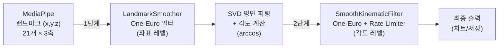
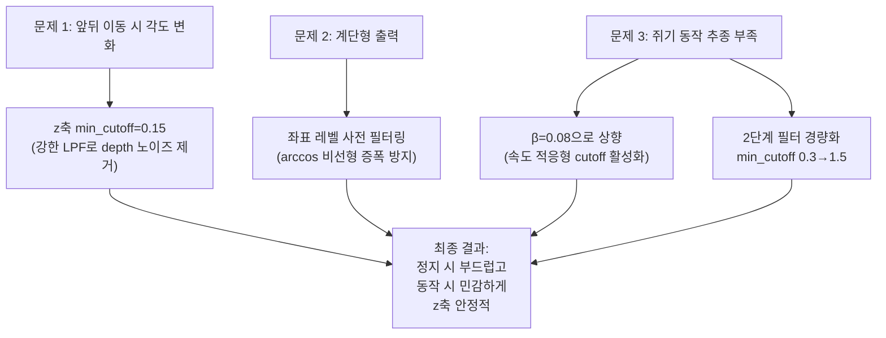

# [2026.08.31] 필터 파이프라인 구조 및 파라미터 튜닝 정리노트

## 1. 전체 구조: 2단계 필터 파이프라인



---

## 2. 사용 필터: One-Euro Filter

> **논문**: Casiez et al., *"1€ Filter: A Simple Speed-based Low-pass Filter for Noisy Input in Interactive Systems"*, CHI 2012

### 핵심 수식

```
실제 cutoff = min_cutoff + β × |속도|
```

| 파라미터       | 역할                                                              |
| -------------- | ----------------------------------------------------------------- |
| `min_cutoff` | 정지 시 최소 차단주파수 (Hz).**낮을수록 부드러움** (지연↑) |
| `beta (β)`  | 속도 적응 계수.**높을수록 빠른 움직임에 반응적**            |
| `d_cutoff`   | 속도(미분값) 자체를 스무딩하는 차단주파수                         |

### 왜 One-Euro인가?

- **Kalman 필터**: 정확하지만 시스템 모델(관절 역학)을 정의해야 하고, 파라미터 튜닝 복잡
- **이동평균**: 단순하지만 고정 지연이 생기고, 빠른 움직임도 느리게 만듦
- **Butterworth LPF**: 고정 cutoff라 정지 시 노이즈 제거 vs 동작 시 추종 사이에서 타협 불가
- **One-Euro**: 정지 시 강한 스무딩 + 빠른 동작 시 자동 추종. **파라미터 2개로 직관적 튜닝**

---

## 3. 1단계: LandmarkSmoother (좌표 레벨 필터)

> 코드 위치: [app_gui.py - LandmarkSmoother](file:///c:/Users/passp/Desktop/univercity/4-2/캡스톤/05_웹캠_핸드트래킹_테스트/app_gui.py#L140-L163)

### 적용 대상

- 21개 랜드마크 × 3축 = **63개 독립 One-Euro 필터**
- 각도 계산(arccos) **이전**에 적용

### 파라미터

| 축          | min_cutoff | beta (β) | d_cutoff | 설명                                            |
| ----------- | ---------- | --------- | -------- | ----------------------------------------------- |
| **x** | 0.4        | 0.08      | 1.2      | 적당한 스무딩 + 높은 속도 적응                  |
| **y** | 0.4        | 0.08      | 1.2      | x와 동일                                        |
| **z** | 0.15       | 0.002     | 0.8      | **매우 강한 스무딩**, 속도 적응 거의 없음 |

### 왜 이렇게 설정했는가

#### x, y축 (min_cutoff=0.4, β=0.08)

- **min_cutoff=0.4Hz**: 정지 시 MediaPipe 히트맵의 **양자화 스텝**(서브픽셀 점핑)을 제거
- **β=0.08 (높음)**: 쥐었다 펼 때 손가락 속도가 올라가면 cutoff가 자동으로 높아져서 **실제 동작을 빠르게 추종**
- 예시: 정지 시 cutoff ≈ 0.4Hz (부드러움) → 빠른 쥐기 시 cutoff ≈ 0.4 + 0.08×500 ≈ 40Hz (거의 raw)

#### z축 (min_cutoff=0.15, β=0.002)

- **min_cutoff=0.15Hz**: MediaPipe의 단안 z 추정은 **노이즈가 x,y보다 5~10배 큼**. 매우 강하게 스무딩해야 함
- **β=0.002 (매우 낮음)**: 앞뒤로 빠르게 이동해도 z축 스무딩을 풀지 않음. z의 빠른 변화는 대부분 **노이즈**이지 실제 동작이 아니기 때문
- **d_cutoff=0.8**: 속도 미분값 자체도 더 강하게 스무딩

### 왜 좌표 레벨에서 필터링하는가

```
각도 = arccos(내적 / (노름 × 노름))
```

- arccos는 **비선형 함수**
- 좌표에 양자화 노이즈가 있으면 → 내적/노름에서 증폭 → arccos에서 더 증폭
- **좌표를 먼저 스무딩하면** 이 비선형 증폭 자체가 방지됨

---

## 4. 2단계: SmoothKinematicFilter (각도 레벨 필터)

> 코드 위치: [app_gui.py - SmoothKinematicFilter](file:///c:/Users/passp/Desktop/univercity/4-2/캡스톤/05_웹캠_핸드트래킹_테스트/app_gui.py#L104-L134)

### 구성 요소

1. **One-Euro 필터** (각도값에 적용)
2. **Rate Limiter** (프레임 간 최대 변화량 제한)
3. **Missing Value Handler** (손 미인식 시 값 유지)

### 파라미터

| 파라미터          | 값               | 설명                                                      |
| ----------------- | ---------------- | --------------------------------------------------------- |
| min_cutoff        | **1.5**    | 높은 값 → 가벼운 스무딩 (1단계에서 이미 충분하므로)      |
| beta (β)         | **0.05**   | 적당한 속도 적응                                          |
| max_deg_per_frame | **30.0°** | 1프레임(~33ms)에 최대 30° 변화 허용 (30fps 기준 900°/s) |
| max_missing_hold  | 12               | 손 미인식 시 최대 12프레임(~0.4초) 동안 마지막 값 유지    |

### 왜 이렇게 설정했는가

- **min_cutoff=1.5 (높음)**: 1단계 LandmarkSmoother가 **주된 노이즈 제거를 담당**하므로, 2단계는 가볍게만 보정
- **β=0.05**: 적당한 속도 적응. 1단계보다는 낮지만 충분
- **max_deg_per_frame=30°**: 정상적인 손 쥐기 동작은 ~300°/s 이내. 30° × 30fps = 900°/s까지 허용하므로 실제 동작은 제한하지 않으면서, **MediaPipe의 순간적인 랜드마크 점핑**(한 프레임에 50°+ 변화)은 차단
- **Missing Value Handler**: 손이 잠깐 프레임에서 사라졌을 때 그래프가 0으로 떨어지는 것 방지. 12프레임 후에는 서서히 160°(펴진 상태)로 복귀

---

## 5. 문제 해결 및 파라미터 결정 과정


