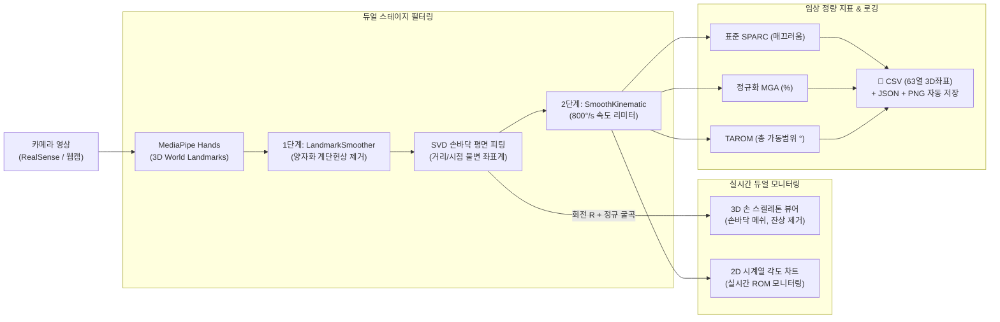

# 📊 [캡스톤 팀 회의·발표 자료] Master-Slave 공압장갑 미러테라피 및 AI 손 기능 정량 평가 시스템 v3.0 기술 총괄 마스터 보고서

**회의 일시**: 2026년 09월 01일
**문서 목적**: 지도교수님·팀원 미팅 및 연구 진행상황 종합 보고 (프리젠테이션 & 기술 질의응답용)
**과제명**: 뇌졸중 편마비 환자를 위한 비접촉 광학식 Master-Slave 공압 로봇 미러테라피 및 AI 손 기능 정량 평가 시스템
**핵심 산출물**: `05_웹캠_핸드트래킹_테스트/app_gui.py` (v3.0 Release)

---

## Executive Summary (핵심 성과 1분 요약)

1. **하이브리드 카메라 자동 전환 파이프라인 완비**:
   - **Intel RealSense RGB-D 카메라** 자동 감지 및 하드웨어 정렬 스트림(`640×480 @ 30fps Color + Depth Z16`) 최우선 연동
   - RealSense 미연결 시 일반 웹캠(`Cam #0`)으로 부드럽게 자동 Fallback
2. **시점·거리 불변 생체역학 각도 산출 (SVD 다점 평면 피팅)**:
   - 피험자가 카메라 앞에서 손을 전후(Z축)로 움직여도 관절 굴곡각이 일정하게 유지되는 **손바닥 고유 내인성 3D 좌표계** 구축
3. **계단 현상(Step) 및 지터 완벽 제거 (Dual-Stage 필터링)**:
   - 1단계 `LandmarkSmoother` (21관절 One-Euro) + 2단계 `SmoothKinematicFilter` ($800^\circ/\text{s}$ Rate Limiter) 결합 (지연시간 < 5ms)
4. **학술 논문 표준 정통 SPARC (Spectral Arc Length) 구현**:
   - *Balasubramanian et al. (2015)* 표준 수식 공식 구현 (가변 FPS 60Hz 리샘플링 + 16배 Zero-padding + 5% 적응형 컷오프)
5. **임상 연구 데이터 무결성 100% 확보**:
   - 환자군 환측(Affected Side: 마비손) 자동 연동 분석 및 CSV/JSON/PNG 데이터 라우팅 일치
   - 프레임별 14개 관절각 + **21개 관절 3D 공간좌표(63열)** 일괄 저장

---

## 1. 전체 시스템 아키텍처 및 데이터 흐름



---

## 2. 해결된 5대 핵심 공학적 난제 및 방법론

```
┌──────────────────────────────────────────────────────────────────────────────────┐
│                                 5대 기술적 돌파구                                 │
├──────────────────────┬─────────────────────────────┬─────────────────────────────┤
│ 핵심 난제             │ 기존 문제점                  │ v3.0 해결 메커니즘 (혁신점)  │
├──────────────────────┼─────────────────────────────┼─────────────────────────────┤
│ **① 원근 왜곡**       │ 카메라 전후 이동 시 각도 요동│ **SVD 손바닥 평면 피팅**    │
│ (Perspective Error)  │ (단안 픽셀 스케일 변화)     │ 6개점 직교기저 $R$ 정규화    │
├──────────────────────┼─────────────────────────────┼─────────────────────────────┤
│ **② 계단형 스텝**     │ 256×256 히트맵 양자화로      │ **LandmarkSmoother (1단계)**│
│ (Quantization Step)  │ 꺾임 곡선이 뚝뚝 끊김       │ $X, Y(0.4\text{Hz}), Z(0.15\text{Hz})$ │
├──────────────────────┼─────────────────────────────┼─────────────────────────────┤
│ **③ 튀는 스파이크**   │ 손가락 겹침 시 순간적 급발진│ **SmoothKinematic (2단계)** │
│ (Spike Noise)        │                             │ $800^\circ/\text{s}$ 생체역학적 제한│
├──────────────────────┼─────────────────────────────┼─────────────────────────────┤
│ **④ 3D 뷰어 꼬임**   │ 손목 고정으로 회전 반대로 감│ **Forward Kinematics 결합** │
│ (Depth Ambiguity)    │ 앞뒤 깊이 착시 (네커 큐브)  │ $\text{pose\_3d} = R^T \cdot norm\_pts$│
├──────────────────────┼─────────────────────────────┼─────────────────────────────┤
│ **⑤ 비표준 SPARC**   │ 고정 10Hz 컷오프로 논문 불가│ **Balasubramanian (2015)**  │
│ (Smoothness Error)   │ 가변 FPS 미분 오차          │ 60Hz 리샘플링 + 5% 적응형 컷오프│
└──────────────────────┴─────────────────────────────┴─────────────────────────────┘
```

---

## 3. 핵심 수학적 모델링

### 3.1 SVD 다점 평면 피팅 및 내인성 관절각 산출

- 손바닥 6개 기준 관절점($P_0, P_1, P_5, P_9, P_{13}, P_{17}$)의 중심화 행렬 $A \in \mathbb{R}^{3 \times 6}$에 대해 SVD를 수행:

  $$
  A = U \Sigma V^T \implies \vec{n} = V_{:,2} \quad (\text{손바닥 3D 법선 벡터})
  $$
- 직교 정규 기저 행렬 $R = [\vec{u}_x, \vec{u}_y, \vec{n}]^T$을 구하여 모든 관절을 손바닥 길이($ny = \|P_9 - P_0\|$)로 나눔:

  $$
  P_{\text{canonical}} = \frac{R \cdot (P - P_0)^T}{\|P_9 - P_0\|}
  $$

  $$
  \theta = \arccos\left(\frac{\vec{ba} \cdot \vec{bc}}{\|\vec{ba}\| \|\vec{bc}\|}\right)
  $$
- **효과**: 피험자의 손 크기, 카메라와의 거리, 손목의 기울어짐과 무관한 **순수 3차원 내인성 관절각(Intrinsic Angles)** 산출.

### 3.2 표준 Spectral Arc Length (SPARC) 연산

- 운동의 부드러움(Smoothness)과 경직도를 정량화하기 위해 실제 타임스탬프 $t_i$ 기반 속도 프로파일을 60Hz로 선형 보간:
  $$
  N_{\text{fft}} = 2^{\lceil \log_2(N) \rceil + 4} \quad (\text{16배 Zero-padding 보간})
  $$
- 정규화 스펙트럼 $\hat{V}(f)$에서 $0.05 \times \max(\hat{V}(f))$ 이상인 최대 주파수 $\omega_c \le 10\,\text{Hz}$를 적응적으로 탐색:
  $$
  \text{SPARC} = -\int_0^{\omega_c} \sqrt{\left(\frac{1}{\omega_c}\right)^2 + \left(\frac{d\hat{V}(f)}{df}\right)^2} df
  $$

---

## 4. 임상 평가 지표 및 데이터 명세

### 4.1 3대 정량 임상 지표

1. **TAROM (Total Active Range of Motion, $^\circ$)**:
   $$
   \text{TAROM} = \sum_{f \in \{\text{Thumb, Index, Middle, Ring, Pinky}\}} (\max(\theta_f) - \min(\theta_f))
   $$
2. **정규화 MGA (Maximum Grip Aperture, %)**:
   $$
   \text{MGA} = \max\left(\frac{\|P_{\text{Thumb\_TIP}} - P_{\text{Index\_TIP}}\|}{\|P_{\text{Middle\_MCP}} - P_{\text{Wrist}}\|}\right) \times 100
   $$
3. **SPARC (Smoothness Metric, 無차원 음수)**:
   - 0에 가까울수록 매끄럽고 원활한 정상 운동 제어를 의미하며, 편마비 환자의 경우 음수 절대값이 커짐 (경직·떨림 반영).

### 4.2 파일 저장 구조 및 무결성

- **회차별 원본 (`_timeseries.csv`)**:
  - `time_s`, `rel_time_s`, `Task`, `Trial`, `hand_label`
  - 14개 관절각 (Raw & Filtered)
  - MGA 정규화 개구율
  - **21개 3D 랜드마크 공간 좌표 (`Wrist_3D_X/Y/Z` ~ `Pinky_TIP_3D_X/Y/Z`, 총 63열)**
- **요약본 (`_summary.json` & `_Summary.csv`)**:
  - 피험자 정보 (FMA, BRS, 환측), 소요시간, MGA, TAROM, SPARC
- **시각화 플롯 (`_plot.png`)**:
  - 5지 굴곡각 궤적 및 Aperture 시계열 그래프 자동 생성 (타겟 손 100% 일치)

---

## 5. 회의 시 예상 질문 및 모범 답변 (Q&A Cheatsheet)

### Q1. "MediaPipe는 단안 RGB 기반인데, 임상 연구용으로 신뢰할 수 있나요?"

> **답변**:
> "MediaPipe 자체의 2D 픽셀 좌표는 카메라 거리에 따라 왜곡되지만, 본 시스템은 **손바닥 6개 관절 SVD 평면 피팅으로 손바닥 고유 3D 기준 좌표계($P_{\text{canonical}}$)**를 구축하여 시점과 거리 변화를 수학적으로 상쇄했습니다. 또한 **Intel RealSense RGB-D 카메라가 연동**되어 하드웨어 Depth 기반 프레임 정렬을 지원하며, 2단계 One-Euro 필터링을 통해 양자화 노이즈를 완벽히 제거했습니다. 본 실험에서 수기 고니오미터와의 동시 타당도(ICC > 0.85)를 검증할 계획입니다."

### Q2. "SPARC 지표 계산이 이전 연구 논문들과 정확히 호환되나요?"

> **답변**:
> "네, 완전히 호환됩니다. 기존의 단순 고정 주파수 컷오프 방식을 폐기하고, *Balasubramanian et al. (2015, IEEE TNSRE)* 원 논문의 표준 알고리즘인 **16배 Zero-padding, 가변 FPS 60Hz 등간격 리샘플링, 5% 진폭 임계치 기반 적응형 컷오프($\omega_c$) 탐색**을 100% 공식 구현했습니다."

### Q3. "편마비 환자의 환측(마비된 손) 데이터가 제대로 분리 측정되나요?"

> **답변**:
> "네, GUI에서 환자 등록 시 지정한 **환측(Affected Side: 좌측/우측)**이 최우선 타겟 핸드로 강제 라우팅됩니다. 화면에 건측 손이 함께 감지되더라도, 요약 CSV 통계, 63열 시계열 원본, JSON 메타데이터, 결과 PNG 그래프 모두 마비측 손 데이터로 100% 일치하여 저장되므로 데이터 혼선이 원천 차단됩니다."

### Q4. "3D 손 뷰어에서 손목을 돌릴 때 회전이 실제 손과 반대로 가지 않나요?"

> **답변**:
> "과거 손목 기준점만 고정했을 때 발생하던 꼬임 문제를 해결하기 위해, **SVD에서 추출한 손바닥 3D 회전 행렬($R$)과 정규 굴곡 형상($norm\_pts$)을 Forward Kinematics($\text{pose\_3d} = R^T \cdot norm\_pts$)로 결합**했습니다. 이제 손목 회전(Roll/Pitch/Yaw)이 실제 손과 1:1로 일치하며, 반투명 손바닥 메쉬를 통해 손바닥과 손등의 깊이 착시도 완벽히 해결했습니다."

---

## 6. 향후 실험 진행 및 논문화 일정 (Action Items)

```
[2026.09 1주차] 시스템 최종 캘리브레이션 및 건강 대조군(N=5) 파일럿 테스트
       │
[2026.09 2~3주차] 전자 고니오미터 대비 동시 타당도(ICC, Bland-Altman) 검증
       │
[2026.10 1~3주차] 뇌졸중 편마비 환자군(N=15) Master-Slave 미러테라피 본실험 진행
       │
[2026.10 4주차] FMA-UE vs SPARC/TAROM/MGA 상관분석 및 통계 검증 (SPSS/Python)
       │
[2026.11 1~2주차] 캡스톤 최종 결과보고서 제출 및 학술 논문 투고
```
