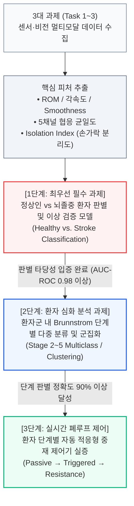

# 실험계획서 08.25 — 공압장갑·비전 미러테라피·온도 햅틱 통합 재활 시스템

**일시**: 2026.08.25  
**작성자**: 이재용  
**연구 제목**: 비전 기반 미러테라피와 공압 소프트 장갑·온도 햅틱을 결합한 뇌졸중 상지 재활 시스템의 파일럿 임상 실증  
**연계 기관**: 에스포항병원

---

## 1. 기존 연구들은 무엇을 했는가 (선행 연구 요약 및 Gap 분석)

### A. 소프트 로봇 장갑 설계 (하드웨어)

- **Radder et al. (2018)** — *J. Rehabil. Med.*
  - 만성 뇌졸중 환자 5명에게 HandinMind(HiM) 소프트 장갑을 착용시킴
  - 손등 위 공압 액추에이터 + 개방형 벨크로 스트랩 구조
  - 착용 전후 비교(단일군): SUS 중앙값 80.0/77.5, IMI 6.3/7로 높은 사용성·내재적 동기 평가, 글러브 착용으로 느려진 과제 수행 시간이 ≤3회 반복 내 비착용 수준으로 회복
  - **한계**: 대조군 없는 단일군 5명 소규모, 미러테라피나 감각 피드백 없음

- **Polygerinos et al. (2015)** — *Robot. Auton. Syst.*
  - 엘라스토머 벨로우즈 공압 액추에이터로 **오픈 팜(Open-palm)** 장갑 설계
  - 건강한 피험자 대상 벤치 테스트: 다양한 물체(원통, 공) 파지 성공
  - 손바닥 개방 구조가 관절 축 불일치 및 전단 응력 통증을 원천 방지함을 입증
  - **한계**: 공학적 설계 검증만 수행, 환자 대상 임상 효과 미검증

- **Yap et al. (2016)** — *J. Med. Devices*
  - 굴곡근 강직(MAS 2–3)으로 주먹이 쥐어진 환자용 초슬림 플라스틱 팽창형 액추에이터 설계
  - 오그라든 손가락 사이에 삽입 후 공압 팽창 → 통증 없이 능동 신전 보조 성공
  - **한계**: 기계적 벤치 테스트만 수행, 실제 환자 착용 임상 미실시

- **Ghobadi et al. (2025)** — *Sensors*
  - Dragon Skin 20 실리콘 + Kevlar 와인딩 기반 **독립 2챔버(MCP/PIP) 액추에이터** 제작
  - MCP 105°, PIP 95° 독립 굴곡, 9.3 N 끝단 파지력 달성
  - **딥러닝 비전 모델**로 장갑에 가려진 4개 관절을 **98% 정밀도**로 추정
  - **한계**: 비전 센싱은 입증했으나, 미러테라피·온도 햅틱과의 결합은 없음

### B. 온도 자극(Thermal Stimulation)의 임상 효과

- **Chen et al. (2005)** — *Stroke*
  - 급성기 뇌졸중 환자 46명(완료 29명) 대상 **단일맹검 RCT**
  - **실험군**: 표준 물리치료 + 온열/한랭 팩 교대 자극, 매일(daily) 30분, 총 6주간 (원문 초록 기준)
  - **대조군**: 표준 물리치료만 시행
  - 실험군에서 Brunnstrom stage, 손목 AROM, Monofilament 감각 유의미 향상 (각 p<0.05)
  - 악력 단독·근긴장도는 유의차 없음
  - **한계**: 온열/냉각 팩 수동 인가(자동화 안 됨), 로봇 보조 없음, 시각 피드백 없음

- **Wang et al. (2024)** — *Cureus*
  - 급성기 뇌졸중 환자 30명 대상 **3군 비교 파일럿 RCT**
  - [물리치료+온도 자극] vs [물리치료+TENS] vs [물리치료 단독]
  - 온도 자극군에서 Hand Brunnstrom stage 유의미 상승 (p<0.05)
  - **한계**: 소규모(30명), 온도 자극과 운동 보조를 동시 결합하지 않음

### C. 미러테라피 + 로봇 장갑 병합

- **Qian et al. (2025)** — *Front. Neurol.*
  - 아급성 뇌졸중 환자 52명 대상 **3군 비교 RCT**
  - [미러테라피 단독(MT)] vs [로봇 장갑 단독(RT)] vs [로봇 장갑 + 미러테라피 병합(RMT)]
  - RMT 복합군이 MT 단독 대비 FMA-UE, Brunnstrom, FIM 모두 유의미 향상 (각 p<0.05)
  - **한계**: 거울 기반 아날로그 미러링(비전 AI 아님), 온도 햅틱 없음, 단계별 적응형 제어 없음

### D. 대뇌 신경 활성화 근거

- **Yap et al. (2017)** — *IEEE TNSRE*
  - MRI 호환 비금속 소프트 장갑을 개발하여 **fMRI 동시 촬영** 수행
  - 능동 파지 / 수동 파지(장갑 보조) / 휴식 세 조건 비교
  - 장갑 보조 시 **M1(운동피질) 및 S1(감각피질) BOLD 신경 활성화** 직접 포착
  - **한계**: 건강한 피험자 대상, 환자 미적용, 미러테라피·온도 결합 없음

### E. Brunnstrom 단계별 맞춤형 로봇 재활

- **Liu et al. (2024)** — *Front. Neurol.*
  - 뇌졸중 환자 53명 대상 **단일맹검 RCT**
  - **RT군(n=26)**: Brunnstrom 단계별로 보조 강도를 자동 전환하는 맞춤형 로봇 훈련
  - **CT군(n=27)**: 동일 시간·빈도의 획일적 통상 물리치료
  - RT군의 FMA-UE 주당 회복 속도 1.979 vs CT군 1.198 points/week (**+0.781 p/w 향상**)
  - BRS III에서 가장 큰 효과 관찰
  - **한계**: 로봇 단일 모달리티(운동 보조만), 시각/감각 피드백 결합 없음

### F. 비전 AI 기반 비접촉 운동 평가

- **Wagh et al. (2025)** — *J. Neuroeng. Rehabil.*
  - 뇌졸중 환자 7명 대상 **MediaPipe Pose Landmarker** proof-of-principle 연구
  - 반몰입형 게이미파이 리칭 과제 5세션 수행, 4개 시점의 운동학 변화 추적
  - 단일 카메라 + MediaPipe만으로 Palm speed, BVE 등 운동학적 지표 추적 가능 입증
  - **한계**: N=7 극소규모, 손가락 관절 단위 측정 아님(상지 전체), 치료 개입 없는 관찰 연구

---

## 2. 기존 연구들의 공통 한계 (Research Gap)

- **단일 모달리티 중재**: 기존 연구들은 [로봇 장갑만], [온도 자극만], [미러테라피만] 각각을 단독 또는 2가지까지만 결합
  - → **[시각(비전 미러) + 운동(공압 장갑) + 감각(온도 햅틱)]을 3중 동기화한 연구는 없음**
- **아날로그 미러링**: Qian et al.의 미러테라피는 물리 거울(광학 거울)을 사용
  - → **비전 AI로 건측 손을 실시간 추적하고, 그 각도로 환측 장갑을 자동 구동하는 디지털 미러링은 수행되지 않았음**
- **일률적 재활**: 대부분의 연구가 모든 환자에게 동일한 프로토콜을 적용
  - → **환자의 Brunnstrom 단계에 따라 자동으로 제어 모드를 전환하는 적응형 시스템은 Liu et al. (2024)이 제안했으나, 시각·감각 통합은 없음**
- **정량 평가 부재**: 대부분 FMA-UE 같은 치료사 주관 평가 척도에 의존
  - → **비전 AI를 통해 0.1° 단위 관절각, 속도, 동기화 오차를 실시간 자동 계측하는 객관적 정량 시스템은 없음**

---

## 3. 우리는 무엇을 하는가 (본 연구의 실험 내용)

### 3-1. 연구 시스템 구성

- **공압 소프트 장갑 (환측 착용)**
  - 오픈 팜 구조, 손등 위 액추에이터 배치
  - 5채널 굴곡 센서 내장 (손가락별 실시간 각도 읽기)
  - 솔레노이드 밸브 PWM PID 제어로 공기압 비례 인가

- **비전 AI 미러테라피 (건측 추적)**
  - 단일 RGB 웹캠 + MediaPipe Hand (21개 관절 랜드마크)
  - 건측 손의 굴곡 각도를 실시간 추출 → 공압 장갑의 구동 신호로 변환
  - 건측 손 영상을 좌우 반전하여 모니터에 투사 (디지털 미러링)

- **손끝 온도 햅틱 (펠티어 소자)**
  - 물체를 쥐는 시점(Grasp Event)에 온열(38°C) 또는 냉각(22°C) 즉각 인가
  - 대뇌 체성감각피질(S1) 직접 자극 → 시각적 미러 착각에 촉각 감각을 더해 체화감(Embodiment) 극대화

### 3-2. 폐루프 동작 흐름

1. 환자가 건측 손을 카메라 앞에서 움직임
2. MediaPipe가 21개 관절 좌표 추출 → 목표 각도(θ_target) 산출
3. 건측 손 영상이 좌우 반전되어 모니터에 투사 (시각적 미러 착각)
4. θ_target에 비례하여 환측 공압 장갑의 밸브 PWM 제어 → 마비된 손가락이 건측과 동일하게 움직임
5. 환측 장갑 5채널 센서가 실제 각도(θ_actual) 측정 → 추종 오차(Δθ) 보정
6. 물체 파지 접촉 시 펠티어 소자가 온/냉 햅틱 인가

---

## 4. 우리는 왜 이 실험을 하는가 (연구 동기 및 목적)

### 4-1. 핵심 동기

- 뇌졸중 편마비 환자는 **"학습된 비사용(Learned Non-Use)"**으로 마비된 손을 점점 더 안 쓰게 됨
- 기존의 단순 물리치료나 아날로그 거울치료는:
  - 시각 피드백만 있고 실제 운동 보조가 없거나 (거울치료)
  - 운동 보조만 있고 환자 뇌의 능동 참여가 부족하거나 (로봇 장갑 단독)
  - 감각 입력이 빠져서 감각-운동 루프 재건이 불완전함

### 4-2. 해결하고자 하는 문제

- **문제 1**: 시각·운동·감각 3가지를 동시에 동기화한 재활 시스템이 없음
  - → **우리의 해결**: 비전 미러링 + 공압 장갑 + 펠티어 햅틱을 0.1초 이내에 동기화하여 S1-M1 감각운동 루프를 3중으로 자극
- **문제 2**: 아날로그 거울은 실제 힘을 주지 못하고, 비전 기반 디지털 미러링은 시도된 적 없음
  - → **우리의 해결**: 카메라가 건측 손을 추적 → 환측 장갑이 자동 추종 → 환자는 거울 화면 속에서 양손이 완벽히 움직이는 착각 + 실제 물리적 힘도 제공
- **문제 3**: 모든 환자에게 동일한 프로토콜을 적용하는 일률적 재활
  - → **우리의 해결**: 3대 과제로 환자의 Brunnstrom 단계를 정량 분류한 뒤, 단계별로 제어 모드를 자동 전환 (수동보조 → 트리거보조 → 저항훈련)
- **문제 4**: 재활 효과를 치료사의 주관적 눈대중 점수(0/1/2점)로만 평가
  - → **우리의 해결**: MediaPipe 비전 AI로 관절각도·속도·동기화 오차·손가락 분리도를 0.1° 단위로 자동 계측 → 객관적 정량 데이터 확보

---

## 5. 어떻게 실험할 것인가 (실험 프로토콜)

### 5-1. 피험자 모집

- **환자군**: 아급성기 편측 뇌졸중 환자 **15~20명**
  - 발병 후 2주~6개월
  - Brunnstrom Stage 2~5
  - 상지 운동 기능 일부 남아있는 자
- **대조군 (정상)**: 연령·성별 매칭 건강한 성인 **15명**
- **총 규모**: 30~35명

### 5-2. 1회 세션 구성 (환자 1인당 약 20~30분)

#### Task ① — 최대 굴곡·신전 (Mass Open/Close)

- **수행 방법**:
  - 허공에서 5손가락을 최대한 쥐었다 펴기 반복
  - 무보조 시도 4회 → 공압 보조 시도 4회 (총 8회)
- **왜 하는가**:
  - 굴곡은 가능하나 자발적 신전(손 펴기)이 불가능한지 판별 → **Brunnstrom 1~3단계 구분**
  - 공압 보조 전/후 비교로 강직 저항성(Stiffness)을 정량화
- **측정 데이터**:
  - 순수 관절가동범위(ROM, 최대 굴곡각·최대 신전각)
  - 최대 굴곡 속도(°/s) 및 최대 신전 속도(°/s)
  - 공압 보조 전후의 ROM 차이(Δ_assist)

#### Task ② — 감싸쥐기 (Cylinder / Sphere Grasping)

- **수행 방법**:
  - 표준 원통(지름 5cm) 및 구형(지름 7cm) 물체를 손바닥 전체로 감싸쥐기
  - 무보조 8회 시도
  - 물체를 쥐는 순간 **펠티어 온도 햅틱 자극(온열 38°C / 냉각 22°C)** 인가
- **왜 하는가**:
  - 5개 손가락이 물체 형태에 맞춰 균일하게 굽혀지는 **협응(Coordination)** 능력 판별 → **Brunnstrom 4~5단계 구분**
  - 온도 햅틱 인가 전/후로 파지 동작의 안정성·균일도 변화 관찰
  - 공동운동(Synergy) 패턴에서 벗어나 물체 형태에 적응할 수 있는지 확인
- **측정 데이터**:
  - 5채널 손가락별 굴곡 비율(균일도 = 표준편차가 작을수록 우수)
  - 물체 접촉 시점 동시 수축(Co-contraction) 패턴
  - 온도 자극 유/무에 따른 파지 안정성 변화

#### Task ③ — 검지 단독 굴곡 (Isolated Index Flexion)

- **수행 방법**:
  - 나머지 4개 손가락을 가능한 한 고정한 상태에서 검지만 굽히기
  - 무보조 8회 시도
- **왜 하는가**:
  - 공동운동 패턴에서 완전히 벗어나 **개별 손가락을 독립적으로 제어**할 수 있는지 판별 → **Brunnstrom 5~6단계 구분**
  - 정상인은 검지만 움직이고 나머지는 거의 안 움직이지만, 환자는 검지를 굽히면 다른 손가락도 같이 굽혀짐
- **측정 데이터**:
  - 검지 굴곡각(°) 대비 비목표 손가락 4개의 원치 않는 연동 움직임(°)
  - **Isolation Index** = 검지 변화량 / (검지 변화량 + 비목표 변화량 합) → 1에 가까울수록 정상
  - 시도별 분리도 추이 변화(학습 효과 여부)

### 5-3. 미러테라피 조건 (Task ①~② 병행)

- Task ①, ② 수행 시 건측 손으로 동일 과제를 먼저 시연
- MediaPipe가 건측 손 관절 추적 → 환측 장갑이 자동 추종 구동
- 모니터에 건측 손 좌우 반전 영상 투사 (환자는 마비된 손이 움직이는 착각 경험)

---

## 6. 데이터 분석 및 AI 모델링 로드맵 (단계별 3단계 파이프라인)

### 6-1. [Step 1: 최우선 과제] 정상인 vs 환자 차이 증명 및 판별 모델 (Healthy vs. Stroke Model)

- **연구 목적**:
  - 본 연구에서 제안한 3대 과제(Task ①~③)와 비전/5채널 센서 피처가 **정상인과 뇌졸중 환자의 운동학적 차이를 통계적으로 유의미하게 구별해낼 수 있는지(Discriminative Validity)를 최우선 증명**함.
  - 환자 단계별 세부 분류로 넘어가기 전, "이 시스템이 운동 장애 유무를 100%에 가깝게 선별할 수 있는가"를 검증하는 기초 필수 단계.

- **정상인 기준 베이스라인(Normal Baseline Distribution) 구축**:
  - 건강한 대조군 15명(양손 총 30개 손 데이터)의 3대 과제 데이터로부터 피처별 정규분포(평균 $\mu$, 표준편차 $\sigma$, 95% 신뢰구간) 산출
  - 정상인의 고유 운동학적 기준선(정상 ROM, 정상 신전 속도, 완벽한 분리도 $II \approx 1.0$) 확립

- **환자-정상인 간 핵심 차이 검증 피처 (Feature Vector)**:
  1. **가동성 피처 (ROM & Extension Deficit)**: Task ①에서 최대 신전각 부족분(손이 완전히 펴지지 않는 각도 오차)
  2. **운동 속도 및 원활도 (Kinematic Smoothness)**: 최대 각속도(°/s), 속도 프로파일의 피크 수(Movement Units, 불연속적 떨림/경직 측정)
  3. **형태 협응 균일도 (Coordination Variance)**: Task ② 파지 시 5개 손가락 굴곡비의 분산(Variance) — 정상인은 물체 곡률에 맞춰 균일 적응, 환자는 공동운동으로 비정상적 과굴곡/미달
  4. **손가락 독립 분리도 (Isolation Index, $II$)**: Task ③에서 검지 외 4개 손가락의 원치 않는 연동 움직임 비율 ($II < 0.6$이면 병적 공동운동)

- **통계 검정 및 머신러닝 분류 모델**:
  - **통계적 차이 검정**: 독립표본 t-검정(Independent t-test) 및 Mann-Whitney U 검정 ($p < 0.001$ 수준에서 정상 vs 환자 간 유의차 입증)
  - **이상 감지(Anomaly Detection)**: One-Class SVM, Mahalanobis Distance 기반 정상 분포 이탈도 점수화
  - **이진 분류(Binary Classification)**: Logistic Regression, Support Vector Machine(SVM with RBF kernel), Random Forest, XGBoost
  - **목표 성능**: **Classification Accuracy $\ge 95\%$, AUC-ROC $\ge 0.98$ 달성**

---

### 6-2. [Step 2: 심화 과제] 환자군 내부 Brunnstrom 단계별 정밀 분류 및 군집화 (Stage-Specific Model)

- **연구 목적**:
  - 환자군(N=15~20) 내부에서 회복 수준(Brunnstrom Stage 2, 3, 4, 5)에 따른 운동학적 특성 패턴을 정량화하고 자동 판별
- **분류 모델**:
  - Multi-class SVM, Random Forest Classifier, k-NN
  - 비지도 군집화(k-Means, t-SNE)를 통해 임상 평가(FMA-UE)와 일치하는 환자 서브그룹 군집 형성 확인
- **목표 성능**:
  - 전문의/치료사의 **Brunnstrom 단계 평가 결과와 AI 예측 일치도 $\ge 90\%$** 달성
  - 정량 피처와 FMA-UE 임상 점수 간 **피어슨 상관계수 $r \ge 0.85$** 달성

---

### 6-3. [Step 3: 최종 실증] 단계별 적응형(Adaptive) 폐루프 제어 연동

- **제어 모드 자동 전환**:
  - Step 1/2 모델이 실시간으로 판별한 환자의 회복 단계에 따라 공압/햅틱 모드 자동 변경
  - **Stage 2~3**: 수동 신전 완전 보조 + 온열 햅틱 이완 모드
  - **Stage 4**: 환자 의도 트리거 보조 + 물체 접촉 온도 피드백 모드
  - **Stage 5~6**: 비목표 손가락 신전 지지 + 검지 독립 저항 훈련 모드

---

## 7. 기대 효과 및 차별점 요약

### 7-1. 기존 연구 대비 본 연구의 차별점

| 비교 항목 | 기존 연구 | 본 연구 |
|:---|:---|:---|
| **진단/검증 체계** | 정상인 데이터 없이 환자군만 관찰하거나 주관적 평가 의존 | **[1단계] 정상인 대조군 baseline 구축 및 정상 vs 환자 95% 이상 정량 판별 모델 최초 검증** |
| **중재 모달리티** | 시각(거울) 피드백만 단독 제공 또는 로봇 단독 | **시각(비전 미러) + 운동(공압) + 감각(온도) 3중 동기화 폐루프** |
| **미러링 방식** | 물리 거울(광학 거울) 기반 아날로그 미러링 | **MediaPipe 비전 AI 디지털 미러링 + 환측 공압 자동 추종** |
| **재활 프로토콜** | 모든 환자에게 일률적 강도의 보조 적용 | **AI 분류 모델 기반 Brunnstrom 단계별 자동 모드 전환 (수동→트리거→저항)** |
| **평가 정밀도** | 치료사의 눈대중 평가 (FMA-UE 0/1/2점 정수 척도) | **비전 AI + 5채널 센서 기반 0.1° 단위 연속형 정량 자동 계측** |
| **온도 자극 방식** | 핫팩/아이스팩 수동 인가 (기록/제어 불가) | **손끝 펠티어 소자 디지털 제어, 파지 이벤트 동기화 즉각 인가** |

### 7-2. 기대되는 학술적 기여

- **임상 진단적 기여**: 정상인과 환자를 95% 이상의 정확도로 명확히 가르는 3대 핵심 운동학 피처(신전 결손각, 협응 분산, Isolation Index)의 임상적 타당성 실증
- **공학적 기여**: 비전 AI(Master) → 공압 솔레노이드 제어(Slave) → 펠티어 햅틱(Feedback)으로 이어지는 초저지연 다중감각 폐루프 시스템 완성
- **AI 재활 기여**: 1단계(정상/환자 판별) $\rightarrow$ 2단계(Brunnstrom 세부 단계 분류) $\rightarrow$ 3단계(적응형 제어)로 이어지는 계층적 AI 재활 프레임워크 구축

---

## 8. 학술적 근거 (References — APA 7th Edition, DOI 원문 대조 완료)

1. Chen, J.-C., Liang, C.-C., & Shaw, F.-Z. (2005). Facilitation of sensory and motor recovery by thermal intervention for the hemiplegic upper limb in acute stroke patients: A single-blind randomized clinical trial. *Stroke*, 36(12), 2665–2669. https://doi.org/10.1161/01.STR.0000189992.06654.ab
2. Ghobadi, N., Kinsner, W., Szturm, T., & Sepehri, N. (2025). Design and evaluation of a soft robotic actuator with non-intrusive vision-based bending measurement. *Sensors*, 25(13), 3858. https://doi.org/10.3390/s25133858
3. Liu, Y., Cui, L., Wang, J., Xiao, Z., Chen, Z., & Xie, Q. (2024). Robot-assisted therapy in stratified intervention: A randomized controlled trial on poststroke motor recovery. *Frontiers in Neurology*, 15, 1453508. https://doi.org/10.3389/fneur.2024.1453508
4. Polygerinos, P., Wang, Z., Galloway, K. C., Wood, R. J., & Walsh, C. J. (2015). Soft robotic glove for combined assistance and at-home rehabilitation. *Robotics and Autonomous Systems*, 73, 135–143. https://doi.org/10.1016/j.robot.2014.08.014
5. Qian, J., Liang, C., Liu, R., Yu, J., Yang, T., & Bai, D. (2025). Combination of robot-assisted glove and mirror therapy improves upper limb motor function in subacute stroke patients: A randomized controlled pilot study. *Frontiers in Neurology*, 16, 1602896. https://doi.org/10.3389/fneur.2025.1602896
6. Radder, B., Prange-Lasonder, G. B., Kottink, A. I. R., Melendez-Calderon, A., Buurke, J. H., & Rietman, H. J. S. (2018). Feasibility of a wearable soft-robotic glove to support impaired hand function in stroke patients. *Journal of Rehabilitation Medicine*, 50(7), 598–606. https://doi.org/10.2340/16501977-2357
7. Wagh, V., Scott, M. W., Andrushko, J. W., Jones, C. B., Larssen, B. C., Boyd, L. A., & Kraeutner, S. N. (2025). Using MediaPipe to track upper-limb reaching movements after stroke: A proof-of-principle study. *Journal of NeuroEngineering and Rehabilitation*, 22, 268. https://doi.org/10.1186/s12984-025-01808-4
8. Wang, H.-C., Chou, W., You, Y.-L., Wang, Y.-L., Hsu, M., Yang, C.-C., Yen, C.-W., & Guo, L.-Y. (2024). Effects of thermal stimulation and transcutaneous electrical nerve stimulation on sensory and motor function of upper extremity in acute stroke survivors: A randomized controlled pilot study. *Cureus*, 16(6), e63375. https://doi.org/10.7759/cureus.63375
9. Yap, H. K., Lim, J. H., Goh, J. C. H., & Yeow, C.-H. (2016). Design of a soft robotic glove for hand rehabilitation of stroke patients with clenched fist deformity using inflatable plastic actuators. *Journal of Medical Devices*, 10(4), 044504. https://doi.org/10.1115/1.4033035
10. Yap, H. K., Kamaldin, N., Lim, J. H., Nasrallah, F. A., Goh, J. C. H., & Yeow, C.-H. (2017). A magnetic resonance compatible soft wearable robotic glove for hand rehabilitation and brain imaging. *IEEE Transactions on Neural Systems and Rehabilitation Engineering*, 25(6), 782–793. https://doi.org/10.1109/TNSRE.2016.2602941
