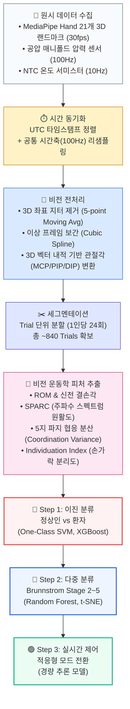

# 캡스톤 프로젝트 데이터 가공 및 AI 학습 전략 가이드 (비전 기반 마커리스 개정판)

> **프로젝트**: 비전 기반 미러테라피 × 공압 소프트 장갑 × 온도 햅틱 통합 재활 시스템
> **데이터 규모**: 정상인 ~15명 + 뇌졸중 환자 ~15~20명 (총 30~35명, 약 720~840 Trials)
> **데이터 소스**: **단일 RGB 카메라 MediaPipe Hand (21개 3D 랜드마크, 63차원) + 공압 매니폴드 압력 센서 + NTC 온도 서미스터**
> **핵심 특징**: 플렉스 센서 배선을 배제한 **100% 완전 비접촉·마커리스(Markerless Non-invasive) 임상 운동학 평가 체계**

---

## 목차

1. [전체 파이프라인 조감도](#1-전체-파이프라인-조감도)
2. [Phase 1: 원시 데이터 수집 및 동기화](#2-phase-1-원시-데이터-수집-및-동기화)
3. [Phase 2: 비전 신호 전처리 (Preprocessing)](#3-phase-2-비전-신호-전처리)
4. [Phase 3: 비전 기반 피처 엔지니어링 (Feature Engineering)](#4-phase-3-비전-기반-피처-엔지니어링)
5. [Phase 4: 학습 전략 Step 1 — 정상인 vs 환자 판별](#5-phase-4-학습-전략-step-1--정상인-vs-환자-판별)
6. [Phase 5: 학습 전략 Step 2 — Brunnstrom 단계별 분류](#6-phase-5-학습-전략-step-2--brunnstrom-단계별-분류)
7. [Phase 6: 학습 전략 Step 3 — 실시간 적응형 제어 연동](#7-phase-6-학습-전략-step-3--실시간-적응형-제어-연동)
8. [소규모 임상 데이터의 함정과 방지책](#8-소규모-임상-데이터의-함정과-방지책)
9. [추천 기술 스택 및 라이브러리](#9-추천-기술-스택-및-라이브러리)
10. [전체 참고문헌](#10-전체-참고문헌)

---

## 1. 전체 파이프라인 조감도



---

## 2. Phase 1: 원시 데이터 수집 및 동기화

### 2.1 2원화 세션 구조 (평가 세션 vs 훈련 세션)

플렉스 센서를 배제함으로써 시스템을 **[평가 세션]**과 **[재활 훈련 세션]**으로 명확히 2원화하여 운영합니다.

```text
┌─────────────────────────────────────────────────────────────────────────────┐
│ 1. 임상 정량 평가 세션 (Assessment Session) — 순수 맨손 비전 추적          │
│    • 환자가 장갑을 벗고 카메라 앞에서 3대 과제(Task ①~③) 수행              │
│    • MediaPipe Hand 21개 3D 관절 좌표(x, y, z) 100% 정밀 추적               │
│    • 장갑의 간섭 없이 순수 환자의 관절 가동성, 경직, 분리도를 객관적 계측   │
├─────────────────────────────────────────────────────────────────────────────┤
│ 2. 폐루프 미러링 재활 세션 (Training Session) — 다중감각 중재               │
│    • 건측 손: 단일 웹캠 MediaPipe가 실시간 추종 ➔ 목표 각도(θ_target) 산출  │
│    • 환측 손: 공압 소프트 장갑 착용 ➔ 비례 압력 인가로 손가락 굴곡/신전 보조│
│    • 손끝: 물체 접촉 시 펠티어 소자가 온열(38°C)/냉각(22°C) 즉각 인가      │
│    • 시스템 로깅: 인가 공기압(kPa), 밸브 PWM 듀티비, 손끝 온도(°C) 기록    │
└─────────────────────────────────────────────────────────────────────────────┘
```

### 2.2 멀티모달 데이터 스트림 구성

| 데이터 소스                       |            채널 수            | 샘플링 레이트 | 데이터 형태             | 단위 및 설명                                                             |
| :-------------------------------- | :---------------------------: | :-----------: | :---------------------- | :----------------------------------------------------------------------- |
| **MediaPipe Hand 랜드마크** | 21 × 3 (x,y,z) =**63** |    ~30 fps    | 정규화된 3D 월드 좌표   | Wrist, Thumb(1~4), Index(5~8), Middle(9~12), Ring(13~16), Pinky(17~20) |
| **공압 매니폴드 압력**      |              1~2              |    ~100 Hz    | 연속 아날로그 → 디지털 | kPa (환자 강직 저항성 역추정 지표)                                       |
| **NTC 온도 서미스터**       |              1~2              |    ~10 Hz    | 연속 아날로그 → 디지털 | °C (손끝 펠티어 접촉면 실제 온도)                                       |
| **제어 신호 (PWM)**         |              1~2              |    ~100 Hz    | 디지털 듀티비 (0~255)   | 밸브 개폐율 (공압 인가 강도)                                             |

### 2.3 시간 동기화 (Time Synchronization)

> **구현 배경**: 비전 프레임과 센서 스트림의 동기화는 멀티모달 데이터 처리의 표준 전처리 절차로서, 본 연구에서는 **UTC 타임스탬프 기반 정렬** 및 누락 프레임 **3차 스플라인 보간(Cubic Spline Interpolation)**을 적용합니다. 참고로 Wagh et al. (2025, *J. Neuroeng. Rehabil.*)는 단일 카메라 영상을 MediaPipe Pose Landmarker로 처리하여 뇌졸중 환자 운동학 지표를 추출하는 파이프라인의 타당성을 입증하였습니다.

```python
import pandas as pd
import numpy as np
from scipy.interpolate import interp1d

def synchronize_multimodal_streams(mp_df, pressure_df, temp_df, target_hz=100):
    """비전(30fps), 압력(100Hz), 온도(10Hz) 스트림을 공통 100Hz 시간축으로 정렬"""
    t_start = max(df['timestamp'].min() for df in [mp_df, pressure_df, temp_df])
    t_end = min(df['timestamp'].max() for df in [mp_df, pressure_df, temp_df])
    common_time = np.arange(t_start, t_end, 1.0 / target_hz)
  
    synced = pd.DataFrame({'timestamp': common_time})
  
    # 1. MediaPipe 63개 좌표 컬럼 보간 (30fps -> 100Hz, Cubic Spline)
    mp_time = mp_df['timestamp'].values
    for col in mp_df.columns:
        if col != 'timestamp':
            f_interp = interp1d(mp_time, mp_df[col].values, kind='cubic', fill_value='extrapolate')
            synced[f'mp_{col}'] = f_interp(common_time)
          
    # 2. 압력 및 온도 보간 (선형)
    for df, prefix in [(pressure_df, 'pres'), (temp_df, 'temp')]:
        t_vals = df['timestamp'].values
        for col in df.columns:
            if col != 'timestamp':
                synced[f'{prefix}_{col}'] = np.interp(common_time, t_vals, df[col].values)
              
    return synced
```

---

## 3. Phase 2: 비전 신호 전처리

### 3.1 MediaPipe 3D 랜드마크 ➔ 관절 각도(Joint Angles) 변환

MediaPipe의 21개 랜드마크 중 각 손가락의 3개 마디점(예: 검지의 경우 Wrist-MCP-PIP, MCP-PIP-DIP) 사이의 **3차원 공간 벡터 내적**을 통해 물리적 관절 각도(°)를 추출합니다.

```
손가락별 3대 관절 구조:
[손목: 0] ───▶ [MCP: 1, 5, 9, 13, 17] ───▶ [PIP: 2, 6, 10, 14, 18] ───▶ [DIP: 3, 7, 11, 15, 19] ───▶ [Tip: 4, 8, 12, 16, 20]
```

```python
def compute_3d_joint_angle(p_proximal, p_joint, p_distal):
    """세 랜드마크 3D 좌표로부터 관절 굴곡 각도(°) 계산
    p_joint가 관절 회전 중심점
    """
    v1 = np.array(p_proximal) - np.array(p_joint)  # 관절 → 기위(몸쪽) 벡터
    v2 = np.array(p_distal) - np.array(p_joint)    # 관절 → 원위(끝쪽) 벡터
  
    # 3D 벡터 내적
    dot_product = np.dot(v1, v2)
    norm_v1 = np.linalg.norm(v1)
    norm_v2 = np.linalg.norm(v2)
  
    cos_angle = dot_product / (norm_v1 * norm_v2 + 1e-8)
    cos_angle = np.clip(cos_angle, -1.0, 1.0)
  
    # 관절 각도 (180° = 완전 펴짐, 각도가 작아질수록 굽힘)
    # 굴곡각 = 180° - 사잇각 (0° = 완전 펴짐, 90° = 직각 굴곡)
    interior_angle = np.degrees(np.arccos(cos_angle))
    flexion_angle = 180.0 - interior_angle
  
    return flexion_angle

def extract_all_finger_angles(landmarks_frame):
    """단일 프레임(21개 랜드마크)에서 5개 손가락의 MCP 및 PIP 굴곡각 추출"""
    # landmarks_frame: dict 또는 array (21, 3)
    # 랜드마크 인덱스 매핑: [MCP_prox, MCP_joint, MCP_distal/PIP_prox, PIP_distal/DIP]
    finger_indices = {
        'thumb':  (0, 1, 2, 4),    # CMC, MCP, IP, Tip
        'index':  (0, 5, 6, 8),    # Wrist, MCP, PIP, Tip
        'middle': (0, 9, 10, 12),  # Wrist, MCP, PIP, Tip
        'ring':   (0, 13, 14, 16), # Wrist, MCP, PIP, Tip
        'pinky':  (0, 17, 18, 20)  # Wrist, MCP, PIP, Tip
    }
  
    angles = {}
    for finger, (w, mcp, pip, tip) in finger_indices.items():
        # MCP 굴곡각 (손목-MCP-PIP)
        angles[f'{finger}_MCP'] = compute_3d_joint_angle(
            landmarks_frame[w], landmarks_frame[mcp], landmarks_frame[pip]
        )
        # PIP 굴곡각 (MCP-PIP-Tip)
        angles[f'{finger}_PIP'] = compute_3d_joint_angle(
            landmarks_frame[mcp], landmarks_frame[pip], landmarks_frame[tip]
        )
      
    return angles
```

### 3.2 랜드마크 지터 제거 및 속도 미분

> **구현 배경**: MediaPipe 좌표 시퀀스에는 프레임 간 포즈 추정 오차에 기인한 고주파 지터가 포함될 수 있습니다. 본 연구에서는 **사비츠키-골레이(Savitzky-Golay) 필터**를 적용하여 고주파 떨림을 억제하면서 급격한 속도 피크의 감쇄를 최소화하고 운동학 지표의 왜곡을 방지합니다.

```python
from scipy.signal import savgol_filter

def smooth_and_differentiate(angle_series, fs=100, window_length=11, polyorder=3):
    """Savitzky-Golay 필터를 사용하여 부드러운 각도 및 각속도/가속도 동시 산출"""
    # 각도 스무딩
    smooth_angle = savgol_filter(angle_series, window_length=window_length, polyorder=polyorder)
    # 1차 미분 (각속도 °/s)
    smooth_velocity = savgol_filter(angle_series, window_length=window_length, polyorder=polyorder, deriv=1, delta=1.0/fs)
    # 2차 미분 (각가속도 °/s²)
    smooth_accel = savgol_filter(angle_series, window_length=window_length, polyorder=polyorder, deriv=2, delta=1.0/fs)
  
    return smooth_angle, smooth_velocity, smooth_accel
```

---

## 4. Phase 3: 비전 기반 피처 엔지니어링

플렉스 센서 대신 **MediaPipe 21개 3D 관절 궤적**을 기반으로 임상 운동학 바이오마커(Kinematic Biomarkers)를 정밀하게 추출합니다.

---

### 🏗️ 카테고리 A: 가동성 피처 (ROM & Extension Deficit) — Task ①

> **학술적 근거**: Liu et al. (2024, *Front. Neurol.*)는 뇌졸중 환자 53명의 FMA-UE 주당 회복 속도를 분석하며, **ROM(관절가동범위)과 신전 결손각(Extension Deficit)**이 Brunnstrom Stage 2~3 환자를 가장 잘 구별하는 운동학적 지표임을 입증했습니다.

| 피처 번호 | 피처 명                                         | 산출 방식 (비전 3D 기반)                                                                                               | 임상적 의미                                            |
| :-------: | :---------------------------------------------- | :--------------------------------------------------------------------------------------------------------------------- | :----------------------------------------------------- |
|    A1    | **5지 평균 MCP 최대 굴곡 ROM**            | $\text{ROM}_{\text{flex}} = \max(\theta_{\text{MCP}}) - \theta_{\text{rest}}$                                        | 주먹을 쥘 때의 최대 굴곡 능력                          |
|    A2    | **5지 평균 MCP 최대 신전 ROM**            | $\text{ROM}_{\text{ext}} = \theta_{\text{rest}} - \min(\theta_{\text{MCP}})$                                         | 손을 쫙 펼 때의 신전 능력 (**환자의 핵심 장애**) |
|    A3    | **신전 결손각 (Extension Deficit)**       | $\Delta_{\text{ext}} = \text{ROM}_{\text{ext}}^{\text{Normal Baseline}} - \text{ROM}_{\text{ext}}^{\text{Patient}}$  | 정상인 기준치 대비 펴지지 않는 각도 오차               |
|    A4    | **최대 굴곡/신전 각속도**                 | $\dot{\theta}_{\text{flex}}^{\max} = \max(\dot{\theta})$, $\dot{\theta}_{\text{ext}}^{\max} = \max(-\dot{\theta})$ | 쥐기/펴기 동작의 민첩성                                |
|    A5    | **손바닥 개구 면적 (Palm Aperture Area)** | 5개 손가락 Tip 랜드마크가 이루는 3D 다각형의 최대 면적($\text{cm}^2$)                                                | 손을 쫙 폈을 때 공간상 펼쳐지는 크기                   |

```python
def extract_vision_rom_features(trial_angles_dict, landmarks_3d_seq, fs=100):
    """Task ① 단일 Trial에서 비전 가동성 피처 추출"""
    # 5개 손가락 MCP 굴곡각 평균 궤적
    mcp_keys = [k for k in trial_angles_dict.keys() if 'MCP' in k]
    avg_mcp = np.mean([trial_angles_dict[k] for k in mcp_keys], axis=0)
  
    rest_angle = avg_mcp[0]
    rom_flex = np.max(avg_mcp) - rest_angle
    rom_ext = rest_angle - np.min(avg_mcp)
  
    # 각속도
    velocity = np.gradient(avg_mcp, 1.0/fs)
    max_flex_vel = np.max(velocity)
    max_ext_vel = np.max(-velocity)
  
    # 손바닥 최대 개구 면적 (엄지~새끼 Tip 5점의 볼록 껍질 면적)
    from scipy.spatial import ConvexHull
    tip_indices = [4, 8, 12, 16, 20]
    max_area = 0.0
    for frame in landmarks_3d_seq:
        tips = frame[tip_indices, :2]  # 2D 평면 투영 면적
        if len(np.unique(tips, axis=0)) >= 3:
            hull = ConvexHull(tips)
            max_area = max(max_area, hull.volume)  # 2D에서는 volume이 면적
          
    return {
        'ROM_flex_MCP': rom_flex,
        'ROM_ext_MCP': rom_ext,
        'max_flex_velocity': max_flex_vel,
        'max_ext_velocity': max_ext_vel,
        'max_palm_aperture_area': max_area
    }
```

---

### 🏗️ 카테고리 B: 운동 원활도 피처 (Kinematic Smoothness) — Task ①②③

> **학술적 근거**: **SPARC(Spectral Arc Length)**는 Balasubramanian et al. (2012, 2015)가 제안한 운동 원활도 지표로, 뇌졸중 환자의 상지 운동이 정상인에 비해 얼마나 **떨리고 끊기는지(Jerkiness)**를 정량화합니다. MediaPipe 랜드마크의 3D 공간 궤적 속도 프로파일로부터 산출합니다.

```python
def compute_sparc_3d(tip_trajectory_3d, fs=100, fc=10.0):
    """검지 손끝(Index Tip)의 3차원 속도로부터 SPARC 계산
    tip_trajectory_3d: shape (time_steps, 3) [x, y, z]
    """
    # 3D 위치 미분 -> 3D 속도 크기 (Tangential Velocity)
    vel_3d = np.gradient(tip_trajectory_3d, 1.0/fs, axis=0)
    speed = np.linalg.norm(vel_3d, axis=1)  # 스칼라 속력
  
    # 1. FFT
    N = len(speed)
    freq = np.fft.rfftfreq(N, d=1.0/fs)
    Vf = np.abs(np.fft.rfft(speed))
    Vf_norm = Vf / (np.max(Vf) + 1e-8)
  
    # 2. fc(10Hz) 이하 주파수 선택
    fc_idx = np.argmax(freq > fc) if np.any(freq > fc) else len(freq)
    freq_sel = freq[1:fc_idx]
    Vf_sel = Vf_norm[1:fc_idx]
  
    # 3. 호 길이(Arc Length) 계산
    dVf = np.diff(Vf_sel)
    dw = np.diff(freq_sel)
    sparc = -np.sum(np.sqrt((dw / fc)**2 + dVf**2))
  
    return sparc
```

---

### 🏗️ 카테고리 C: 형태 협응 피처 (Coordination) — Task ②

> **학술적 근거**: Qian et al. (2025, *Front. Neurol.*)는 물체 파지 시 **5개 손가락의 관절 굴곡 비율이 균일할수록(분산이 작을수록)** FMA-UE 점수가 높고 Brunnstrom Stage 4~5에 해당함을 보고했습니다.

| 피처 번호 | 피처 명                                       | 산출 방식                                                                                            | 임상적 의미                                          |
| :-------: | :-------------------------------------------- | :--------------------------------------------------------------------------------------------------- | :--------------------------------------------------- |
|    C1    | **5지 MCP 굴곡 비율 분산**              | $\sigma^2_{\text{MCP}} = \text{Var}\left(\frac{\theta_i}{\theta_{\text{target}}}\right)_{i=1}^{5}$ | 물체 형상에 맞춰 5손가락이 고르게 감싸쥐는 균일도    |
|    C2    | **손가락 간 접촉 시점 지연(Phase Lag)** | 5개 손가락 Tip이 물체 표면 거리 역치에 도달하는 시점들의 표준편차(ms)                                | 모든 손가락이 동시에 접촉하는 시간적 협응 능력       |
|    C3    | **온도 햅틱 인가 시 협응 개선도**       | $\Delta\text{Coord} = \sigma^2_{\text{with\_thermal}} - \sigma^2_{\text{without\_thermal}}$        | 펠티어 온도 피드백이 파지 안정성을 향상시키는 효과량 |

```python
def extract_vision_coordination(trial_angles_dict):
    """Task ②에서 5개 손가락의 굴곡 협응 분산 산출"""
    mcp_keys = ['thumb_MCP', 'index_MCP', 'middle_MCP', 'ring_MCP', 'pinky_MCP']
  
    # 파지 완료 시점(최대 굴곡 시점)의 각도
    peak_angles = [np.max(trial_angles_dict[k]) for k in mcp_keys]
  
    # 정규화된 굴곡 비율
    ratios = peak_angles / (np.max(peak_angles) + 1e-8)
  
    return {
        'coordination_variance': float(np.var(ratios)),
        'coordination_cv': float(np.std(ratios) / (np.mean(ratios) + 1e-8))
    }
```

---

### 🏗️ 카테고리 D: 손가락 독립 분리도 (Individuation Index) — Task ③

> **학술적 근거**: Wolbrecht et al. (2018, *Clin. Neurophysiol.*) 및 Li et al. (1998)의 연구에 기반하여, 검지 단독 굴곡 시 **비목표 4개 손가락의 비자발적 연동 움직임(Involuntary Coupling / Enslaving)**을 3D 비전 랜드마크 각도 변화량으로 정량화합니다. Brunnstrom Stage 5~6을 가르는 가장 결정적인 지표입니다.

$$
\text{Individuation Index (II)} = \frac{\Delta\theta_{\text{Index\_MCP}}}{\Delta\theta_{\text{Index\_MCP}} + \sum_{j \in \{\text{Thumb, Middle, Ring, Pinky}\}} \Delta\theta_{j\_\text{MCP}}}
$$

```python
def compute_vision_individuation_index(trial_angles_dict):
    """Task ③에서 비전 기반 Individuation Index 산출"""
    # 안정 기저선 (시작 0.5초 평균) 대비 최대 변화량 계산
    deltas = {}
    for finger in ['thumb', 'index', 'middle', 'ring', 'pinky']:
        angle_seq = trial_angles_dict[f'{finger}_MCP']
        baseline = np.mean(angle_seq[:50])
        deltas[finger] = np.max(np.abs(angle_seq - baseline))
      
    delta_target = deltas['index']
    delta_non_target = deltas['thumb'] + deltas['middle'] + deltas['ring'] + deltas['pinky']
  
    II = delta_target / (delta_target + delta_non_target + 1e-8)
  
    return {
        'individuation_index': float(II),
        'enslaving_total_deg': float(delta_non_target),
        'index_isolation_ratio': float(delta_target / (deltas['middle'] + 1e-8)) # 검지/중지 결합비
    }
```

---

## 5. Phase 4: 학습 전략 Step 1 — 정상인 vs 환자 판별

### 5.1 최우선 접근: One-Class SVM (정상인 기준선 모델링)

정상인 15명의 비전 운동학 피처로 **정상 기준 분포(Normal Distribution Boundary)**를 학습시킨 후, 환자의 데이터를 입력하여 이상치(Anomaly) 점수를 산출합니다.

```python
from sklearn.svm import OneClassSVM
from sklearn.preprocessing import StandardScaler
from sklearn.metrics import roc_auc_score

def train_healthy_baseline_model(X_healthy_features, X_all_features, y_all_labels):
    """정상인 데이터만으로 학습하여 환자를 이상으로 검출 (Step 1 최우선 모델)"""
    scaler = StandardScaler()
    X_healthy_norm = scaler.fit_transform(X_healthy_features)
    X_all_norm = scaler.transform(X_all_features)
  
    # nu=0.05: 정상 데이터 중 5% 이내의 경계 마진 허용
    oc_svm = OneClassSVM(kernel='rbf', gamma='scale', nu=0.05)
    oc_svm.fit(X_healthy_norm)
  
    # 결정 경계 함수 점수 (- 값이 클수록 비정상)
    scores = oc_svm.decision_function(X_all_norm)
    auc = roc_auc_score(y_all_labels, -scores)
  
    print(f"✅ One-Class SVM 기반 정상 vs 환자 판별 AUC-ROC: {auc:.4f}")
    return oc_svm, scaler, auc
```

### 5.2 지도 학습 벤치마크: XGBoost + Feature Importance

```python
from xgboost import XGBClassifier
from sklearn.model_selection import GroupKFold, cross_validate

def train_xgboost_discriminator(X, y, patient_ids):
    """XGBoost 이진 분류 (정상 0 vs 환자 1) with 피험자 단위 GroupKFold"""
    model = XGBClassifier(
        n_estimators=100, max_depth=3, learning_rate=0.05,
        reg_alpha=1.0, reg_lambda=1.0, subsample=0.8,
        random_state=42
    )
  
    # 핵심: 피험자가 train/test에 섞이지 않도록 GroupKFold 적용
    gkf = GroupKFold(n_splits=5)
    scores = cross_validate(
        model, X, y, cv=gkf, groups=patient_ids,
        scoring=['accuracy', 'roc_auc', 'f1']
    )
  
    print(f"✅ GroupKFold Accuracy: {scores['test_accuracy'].mean():.3f} ± {scores['test_accuracy'].std():.3f}")
    print(f"✅ GroupKFold AUC-ROC:  {scores['test_roc_auc'].mean():.3f} ± {scores['test_roc_auc'].std():.3f}")
    return model, scores
```

---

## 6. Phase 5: 학습 전략 Step 2 — Brunnstrom 단계별 분류

### 6.1 Random Forest 다중 분류 (Stage 2 vs 3 vs 4 vs 5)

```python
from sklearn.ensemble import RandomForestClassifier

def train_stage_classifier(X_patients, y_stages, patient_ids):
    """환자군 내부 Brunnstrom 단계 예측 모델"""
    model = RandomForestClassifier(
        n_estimators=150, max_depth=4, min_samples_leaf=2,
        class_weight='balanced', random_state=42
    )
  
    gkf = GroupKFold(n_splits=4)
    scores = cross_validate(
        model, X_patients, y_stages, cv=gkf, groups=patient_ids,
        scoring=['accuracy', 'f1_macro']
    )
  
    model.fit(X_patients, y_stages)
    return model, scores
```

---

## 7. Phase 6: 학습 전략 Step 3 — 실시간 적응형 제어 연동

비전 AI가 판별한 Brunnstrom 단계에 따라 **공압 장갑과 온도 햅틱의 제어 모드가 실시간으로 자동 전환**됩니다.

```python
def real_time_adaptive_rehab_controller(current_vision_features, stage_classifier_model):
    """비전 피처로부터 실시간 단계를 추론하고 제어 모드 자동 전환"""
    predicted_stage = stage_classifier_model.predict([current_vision_features])[0]
  
    if predicted_stage in [2, 3]:
        # [Stage 2~3: 수동 신전 & 강직 이완 모드]
        return {
            'target_stage': predicted_stage,
            'mode_name': 'PASSIVE_FULL_ASSIST',
            'pneumatic_pwm': 230,       # 최대 공압 신전 보조
            'thermal_temp_c': 38.0,     # 온열 자극으로 근긴장도 완화
            'visual_mirror': 'ENABLED'  # 시각적 착각 집중
        }
    elif predicted_stage == 4:
        # [Stage 4: 환자 트리거 협응 모드]
        return {
            'target_stage': predicted_stage,
            'mode_name': 'TRIGGERED_COORDINATION',
            'pneumatic_pwm': 150,       # 의도 감지 시 비례 보조
            'thermal_temp_c': 38.0,     # 파지 이벤트 발생 시 즉각 인가
            'visual_mirror': 'ENABLED'
        }
    else:
        # [Stage 5~6: 선택적 분리 & 저항 훈련 모드]
        return {
            'target_stage': predicted_stage,
            'mode_name': 'ISOLATED_RESISTANCE',
            'pneumatic_pwm': 60,        # 비목표 손가락 신전 지지
            'thermal_temp_c': 22.0,     # 감각 식별 과제 냉각 인가
            'visual_mirror': 'ENABLED'
        }
```

---

## 8. 소규모 임상 데이터의 함정과 방지책

| # | 주의 사항                              | 발생 원인                                | 해결책                                                |
| :-: | :------------------------------------- | :--------------------------------------- | :---------------------------------------------------- |
| 1 | **Trial 레벨 데이터 누수**       | 한 환자의 시행들이 Train/Test에 분산됨   | **`GroupKFold(groups=patient_id)` 필수 사용** |
| 2 | **과도한 피처 수로 인한 과적합** | 피험자 수(35명) 대비 피처 수(>50개) 과다 | L1 정규화 및 RF Feature Importance Top-10 압축        |
| 3 | **카메라 시점 지터 노이즈**      | MediaPipe 프레임 간 미세 떨림            | **Savitzky-Golay 필터**로 미분 노이즈 차단      |
| 4 | **불균형 환자 분포**             | Stage 3 환자가 Stage 5보다 많은 경우     | `class_weight='balanced'` 및 F1-macro 지표 평가     |

---

## 9. 전체 참고문헌

1. **Balasubramanian, S., Melendez-Calderon, A., Roby-Brami, A., & Burdet, E.** (2015). On the analysis of movement smoothness. *Journal of NeuroEngineering and Rehabilitation*, 12, 112.
2. **Ghobadi, N., Kinsner, W., Szturm, T., & Sepehri, N.** (2025). Design and evaluation of a soft robotic actuator with non-intrusive vision-based bending measurement. *Sensors*, 25(13), 3858.
3. **Li, Z.-M., Latash, M. L., & Zatsiorsky, V. M.** (1998). Force sharing among fingers as a model of the redundancy problem. *Experimental Brain Research*, 119(3), 276–286.
4. **Liu, Y., Cui, L., Wang, J., Xiao, Z., Chen, Z., & Xie, Q.** (2024). Robot-assisted therapy in stratified intervention: A randomized controlled trial. *Frontiers in Neurology*, 15, 1453508.
5. **Qian, J., Liang, C., Liu, R., Yu, J., Yang, T., & Bai, D.** (2025). Combination of robot-assisted glove and mirror therapy. *Frontiers in Neurology*, 16, 1602896.
6. **Wagh, V. et al.** (2025). Using MediaPipe to track upper-limb reaching movements after stroke: A proof-of-principle study. *Journal of NeuroEngineering and Rehabilitation*, 22, 268.
7. **Wolbrecht, E. T., Rowe, J. B., Chan, V., Ingemanson, M. L., Cramer, S. C., & Reinkensmeyer, D. J.** (2018). Finger strength, individuation, and their interaction: Relationship to hand function and corticospinal tract injury after stroke. *Clinical Neurophysiology*, 129(4), 797–808. https://doi.org/10.1016/j.clinph.2018.01.057
