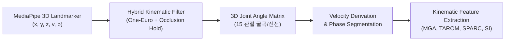

# 실험계획서 08.28 — 공압 소프트 로봇 장갑·비전 미러테라피 및 AI/VLM 기반 손 기능 정량 평가 시스템

**일시**: 2026.08.28**작성자**: 이재용**연구 제목**: 공압 마스터-슬레이브 로봇 장갑과 비전 운동학 분석 및 단계별 AI/VLM 파이프라인을 통한 뇌졸중 손 기능 정량 평가 및 재활 실증 연구**연계 및 활용 장비**: 공압 마스터-슬레이브 소프트 장갑, Intel RealSense D435/D435i, 표준 웹캠, 수동 관절 각도계(Goniometer)**2-Track 마일스톤**:

- **Track A (학술논문 투고 목표)**: 2026.10.12 (알고리즘 고도화 + 파일럿 운동학 평가 + 1단계 AI 정량 분류 모델 검증)
- **Track B (캡스톤 최종 완료 목표)**: 2026.12 (RealSense Depth Ablation 3자 검증 + 2단계 VLM 임상 소견서 자동화 + 통합 시스템 시연)

---

## 1. 실험 과제 및 대상 물체 선정의 임상·생체역학적 당위성

임상 재활 평가(FMA-UE, ARAT, Box and Block)에서 사용하는 파지 유형 중 가장 핵심적인 3가지 동작을 표준화하여 선정함.

```
┌────────────────────────────────────────────────────────────────────────────────────────┐
│                        임상 평가 3대 파지 유형 및 선정 당위성                          │
├──────────────────┬──────────────────┬──────────────────────────────────────────────────┤
│ 과제 (Task)      │ 대상 물체        │ 임상적·생체역학적 평가 목적                      │
├──────────────────┼──────────────────┼──────────────────────────────────────────────────┤
│ Task 1: Free     │ 맨손 (No Object) │ • 외력 저항 없는 순수 능동 가동범위(Active ROM)  │
│                  │                  │ • 손가락 개별 독립 분리도(Individuation) 및 경직 │
├──────────────────┼──────────────────┼──────────────────────────────────────────────────┤
│ Task 2: Cylinder │ 직경 5.0cm 원통  │ • 파워 파지(Power Grasp): 외재 굴곡근(FDS/FDP)   │
│                  │ 높이 12cm, 150g  │ • 컵, 손잡이 등 일상생활(ADL) 필수 파지 능력     │
├──────────────────┼──────────────────┼──────────────────────────────────────────────────┤
│ Task 3: Sphere   │ 직경 7.0cm 구    │ • 구형 파지(Spherical Grasp): 엄지 대립근 협응   │
│                  │ 무게 100g        │ • 5지 방사형 확장 및 MGA 초과/부족 결손 진단     │
└──────────────────┴──────────────────┴──────────────────────────────────────────────────┘
```

### A. 왜 직경 5.0 cm 원통인가? (Cylindrical Power Grasp)

1. **생체역학적 타당성**: 성인 손의 평균 파지 직경(3.5~5.5 cm)의 표준 중간값으로, 손가락의 근위지간관절(PIP)과 원위지간관절(DIP)이 약 60~80° 굴곡되는 이상적인 감싸기 파지 유도.
2. **임상 척도 연계**: **ARAT (Action Research Arm Test) - Subtest 2 (Grasp)**의 표준 원통형 블록 규격을 준용.
3. **평가 지표**: 손바닥과 5개 손가락이 물체 표면에 접촉하는 동시성(Synchronization) 및 파지 유지 안정성(Grasp Stability).

### B. 왜 직경 7.0 cm 구인가? (Spherical Grasp & Opposition)

1. **생체역학적 타당성**: 구형 파지는 엄지손가락의 3차원 대립(Opposition - Opponens pollicis) 및 수근중수관절(CMC)의 복합 회전이 요구됨.
2. **Jeannerod 파지 법칙 및 MGA 민감도**: 물체 크기가 7cm일 때 정상인은 접촉 전 최대 8.5~10.5cm까지 개구(MGA)를 형성함. 뇌졸중 환자의 대표적 증상인 **MGA 과소 형성(Hypometria)** 또는 **과도한 개구(Hypermetria)**가 가장 선명하게 판별되는 임계 직경임.
3. **임상 척도 연계**: **FMA-UE (Fugl-Meyer Assessment)** 손 파트의 '구형 파지(Spherical Grasp)' 항목(테니스공 크기 6.5~7.0cm) 표준 규격.

---

## 2. 구체적인 데이터 처리 파이프라인 및 수학적 수식 (Mathematical Formulations)



### A. 3D 관절 각도 산출 수식 (3D Joint Flexion Angle)

MediaPipe의 3차원 랜드마크 $P_a, P_b, P_c \in \mathbb{R}^3$에 대해, $P_b$를 꼭짓점으로 하는 두 벡터 $\vec{v}_{ba} = P_a - P_b$, $\vec{v}_{bc} = P_c - P_b$를 정의함.

$$
\theta = \arccos \left( \frac{\vec{v}_{ba} \cdot \vec{v}_{bc}}{\|\vec{v}_{ba}\| \|\vec{v}_{bc}\|} \right) \times \frac{180^\circ}{\pi}
$$

- **5개 손가락 관절 산출**:
  - MCP(중수수지관절), PIP(근위지간관절), DIP(원위지간관절) 각 5개 = 총 15개 관절각.
- **Total Active ROM (TAROM)**:
  $$
  TAROM = \sum_{i=1}^{5} \left( \max_{t} \theta_{PIP, i}(t) - \min_{t} \theta_{PIP, i}(t) \right)
  $$

---

### B. Reach vs Grasp 자동 분할 알고리즘 (5% Peak Velocity Threshold)

1. **평균 각속도 산출**:
   $$
   \omega_{avg}(t) = \frac{1}{5}\sum_{i=1}^5 \left| \frac{\theta_{PIP, i}(t + \Delta t) - \theta_{PIP, i}(t)}{\Delta t} \right|
   $$
2. **피크 각속도 검출**: $\omega_{peak} = \max_{t \in [t_{start}, t_{end}]} \omega_{avg}(t)$
3. **Movement Onset (Reach 시작 시점 $t_{reach}$)**:
   $$
   t_{reach} = \min \left\{ t \mid \omega_{avg}(t) \ge 0.05 \times \omega_{peak} \right\}
   $$
4. **Grasp Onset (물체 접촉 시점 $t_{grasp}$)**:
   $$
   t_{grasp} = \min \left\{ t > t_{peak} \mid \omega_{avg}(t) \le 0.05 \times \omega_{peak} \text{ and } \Delta \theta_{avg} < \epsilon \right\}
   $$

---

### C. MGA (Maximum Grip Aperture) 및 MGA Ratio

- 엄지 끝($P_4$)과 검지 끝($P_8$) 사이의 3차원 유클리드 거리 $D(t) = \|P_4(t) - P_8(t)\|$:
  $$
  MGA = \max_{t \in [t_{reach}, t_{grasp}]} D(t)
  $$
- **MGA Scaling Ratio**:
  $$
  R_{MGA} = \frac{MGA}{D_{object}} \quad (D_{object} = 5.0\text{cm or } 7.0\text{cm})
  $$

  *(※ 정상인은 $1.2 \le R_{MGA} \le 1.5$, 뇌졸중 환자는 $R_{MGA} < 1.1$ 또는 불규칙 진동 발생)*

---

### D. 운동 부드러움 지표: SPARC (Spectral Arc Length)

손가락 굴곡 각속도 프로파일 $v(t) = \frac{d\theta}{dt}$에 대해, 푸리에 변환 $V(\omega) = \mathcal{F}\{v(t)\}$ 및 정규화 스펙트럼 $\hat{V}(\omega) = \frac{V(\omega)}{V(0)}$을 적용:

$$
SPARC \equiv -\int_0^{\omega_c} \sqrt{\left(\frac{1}{\omega_c}\right)^2 + \left(\frac{d\hat{V}(\omega)}{d\omega}\right)^2} d\omega
$$

- $\omega_c$: 스펙트럼 에너지가 최대값의 5% 이하로 떨어지는 차단 주파수 (Cut-off frequency).
- 운동이 부드럽고 일정한 단일 벨 모양(Bell-shaped)일수록 SPARC 값은 0에 수렴.

---

### E. 파지 중 Adaptive Occlusion Hold 필터링 수식

물체 파지 중 관절이 가려졌을 때($presence < 0.5$ 또는 $visibility < 0.5$), 이전 상태 기반 지수 유지 모델 적용:

$$
\hat{\theta}(t) = \begin{cases} 
\theta_{raw}(t), & \text{if } presence(t) \ge 0.5 \\
\alpha \cdot \hat{\theta}(t-1) + (1 - \alpha) \cdot \theta_{hold}, & \text{if } presence(t) < 0.5 \text{ and } t - t_{loss} \le T_{hold} \\
\beta \cdot \hat{\theta}(t-1) + (1 - \beta) \cdot 160^\circ, & \text{if } t - t_{loss} > T_{hold}
\end{cases}
$$

- $\theta_{hold} = \hat{\theta}(t_{loss})$ (가림 직전 마지막 유효 파지각, 통상 60~90°)
- $T_{hold} = 3.0\text{초}$ (90프레임 동안 쥐고 있는 상태 유지)
- $\alpha = 0.98, \beta = 0.95$

---

### F. 양손 대칭도 및 시간 지연 (Symmetry Index & Time-Lag)

- **Bilateral Symmetry Index ($SI$)**:
  $$
  SI = \left( 1 - \frac{\sum_{i=1}^5 |\Delta\theta_{i}^{unaff} - \Delta\theta_{i}^{aff}|}{\sum_{i=1}^5 \Delta\theta_{i}^{unaff}} \right) \times 100\%
  $$
- **Time-Lag ($\tau_{lag}$)**: 건측 각속도 $v_{unaff}(t)$와 환측 각속도 $v_{aff}(t)$ 간의 상호 상관(Cross-correlation) 최대 시점:
  $$
  \tau_{lag} = \arg\max_\tau \int v_{unaff}(t) v_{aff}(t + \tau) dt
  $$

---

## 3. 단계별 AI 및 VLM 개발 파이프라인 (2-Stage AI Architecture)

```
[Phase 1: 정량적 운동학 AI 모델] ──> [정량 예측 점수 및 분류 임베딩]
                                               │
                                               ▼
[비디오 키프레임 시퀀스] ───────────────> [Phase 2: VLM 멀티모달 추론] ──> [임상 소견서 자동 생성]
```

### 1단계: 정량적 운동학 기반 손 기능 분류/예측 모델 (Phase 1 AI Model)

VLM 이전에 **정형 운동학 시계열 데이터**를 학습하여 신뢰성 있는 정량 지표를 산출하는 경량 딥러닝/머신러닝 모델을 우선 구축함.

1. **입력 벡터 구성**:
   - $X \in \mathbb{R}^{T \times 24}$ ($T=300$ 프레임, 10초 기준)
   - 피처: 15개 관절 각도, 5개 PIP 각속도, MGA, Aperture, SPARC, Symmetry Index.
2. **모델 아키텍처**:
   - **1D-CNN + Bi-LSTM (또는 Temporal Convolutional Network, TCN)**
   - 특징 맵 추출 $\rightarrow$ 시간적 전후 의존성 학습 $\rightarrow$ 다중 출력 헤드(Multi-head Output).
3. **출력 타겟**:
   - **Head 1 (분류)**: Brunnstrom Stage (Stage 2~5 다중 분류, Softmax).
   - **Head 2 (회귀)**: FMA-UE 손 파트 점수 추정 (0~14점 연속형 회귀, MSE Loss).
   - **Head 3 (이상 감지)**: 경직/비정상 궤적 여부 (Binary).

---

### 2단계: VLM(Vision-Language Model) 기반 임상 소견 및 다중 모달 보고서 생성 (Phase 2 VLM)

Phase 1 모델의 정량적 출력과 실제 동작 영상을 결합하여, 의사/치료사를 보조하는 **자연어 재활 소견서(Rehabilitation Clinical Report)**를 생성함.

1. **멀티모달 프롬프트 구성**:
   - **Visual Input**: Reach-PreShape-Grasp-Hold 주요 시점 4~8개 키 프레임 이미지 그리드.
   - **Structured Data Input**: Phase 1 모델 출력값 (추정 Brunnstrom Stage, FMA 점수, TAROM, MGA Ratio, SPARC, SI, $\tau_{lag}$).
   - **System Role**: "재활의학과 전문의로서 환자의 손 기능 운동학 지표와 동작 비디오를 종합하여 임상 소견서를 작성하라."
2. **VLM 추론 모델**:
   - Med-Flamingo / LLaVA-Med / GPT-4o-Vision 파이프라인.
3. **출력 리포트 구조**:
   - **1. 기능 요약**: "환자의 우측 손 기능은 Brunnstrom Stage 4 수준으로 추정됨."
   - **2. 관절별 운동학 분석**: "원통 파지 시 MGA Ratio가 1.08로 정상 대비 28% 저하되었으며, 제4·5지 PIP의 신전 결손(Extension Deficit 34°)이 두드러짐. SPARC 수치(-3.82)로 미루어 볼 때 경직에 의한 간헐적 움직임 관찰."
   - **3. 맞춤형 재활 권고**: "공압 장갑을 이용한 원통형 파워 파지 모드 집중 훈련 및 원위부 개별 신전 보조 권장."

---

## 4. 2-Track 연구 및 검증 로드맵 (10월 논문 & 12월 캡스톤)

### 📅 Track A: 학술논문 투고 로드맵 (2026.10.12 마감)

- **핵심 초점**: 소프트웨어 기반 가림 극복 + Reach 단계 MGA 및 SPARC 운동학 지표 검증 + Phase 1 정량 분류 모델의 성능 검증.
- **주차별 계획**:
  - **1주차 (08.28 ~ 09.05)**: `app_gui.py` 소프트웨어 알고리즘 개정 (Reach 분기, Occlusion Hold, 5지 TAROM, SPARC, 대칭도 연산 탑재).
  - **2~3주차 (09.06 ~ 09.20)**: 정상인(N=10) 및 마비 모사군 대상 4대 과제 데이터셋 수집 (~240 Trials 확보).
  - **4주차 (09.21 ~ 09.30)**: Phase 1 AI 모델 학습 (FMA 점수 추정 RMSE < 1.2점, Brunnstrom 분류 정확도 > 90% 달성) 및 통계 분석 (ICC, Paired t-test).
  - **5~6주차 (10.01 ~ 10.12)**: 논문 작성, 도표 정리 및 학술지/학회 투고 완료.

---

### 📅 Track B: 캡스톤 최종 완료 로드맵 (2026.12 마감)

- **핵심 초점**: RealSense D435 Depth 융합(3자 Ablation 검증) + Phase 2 VLM 임상 소견서 자동 생성 파이프라인 + 공압 장갑 마스터-슬레이브 폐루프 통합 시연.
- **주차별 계획**:
  - **10월 중순~말 (10.13 ~ 10.31)**: RealSense D435 Depth 파이프라인 통합 및 수동 각도계(Goniometer) 대비 3자 비교 실험 (Bland-Altman 분석).
  - **11월 상반기 (11.01 ~ 11.20)**: Phase 2 VLM 멀티모달 프롬프트 튜닝 및 임상 소견서 자동 PDF 리포트 생성 기능 구현.
  - **11월 하반기 (11.21 ~ 12.10)**: 미러테라피 치료 효과(중재 전후 SPARC/대칭도 개선) 데이터 종합 실증 및 캡스톤 최종 발표/시연.

---

## 5. 기대 효과 및 결론

1. **임상적 타당성 확보**: FMA-UE 및 ARAT 표준 규격(5cm 원통, 7cm 구)을 차용하고, 운동역학 표준 수식(SPARC, MGA Ratio, TAROM)을 도입하여 단순 키포인트 추적을 넘어선 정밀 의료기기급 평가 지표 체계 구축.
2. **AI 구조의 단계적 완성도**: 1단계 경량 시계열 모델로 정량 점수를 확정한 후 2단계 VLM으로 설명 가능한 소견서를 생성함으로써, 환각(Hallucination) 없는 신뢰성 높은 의료 AI 파이프라인 구현.
3. **일정 리스크 분산**: 10월 논문은 이미 검증된 소프트웨어 파이프라인으로 확실하게 완성하고, 12월 캡스톤에서는 RealSense와 VLM을 결합하여 최종 시스템의 스케일을 극대화함.
