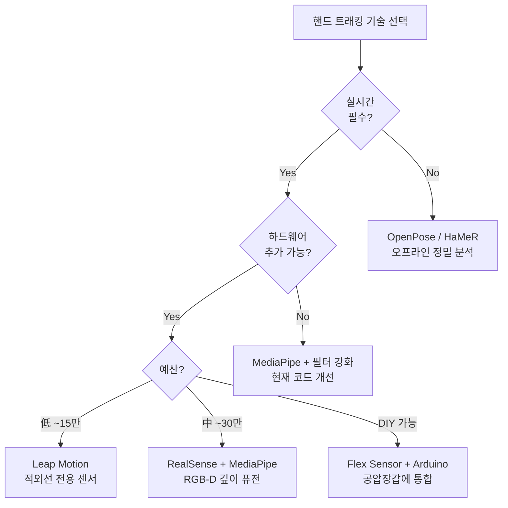

# 기존 연구 근거 및 대안 기술 종합 분석

> 앞서 제안한 개선 방법들이 **실제 학술 논문에서 검증된 방법인지**, 그리고 **MediaPipe 외에 어떤 기술들이 존재하는지**를 정리합니다.

---

## Part 1: 제안한 방법들의 학술적 근거

### ✅ "사용해도 되는" 검증된 방법들

| # | 제안 방법 | 학술 근거 | 판정 |
|:-:|:---|:---|:---:|
| 1 | **Occlusion Hold (가림 시 마지막 값 유지)** | MediaPipe 논문에서 가림(occlusion)이 검지·소지에서 정확도 저하를 일으킨다고 보고. **Kalman Filter / Savitzky-Golay** 등 시간적 보간이 필수적으로 권장됨 (NIH, 2024) | ✅ 검증됨 |
| 2 | **Tracking Confidence (visibility/presence)** | MediaPipe 자체가 landmark별 `visibility`와 `presence` 값을 출력함. **GMH-D 프레임워크** (arxiv, 2024)에서 depth + confidence 기반 가중치를 적용하여 3D 정확도 개선 | ✅ 검증됨 |
| 3 | **Multi-finger Grip Aperture** | Reach-to-grasp 운동역학 연구에서 **MGA(Maximum Grip Aperture)** 는 엄지-검지 기본이나, 원통형/구형 파지는 **전체 손가락 벌어짐(Hand Spread)** 이 분석 대상 (Frontiers in Neuroscience) | ✅ 검증됨 |
| 4 | **5-finger ROM 개별 산출** | 재활의학에서 **Total Active ROM (TAROM)** = 각 손가락 ROM 합산은 표준 평가 방법. 한 손가락만 보는 것은 편마비 환자의 불균등한 마비 분포를 놓침 | ✅ 검증됨 |
| 5 | **SPARC (운동 부드러움)** | SPARC는 **뇌졸중 상지 재활에서 검증된 표준 지표**. FMA-UE(Fugl-Meyer)와 유의미한 종단적 상관(longitudinal association) 확인됨. 시간 영역 지표(Jerk)보다 속도/시간에 덜 의존적 | ✅ 검증됨 |
| 6 | **캘리브레이션 (0~100% 정규화)** | Leap Motion, 데이터 글러브 연구에서 **비선형 회귀 캘리브레이션** 후 정확도 유의미하게 향상됨. 피험자별 정규화는 inter-subject 비교를 위해 필수적 | ✅ 검증됨 |
| 7 | **양손 동시 대칭도 (Symmetry Index)** | 미러테라피 효과 연구에서 **양측 운동 대칭도**는 핵심 평가 변수. 환측/건측 비교 없이는 미러테라피 효과를 정량화 불가 | ✅ 검증됨 |
| 8 | **영상 녹화** | 임상 실험 프로토콜에서 **동작 영상 기록은 IRB 표준 절차**. 데이터-영상 동기화를 통한 사후 검증(post-hoc review) 필수 | ✅ 검증됨 |
| 9 | **자동 파지 감지 (velocity threshold)** | 각속도(angular velocity) 기반 **movement onset/offset detection**은 운동역학 연구의 표준 방법 (5% peak velocity threshold가 가장 보편적) | ✅ 검증됨 |
| 10 | **메모리 최적화** | 공학적 문제이며 별도 학술 근거 불필요. 장시간 세션에서 streaming write는 표준 관행 | ✅ 해당없음 |
| 11 | **Task별 평가 지표 분기** | 각 과제별 운동역학 분석은 해당 과제의 **functional outcome**에 적합한 지표 선택이 원칙 (ARAT, JHFT 등 표준 과제별 평가 체계 참고) | ✅ 검증됨 |
| 12 | **Excel/PDF 내보내기** | 공학적 편의 기능. 임상 연구자에게 CSV보다 xlsx가 친숙한 것은 사실 | ✅ 해당없음 |

> [!NOTE]
> **12가지 방법 모두 학술적으로 사용해도 되는 검증된 접근법**입니다. 특히 SPARC, MGA, ROM, Symmetry Index는 재활의학에서 수십 년간 사용된 표준 지표이고, MediaPipe의 confidence 값 활용이나 필터링 강화도 최근 논문에서 적극 권장되고 있습니다.

---

### ⚠️ 현재 코드에서 "틀린" MGA 측정 방법

현재 [app_gui.py](file:///c:/Users/passp/Desktop/univercity/4-2/캡스톤/05_웹캠_핸드트래킹_테스트/app_gui.py#L1040-L1041)에서 MGA를 **파지 구간 전체의 max(aperture)** 로 구하고 있는데, 이것은 운동역학 논문의 정의와 다릅니다:

```
❌ 현재: 파지 시작~완료 전체 구간에서 max(엄지-검지 거리)
✅ 논문 기준: "뻗기(reach) 단계에서" 손이 물체에 닿기 직전까지의 max(엄지-검지 거리)
```

MGA는 **물체를 잡으러 손을 뻗는 동안 손가락이 최대한 벌어지는 순간**을 의미합니다. 이미 물체를 쥐고 있는 구간에서는 aperture가 물체 크기에 맞게 좁혀져 있으므로, 그 구간을 포함하면 MGA의 의미가 달라집니다.

**임상 프로토콜에서의 올바른 MGA 측정:**
- Movement onset (손이 움직이기 시작) → **MGA (손가락 최대 벌어짐)** → Object contact (물체 접촉) → Grasp stabilization → Lift
- MGA는 보통 reach 단계의 60~80% 지점에서 나타남
- MGA 값을 물체 크기로 나눈 **MGA ratio** (= MGA / object_size)가 더 표준적

> [!WARNING]
> 현재 시스템은 "파지 시작~완료"를 수동으로 마킹하는 2-State 방식이라, reach 단계와 grasp 단계를 분리하기 어렵습니다. 이를 개선하려면 **velocity-based phase detection** (각속도 기반 자동 단계 분리)을 추가하는 것이 좋습니다.

---

## Part 2: MediaPipe 외 대안 기술 총정리

### 🔬 방법 A — 전문 하드웨어 기반

#### A1. Leap Motion (Ultraleap) — 적외선 손 전용 센서

| 항목 | 내용 |
|:---|:---|
| **원리** | 적외선 스테레오 카메라 + 전용 알고리즘으로 손가락 21개 관절 추적 |
| **정확도** | 높은 반복 신뢰도(reliability), **BUT** 절대 정확도는 고니오미터와 5° 이상 편차 (80% 이상의 측정치에서). 근위부(MCP) 관절에서 오차 큼 |
| **비용** | ~15만원 (센서 단일 기기) |
| **장점** | 별도 마커 불필요, 120fps 고속 추적, MediaPipe보다 depth 정보 정밀, Unity/VR 연동 쉬움 |
| **단점** | 작동 범위 제한(~60cm), 물체 잡으면 여전히 가려짐 문제, 2023년 이후 Intel 제품군 단종 우려 |
| **캡스톤 적합도** | ⭐⭐⭐ (센서만 추가 구매하면 코드 구조 유지 가능) |

#### A2. 데이터 글러브 (Flex Sensor / IMU)

| 항목 | 내용 |
|:---|:---|
| **원리** | 각 손가락에 부착된 곡률 센서(flex sensor) 또는 관성 센서(IMU)로 관절 각도 직접 계측 |
| **정확도** | **가림(occlusion)에 완전 면역** — 물체를 잡아도 센서가 손가락 위에 있으므로 데이터 유실 없음. 높은 정밀도 (~2~5° 오차) |
| **비용** | DIY: ~5만원 (Arduino + flex sensor 5개), 상용: ~100~500만원 (CyberGlove, StretchSense 등) |
| **장점** | 가림 문제 완전 해결, 직접 물리량 측정, 카메라 시야/조명에 무관 |
| **단점** | 착용 부담 (환자에게 스트레스), 개인 캘리브레이션 필수, 센서 열화/마모, 편마비 환자는 착용 자체가 어려울 수 있음 |
| **캡스톤 적합도** | ⭐⭐⭐⭐ (공압장갑 프로젝트라면 글러브에 flex sensor를 통합 가능) |

> [!TIP]
> **공압장갑에 이미 flex sensor가 내장되어 있다면**, 비전(MediaPipe) + 센서(flex/IMU) **멀티모달 퓨전**이 가장 이상적입니다. 가림 시 센서로 보완하고, 센서 캘리브레이션은 비전 값으로 교차 검증할 수 있습니다.

#### A3. RGB-D 깊이 카메라 (Intel RealSense, Azure Kinect)

| 항목 | 내용 |
|:---|:---|
| **원리** | 구조광(Structured Light) 또는 ToF(Time-of-Flight) 방식으로 각 픽셀의 깊이(depth) 정보 추가 제공 |
| **정확도** | MediaPipe RGB + RealSense Depth 결합 시 RMSE ~3.1mm (Penn State, 2024). 단독 RGB 대비 3D 정확도 대폭 향상 |
| **비용** | RealSense D435: ~30만원, Azure Kinect DK: ~50만원 (단종, 중고만 가능) |
| **장점** | 기존 MediaPipe 코드에 depth를 추가만 하면 되므로 **코드 변경 최소**, 3D 정확도 크게 개선, 원래 코드의 카메라를 교체만 하면 됨 |
| **단점** | Intel RealSense 라인업 축소 추세, 야외/강한 조명에서 depth 노이즈, 물체 가림 자체는 해결 못함 |
| **캡스톤 적합도** | ⭐⭐⭐ (하드웨어 추가 구매 필요) |

---

### 🧠 방법 B — 소프트웨어/딥러닝 기반 (코드 교체)

#### B1. MANO 파라메트릭 핸드 모델 + HaMeR / FrankMocap

| 항목 | 내용 |
|:---|:---|
| **원리** | **MANO**(Max Planck Institute)는 손의 3D 메쉬를 45개 파라미터(포즈) + 10개 파라미터(형태)로 표현하는 통계적 모델. HaMeR 등이 단일 RGB 이미지에서 MANO 파라미터를 추정 |
| **정확도** | MediaPipe(21개 키포인트)보다 **3D 메쉬 전체를 복원**하므로 물리적으로 더 정밀. 특히 **물체와의 접촉면/관통(penetration) 방지**에 강함 |
| **비용** | 무료 (오픈소스) |
| **장점** | 해부학적으로 유효한 손 자세만 출력 (비현실적인 손가락 꺾임 방지), 물체와의 상호작용 모델링 가능 |
| **단점** | **GPU 필수** (RTX 3060 이상 권장), 실시간 30fps 어려울 수 있음, 코드 전면 교체 필요 |
| **캡스톤 적합도** | ⭐⭐ (코드 구조 변경 크지만, 논문 퀄리티 향상에는 최상) |

```
대표 프레임워크:
- HaMeR (CVPR 2024): 단일 RGB → MANO 3D 손 메쉬, 가장 최신
- FrankMocap (Meta): 손+몸 동시, 오픈소스
- Hand4Whole (CVPR 2022): 전신+양손
```

#### B2. OpenPose (CMU)

| 항목 | 내용 |
|:---|:---|
| **원리** | Bottom-up 방식 다관절 추정. 손가락 21개 키포인트 + 전신 + 얼굴 동시 검출 |
| **정확도** | 학술 연구에서 가장 많이 인용된 도구, MediaPipe보다 정확하다고 보고하는 논문 다수, **하지만 무겁고 느림** |
| **비용** | 무료 (학술용). 상업적 사용은 라이선스 확인 필요 |
| **장점** | 다인원 동시 추적 가능, 학술 인용 풍부 |
| **단점** | GPU 필수, 실시간 어려움(~15fps), 설치 복잡, 가림 문제는 동일 |
| **캡스톤 적합도** | ⭐⭐ (오프라인 영상 분석에는 좋지만, 실시간 GUI에는 부적합) |

#### B3. Hand-Object Interaction 전용 모델 (HOISDF, HOLD 등)

| 항목 | 내용 |
|:---|:---|
| **원리** | 손과 물체를 **동시에 결합(joint)으로 추적**. Signed Distance Field(SDF)로 물체 표면과 손의 접촉면을 모델링하여, 물체에 가려진 손가락의 위치를 물리적으로 추론 |
| **정확도** | **물체 가림 상황에서 가장 정확** — 2024년 최신 연구 트렌드 |
| **비용** | 무료 (오픈소스, 대부분 연구 단계) |
| **장점** | 물체를 잡고 있을 때도 손가락 포즈 추정 가능 |
| **단점** | 물체의 3D 모델이 사전에 필요한 경우 많음, GPU 고사양 필요, 아직 실시간 어려움, 연구 초기 단계 |
| **캡스톤 적합도** | ⭐ (아직 캡스톤 수준에서 실용화하기 어려움) |

---

### 📊 대안 기술 비교 총정리



| 기술 | 실시간 | 가림 대응 | 정확도 | 비용 | 구현 난이도 |
|:---|:---:|:---:|:---:|:---:|:---:|
| **MediaPipe (현재)** | ✅ 30fps+ | ❌ 약함 | ⭐⭐⭐ | 무료 | ⭐ |
| MediaPipe + 필터 강화 | ✅ 30fps+ | 🟡 개선 | ⭐⭐⭐+ | 무료 | ⭐⭐ |
| **Leap Motion** | ✅ 120fps | 🟡 부분 | ⭐⭐⭐ | 15만원 | ⭐⭐ |
| **RealSense + MediaPipe** | ✅ 30fps | 🟡 부분 | ⭐⭐⭐⭐ | 30만원 | ⭐⭐ |
| **Flex Sensor 글러브** | ✅ 100Hz+ | ✅ 완전 면역 | ⭐⭐⭐⭐ | 5~50만원 | ⭐⭐⭐ |
| **MANO + HaMeR** | 🟡 ~15fps | 🟡 부분 | ⭐⭐⭐⭐⭐ | 무료 (GPU) | ⭐⭐⭐⭐ |
| **OpenPose** | 🟡 ~15fps | ❌ 약함 | ⭐⭐⭐⭐ | 무료 (GPU) | ⭐⭐⭐ |
| **HOI 모델 (HOISDF 등)** | ❌ 연구단계 | ✅ 가장 강함 | ⭐⭐⭐⭐⭐ | 무료 (GPU) | ⭐⭐⭐⭐⭐ |

---

## Part 3: 기존 연구에서의 표준 실험 프로토콜

### 🏥 Reach-to-Grasp 운동역학 표준 프로토콜

기존 연구에서 파지 동작을 평가할 때는 보통 다음 **5단계**로 나누어 분석합니다:

```
[1] Rest         → 시작 자세 유지 (손 테이블 위)
[2] Reach        → 물체를 향해 팔 뻗기 (손가락 벌어짐)
[3] Pre-shape    → 물체 형태에 맞게 손 모양 조정 (★ MGA 발생)
[4] Grasp        → 물체 접촉 및 쥐기 (손가락 굽힘 안정)
[5] Transport    → 물체를 들어올림/이동
```

**현재 코드는 [2]~[5]를 하나의 "파지 구간"으로 묶어버리고 있습니다.** 이상적으로는:
- MGA는 **[2]~[3] 구간**에서 측정
- ROM은 **[1]→[4] 구간의 각도 변화**로 측정
- 소요시간(Movement Time)은 **[2]~[4] 구간**에서 측정
- SPARC(부드러움)는 **[2]~[3] 구간의 velocity profile**에서 측정

### 📋 Trial 안정성 (몇 회 반복해야 하는가?)

| 연구 출처 | 결론 |
|:---|:---|
| NIH (2023) | 대부분의 운동역학 변수는 **2~3회** 시행이면 안정적 성능에 도달 |
| | 단, 복잡한 변수(관절 간 협응, 부드러움)는 **5회 이상** 권장 |
| | 만성 뇌졸중 환자는 정상인보다 변동성이 크므로 **5~10회** 권장 |

→ 현재 코드의 **무제한 Trial 구조**는 적절함. 다만 **3회 이후부터 자동 평균/분산 계산**을 표시해주면 연구자에게 유용합니다.

---

## Part 4: 캡스톤 프로젝트를 위한 실용적 제안

### 🎯 현실적인 접근 전략 3가지

#### 전략 1: **MediaPipe 유지 + 소프트웨어 개선** (추천 — 비용 0원)
> 현재 코드를 최대한 활용하면서 학술적 완성도를 높이는 전략

- 앞서 제안한 **1~7번 개선점** 적용 (occlusion hold, confidence, multi-aperture, 5-finger ROM, SPARC, calibration, bilateral comparison)
- MGA 측정 로직을 논문 정의에 맞게 수정
- **논문에 "한계점(limitation)" 절에 "가림 시 정확도 저하"를 명시**하면 학술적으로 충분히 타당

#### 전략 2: **MediaPipe + RGB-D 깊이 카메라** (비용 ~30만원)
> 3D 정확도를 한 단계 끌어올리는 전략

- Intel RealSense D435를 추가하여 depth 정보로 MediaPipe의 z축 오차 보정
- GMH-D 프레임워크(2024) 참고하여 구현
- **카메라 1대 교체만으로** 기존 PyQt6 GUI 구조 그대로 유지 가능

#### 전략 3: **비전 + 센서 멀티모달** (가장 강력, 비용 ~5~50만원)
> 공압장갑에 센서를 통합하여 가림 문제를 근본적으로 해결

- 공압장갑에 **flex sensor 5개 + Arduino/ESP32** 내장
- 가림 시 flex sensor 값으로 자동 전환 (confidence 기반)
- MediaPipe는 캘리브레이션 교차 검증 및 비접촉 보조 역할
- **"Multimodal fusion" 논문 퀄리티** 달성 가능

> [!IMPORTANT]
> **캡스톤 제출 시한과 예산을 고려하면 전략 1이 가장 현실적**입니다. 소프트웨어 개선만으로도 논문에서 사용되는 모든 핵심 지표(MGA, ROM, SPARC, Symmetry Index)를 추가할 수 있고, 앞서 제안한 12가지 방법은 **모두 학술적으로 검증된 방법들**이므로 안심하고 사용하셔도 됩니다.
