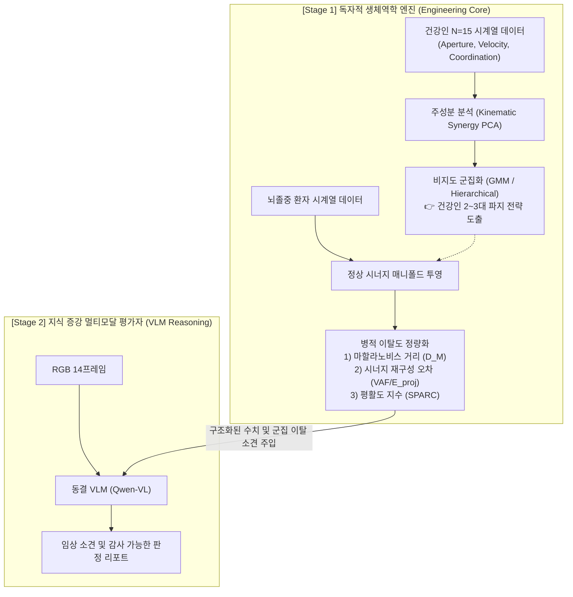

# 비장애인 파지 운동학 클러스터링 기반 뇌졸중 병적 이탈도 정량화 및 VLM 융합 연구: 공학적 기여도 및 오리지널리티 강화 보고서

> **작성일:** 2026-09-18  
> **적용 연구:** RGB-D 운동학 정보를 활용한 양손 손 과제 VLM 평가 파일럿 연구  
> **핵심 목적:** 기성 라이브러리/모델(MediaPipe, Qwen-VL)의 단순 파이프라인 조립이라는 비판을 극복하고, **비장애인(Healthy Control)의 운동학적 다양성 군집화(Kinematic Subtyping)와 뇌졸중 환자의 정상 시너지 매니폴드 이탈도(Kinematic Deviation Index)를 산출하는 독자적 생체역학 엔지니어링 코어**를 구축하여 학술적·공학적 오리지널리티를 확보함.

---

## 0. 문제의 본질과 공학적 돌파구

### 0.1 지도교수님의 비판: "공학적 기여와 오리지널리티 부재"의 본질
공학 심사위원(기계제어·컴퓨터공학)의 관점에서 현재 연구계획서의 외형은 자칫 다음과 같은 **"파이프라인 결합(Pipeline Stitching / Glue Code)"**으로 인식될 위험이 있습니다:
1. 카메라는 상용 센서(Intel RealSense D455)를 구입해 거치함.
2. 손 자세 추정은 구글의 오픈소스 라이브러리(MediaPipe)를 그대로 호출함.
3. 최종 평가는 오픈소스 대형 언어모델(Qwen-VL)에 프롬프트를 넣어 0/1/2 점수를 출력함.
4. 운동학 피처(F1~F4)는 단순 최대값(Max), 최소값(Min), 표준편차(SD) 등의 초등 통계량에 불과함.

이 구조에서는 **"연구자가 직접 수학적으로 모델링하거나 창안한 공학 알고리즘(Engineering Core)"**이 보이지 않습니다.

### 0.2 교수님의 핵심 제안 분석: "비장애인에서도 각각 분류가 다를 것이다"
교수님이 제시한 힌트는 운동제어 및 생체역학(Motor Control & Biomechanics)의 고전적 난제를 찌르고 있습니다:
* **"비장애인 15명은 결코 동일한 궤적으로 물체를 쥐지 않는다."**
* 건강인 내부에서도 손 크기, 접근 속도, 안전 마진(Safety margin), 관절 간 협응 타이밍에 따라 고유한 **파지 전략의 하위 유형(Kinematic Subtypes / Strategies)**이 존재합니다.
* 기존 계획서처럼 건강인 15명을 단순 사분위수(Q1, Median, Q3)라는 1차원 통계로 압축해 버리면, **건강인이 보여주는 풍부한 다차원 운동학 협응(Multivariate Coordination) 정보가 완전히 손실**됩니다.

### 0.3 본 제안의 공학적 솔루션: "2-Stage 생체역학-VLM 하이브리드 아키텍처"
본 보고서는 연구의 큰 틀(4개 과제, RTX 5090, VLM 기반 평가)을 흔들지 않으면서, VLM 앞단에 **독자적인 생체역학 분석 엔진(Kinematic Synergy & Deviation Engine)**을 구축하는 공학적 청사진을 제시합니다.



---

## 1. 생체역학적 이론 배경 및 문헌적 근거

### 1.1 손 파지 시너지 이론 (Kinematic Synergies)
인간의 손은 20개 이상의 자유도(Degrees of Freedom, DoF)를 가집니다. 중추신경계(CNS)가 이 많은 자유도를 개별 제어하는 것은 계산적으로 불가능하므로, 여러 관절을 모듈화된 몇 개의 기본 단위로 묶어 제어한다는 것이 **'운동학적 시너지(Kinematic Synergies)'** 가설입니다.

* **Santello et al. (1998, 2002)**: 다양한 물체를 쥘 때 손가락 관절 각도의 변화를 주성분 분석(PCA)한 결과, **단 2개의 주성분(PC1, PC2)이 전체 분산의 80% 이상을 설명**함을 증명했습니다.
  - **PC1 (제1 시너지)**: 모든 손가락 관절의 동시 굴곡/신전 (손의 전체 크기 조절).
  - **PC2 (제2 시너지)**: 중수지절(MCP) 관절과 지골간(IP) 관절 간의 형태 조절 (원통형 vs 구형 vs 집기 형태 분화).
* **Mason et al. (2001, 2004)**: 도달-파지(Reach-to-grasp) 과정에서 손의 형태 형성(Preshaping)은 물체 접촉 훨씬 전부터 시너지 공간 상에서 부드러운 궤적으로 전개됨을 확인했습니다.

### 1.2 비장애인 내 파지 전략의 다양성 (Healthy Kinematic Heterogeneity)
비장애인이라 하더라도 다음과 같은 차원에 따라 뚜렷한 하위 군집(Subtypes)으로 갈립니다:
1. **Preshaping Scaling 전략 (과도 개방 vs 정밀 개방)**:
   - *안전 우선형(Conservative Grasp)*: 목표 물체보다 손을 1.5~2배 이상 크게 벌린 뒤 천천히 닫는 전략 (떨어뜨릴 위험 최소화).
   - *고효율형(Optimized Grasp)*: 물체 직경보다 약간 큰 최소 마진으로 손을 벌려 빠르게 안착시키는 전략.
2. **운반-파지 시간 협응 (Reach-Grasp Temporal Coupling, Jeannerod 1984)**:
   - 최대 파지 간격($MGA$)이 손목 피크 감속도 시점과 완벽히 동기화되는 집단 vs 손이 물체에 거의 도달한 뒤에야 손가락을 여는 집단.
3. **손가락 간 협응 동시성 (Inter-digit Synchrony)**:
   - 엄지와 검지가 완벽히 대칭적으로 벌어지는 군집 vs 검지가 먼저 펴지고 엄지가 나중에 대향(Opposition)하는 군집.

### 1.3 뇌졸중 편마비에서의 시너지 왜곡 및 붕괴 (Pathological Synergy Alterations)
뇌졸중 환자는 신경 손상으로 인해 건강한 시너지 공간에서 이탈합니다 (Roh et al., 2013; Ting et al., 2015):
* **시너지 병합(Synergy Merging)**: 독립적이던 시너지들이 하나로 뭉쳐져, 팔을 뻗으려고 하면 의도치 않게 손가락이 굳어버림 (이상 굴곡 시너지).
* **매니폴드 이탈(Manifold Deviation)**: 건강인의 2~3차원 시너지 평면 밖으로 궤적이 튕겨 나감 (불규칙한 보정 및 비협응 운동).

---

## 2. [공학 모듈 1] 비장애인 파지 운동학 다차원 군집화 알고리즘

### 2.1 운동학 특성 벡터(Feature Vector)의 수학적 정의
건강인 $N=15$명의 각 시행($k$)에서 30 fps 시계열을 기반으로 6차원 운동학 벡터 $\mathbf{x} \in \mathbb{R}^6$를 구성합니다:

$$\mathbf{x} = \left[ MGA_n, \; t_{MGA\_n}, \; RGC_{lag}, \; SPARC, \; Asym_{thumb-index}, \; Closure_{ratio} \right]^T$$

1. **정규화 최대 파지 간격 ($MGA_n$)**: 물체 직경($W_{obj}$) 대비 최대 벌림 비율
   $$MGA_n = \frac{\max_t a(t)}{W_{obj}}$$
2. **정규화 최대 도달 시점 ($t_{MGA\_n}$)**: 전체 도달 시간 대비 피크 시점
   $$t_{MGA\_n} = \frac{t_{MGA} - t_{onset}}{t_{contact} - t_{onset}}$$
3. **운반-파지 위상 지연 ($RGC_{lag}$)**: 손목 최고 속도 시점($t_{PV}$)과 파지 최대 시점($t_{MGA}$)의 시간차 정규화
   $$RGC_{lag} = \frac{t_{MGA} - t_{PV}}{T_{reach}}$$
4. **스펙트럼 평활도 지수 (SPARC)**: 손목 3D 속도 신호의 푸리에 크기 스펙트럼 호 길이 (Balasubramanian et al., 2015)
   $$SPARC \triangleq -\int_0^{\omega_c} \sqrt{\left(\frac{1}{\omega_c}\right)^2 + \left(\frac{d\hat{V}(\omega)}{d\omega}\right)^2} d\omega$$
5. **엄지-검지 비대칭 지수 ($Asym_{thumb-index}$)**: 손바닥 중심 기준 엄지와 검지의 벌림 변위 비대칭도
6. **접촉 전 폐쇄율 ($Closure_{ratio}$)**: $MGA$ 달성 후 실제 접촉 순간까지 손이 다시 오므라든 비율

### 2.2 가우시안 혼합 모델(GMM) 기반 파지 서브타입 군집화
건강인의 다차원 공간 데이터를 $K$개의 다변량 정규분포의 결합으로 모델링합니다:

$$p(\mathbf{x}) = \sum_{k=1}^K \pi_k \mathcal{N}(\mathbf{x} \,|\, \boldsymbol{\mu}_k, \boldsymbol{\Sigma}_k)$$

* **최적 클러스터 수 ($K$) 결정**: 베이지안 정보 기준(BIC, Bayesian Information Criterion)을 통해 $K=2$ 또는 $K=3$을 자동 선택.
* **추출되는 건강인 파지 서브타입 예시**:
  - **클러스터 1 [고효율-직접 파지형]**: 낮은 $MGA_n$ (1.2~1.4), 높은 $SPARC$ (>-1.5), 작은 $RGC_{lag}$ (도달 감속과 동시에 닫힘).
  - **클러스터 2 [안전마진-신중 파지형]**: 높은 $MGA_n$ (1.6~2.0), 긴 plateau 유지, 손목이 멈춘 후 천천히 파지.
  - **클러스터 3 [동적 사전형상화형]**: 손가락 개폐 속도가 손목 이송 속도보다 현저히 빠른 패턴.

---

## 3. [공학 모듈 2] 뇌졸중 환자의 "정상 매니폴드 이탈도" 정량화

환자($p$)의 데이터가 입력되면, 환자가 어느 건강인 클러스터와 가장 가까운지 매칭하고, 건강인 정상 분포로부터 얼마나 벗어났는지를 나타내는 **3가지 정량적 이탈도 지표**를 자체 알고리즘으로 계산합니다.

### 3.1 지표 1: 마할라노비스 거리 (Mahalanobis Distance, $D_M$)
각 건강인 클러스터 $k$의 공분산 행렬 $\boldsymbol{\Sigma}_k$를 고려한 통계적 거리:

$$D_M(\mathbf{x}_p, k) = \sqrt{(\mathbf{x}_p - \boldsymbol{\mu}_k)^T \boldsymbol{\Sigma}_k^{-1} (\mathbf{x}_p - \boldsymbol{\mu}_k)}$$

* **의미**: 건강인 군집 중심으로부터 몇 $\sigma$만큼 이탈했는가를 공분산 상관관계를 고려하여 다차원 공간에서 측정. 환자의 최단 거리를 **'전반적 운동학 왜곡 지수(Overall Kinematic Anomaly Score)'**로 정의.

### 3.2 지표 2: 시너지 부분공간 투영 잔차 (Synergy Reconstruction Error, $E_{proj}$)
건강인 $N=15$명의 데이터로 주성분 기저 행렬 $\mathbf{V}_r = [\mathbf{v}_1, \mathbf{v}_2] \in \mathbb{R}^{d \times r}$ (상위 2개 주성분)을 구축합니다.  
환자의 벡터 $\mathbf{x}_p$를 건강인 시너지 부분공간에 투영한 뒤 복원되지 않는 잔차 에너지를 계산합니다:

$$\hat{\mathbf{x}}_p = \mathbf{V}_r \mathbf{V}_r^T (\mathbf{x}_p - \bar{\mathbf{x}}_{healthy}) + \bar{\mathbf{x}}_{healthy}$$
$$E_{proj} = \frac{\|\mathbf{x}_p - \hat{\mathbf{x}}_p\|_2}{\|\mathbf{x}_p\|_2} \times 100 \;\; (\%) $$

* **의미**: 건강인의 정상적인 손가락-손목 협응 법칙(시너지)으로 환자의 움직임이 **얼마나 설명되지 않는가(병적 독립 결함/비정상 시너지 결합 정도)**를 0~100%로 나타냄.

### 3.3 지표 3: 시간 협응 디커플링 지수 (Decoupling Index, $\Delta RGC$)
정상인 클러스터의 평균 $RGC_{lag}$와 환자 값의 절대 편차:
$$\Delta RGC = |RGC_{lag, patient} - \mu_{RGC, matched\_cluster}|$$
* **의미**: 손목 도달 운동과 손가락 열림 운동이 시간적으로 분리(Decoupled)되어 따로 노는 현상을 정량화.

---

## 4. [공학 모듈 3] Tool-Augmented VLM과의 지식 주입 결합

이 독자적 알고리즘의 산출물은 VLM(Qwen-VL)의 프롬프트에 **구조화된 도메인 지식(Biomechanical Prior)**으로 주입됩니다.

### 4.1 확장된 A3+ 프롬프트 주입 스키마 (JSON 형태)
기존 A3 조건(단순 Q1, Median, Q3)을 넘어, 우리가 개발한 엔진의 결과를 다음과 같이 전달합니다:

```json
{
  "biomechanical_analysis": {
    "closest_healthy_subtype": "Cluster_1 (High-Efficiency Direct)",
    "kinematic_anomaly_score_DM": 4.82,
    "synergy_reconstruction_error_percent": 38.5,
    "sparc_smoothness": -3.42,
    "healthy_cluster_baseline": {
      "nominal_MGA_mm": 52.1,
      "nominal_RGC_lag": 0.08,
      "nominal_SPARC": -1.35
    },
    "pathological_flags": [
      "SEVERE_SUBMOVE_JERK",
      "TEMPORAL_DECOUPLING_DETECTED",
      "INSUFFICIENT_ACTIVE_RELEASE"
    ]
  }
}
```

### 4.2 VLM의 생성 근거(Rationale) 변화
* **기존 VLM (A1 조건)**: "환자가 손을 컵 쪽으로 뻗어 잡았습니다." (1~2mm 미세 접촉이나 부드러움을 못 보고 환각 발생)
* **제안 시스템 (A3+ 조건)**: "시각적으로 손이 물체에 도달했으나, 자체 생체역학 엔진 분석 결과 정상 시너지 재구성 오차가 38.5%로 비정상적 협응을 보였으며, SPARC(-3.42)가 건강인 군집 1 기준(-1.35)을 심각하게 벗어나 멈칫거림이 극심함. 해제 시 개방 변화량이 미흡하여 최종 1점(부분 완료)으로 판정함."

👉 **공학적 독창성의 완성**: VLM을 단순 분류기로 쓰는 것이 아니라, **"독자 개발한 생체역학 알고리즘 엔진의 정량적 출력을 임상 전문가가 읽을 수 있는 언어로 번역·통합해 주는 멀티모달 보고서 생성기"**로 정의함.

---

## 5. 교수님 면담 및 발표를 위한 "공학적 기여" 정리

교수님이 *"공학적 기여가 무엇이냐?"*고 물으실 때 제시할 **3대 핵심 공학 기여(Engineering Contributions)**입니다:

| 구분 | 기존 계획 (비판받을 수 있는 부분) | 개선된 연구 프레임워크 (본 제안) |
|---|---|---|
| **비장애인 데이터 활용** | 단순 1차원 통계 (Median, Q1, Q3 표) | **다차원 GMM 군집화**를 통한 건강인 파지 서브타입(Kinematic Subtypes) 공간 모델링 |
| **병적 징후 판별 알고리즘** | 단순 문턱값 비교 (`below_Q1` 등) | **시너지 부분공간 투영 잔차($E_{proj}$) 및 마할라노비스 거리($D_M$) 알고리즘** 자체 개발 |
| **평활도(Smoothness) 분석** | 단순 표준편차(F3, 시간 왜곡에 취약) | 푸리에 스펙트럼 적분 기반 **SPARC 알고리즘** 직접 구현 및 탑재 |
| **VLM의 역할 정의** | 0/1/2 점수 맞히는 블랙박스 분류기 | 복잡한 생체역학 지표를 임상 루브릭과 결합하는 **감사 가능한(Auditable) 지식 증강 추론기** |

---

## 6. 개발 및 구현 로드맵 (캡스톤 일정 내 실행 가능성)

본 알고리즘은 복잡한 딥러닝을 새로 학습하는 것이 아니므로, 기존 일정(Phase 0~2) 내에 파이썬 오픈소스 생태계(`numpy`, `scipy`, `scikit-learn`)로 **1~2주 안에 100% 구현 가능**합니다.

1. **1주차 (비장애인 모델링)**:
   - 비장애인 15명의 30 fps $v(t)$, $a(t)$ 시계열에서 특성 벡터 $\mathbf{x}$ 추출.
   - `sklearn.decomposition.PCA` 및 `sklearn.mixture.GaussianMixture`로 클러스터 중심($\boldsymbol{\mu}_k$) 및 공분산($\boldsymbol{\Sigma}_k$) 도출.
   - SPARC 계산 파이썬 함수 모듈화 (`scipy.fft` 기반).
2. **2주차 (이탈도 알고리즘 및 VLM 연동)**:
   - 환자 벡터에 대한 $D_M$ 및 $E_{proj}$ 계산 모듈 완성.
   - 계산된 지표를 연구계획서 부록 B의 VLM 입력 JSON 스키마에 자동 병합하는 브릿지 코드 작성.
3. **산출물**: 
   - 캡스톤 최종 발표 시 **"비장애인 파지 전략 2D/3D 시너지 클러스터링 산점도"**와 **"환자의 시너지 이탈 궤적 그래프"**를 시각화하여 제시 (교수님들이 가장 좋아하는 시각 자료).

---

## 7. 주요 참고문헌 (Academic References)

1. **Santello, M., Flanders, M., & Soechting, J. F.** (1998). Postural hand synergies for tool use. *Journal of Neuroscience*, 18(23), 10105-10115.  
   *(손가락 관절 각도의 PCA 분석을 통해 2개의 주성분 시너지가 파지의 80% 이상을 설명함을 최초로 규명한 기념비적 논문)*
2. **Mason, C. R., Gomez, J. E., & Ebner, T. J.** (2001). Hand synergies during reach-to-grasp. *Journal of Neurophysiology*, 86(6), 2896-2910.  
   *(도달-파지 동작의 형태 형성 과정에서 운동학적 시너지의 동적 변화를 증명)*
3. **Balasubramanian, S., Melendez-Calderon, A., Roby-Brami, A., & Burdet, E.** (2015). On the analysis of movement smoothness. *Journal of NeuroEngineering and Rehabilitation*, 12(1), 112.  
   *(움직임 시간과 크기 독립적인 스펙트럼 평활도 지표인 SPARC의 수학적 유도 및 검증)*
4. **Roh, J., Rymer, W. Z., Perreault, E. J., Yoo, S. B., & Beer, R. F.** (2013). Alterations in upper limb muscle synergies in stroke. *Journal of Neurophysiology*, 109(4), 1168-1181.  
   *(뇌졸중 편마비에서 정상 시너지가 병합(Merging) 및 분절화되는 병적 메커니즘 규명)*
5. **Jeannerod, M.** (1984). The timing of natural prehension movements. *Journal of Motor Behavior*, 16(3), 235-254.  
   *(도달 운반 성분과 손가락 파지 성분 간의 신경학적 시간 협응 이론 정립)*
6. **Cirstea, M. C., & Levin, M. F.** (2000). Compensatory strategies for reaching in stroke. *Brain*, 123(5), 940-953.  
   *(뇌졸중 환자의 관절 간 협응 이탈과 보상 운동 전략의 운동학적 분석)*
7. **Li, V., Kamalakannan, N., Parnandi, A., Schambra, H., & Fernandez-Granda, C.** (2026). Vision-language models for human motion understanding: Lessons from stroke rehabilitation. *PLOS Digital Health*, 5(7), e0001506.  
   *(범용 VLM이 미세 운동 및 접촉 판정에서 심각한 오류를 겪음을 밝히고, 외부 운동학 증강의 필요성을 제시)*
8. **Ting, L. H., Chiel, H. J., Trumbower, R. D., Allen, J. L., McKay, J. L., Hackney, M. E., & Kesar, T. M.** (2015). Neuromechanical principles underlying movement modularity and their implications for rehabilitation. *Neuron*, 86(1), 38-54.  
   *(모듈러 모터 제어 및 시너지 분석의 신경재활 공학적 응용 프레임워크)*
