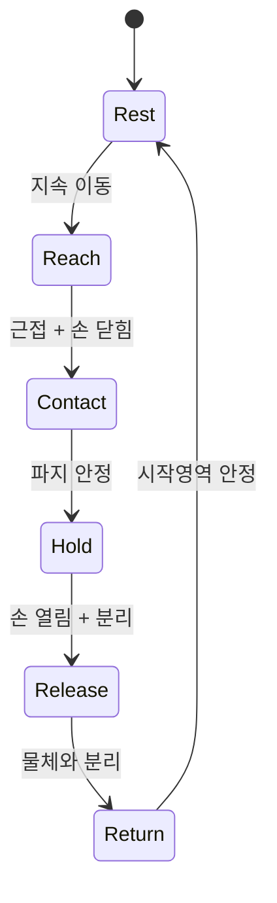
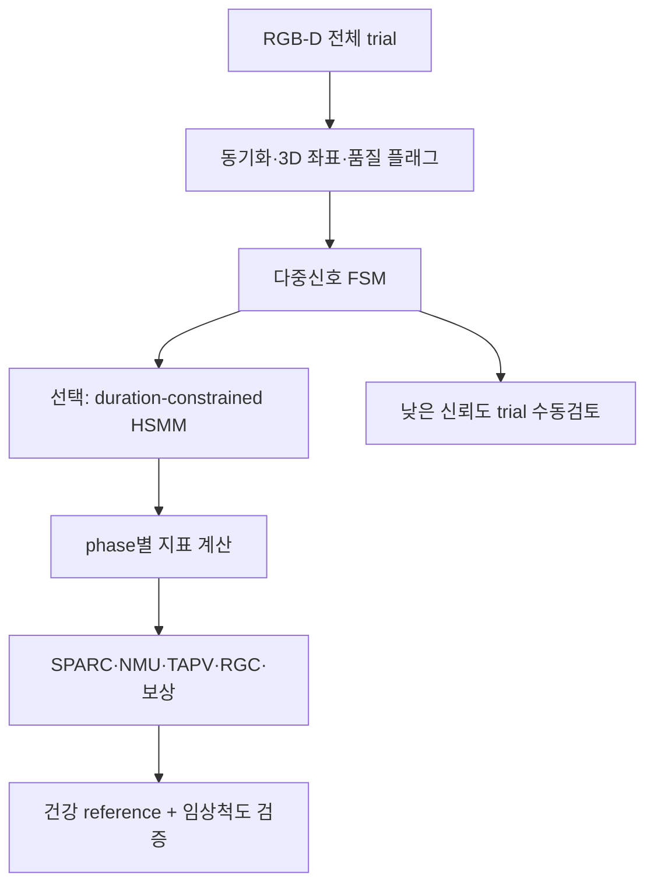

# 뇌졸중 파지 과제의 핵심 운동학적 바이오마커와 자동 구간 분할

> 조사 기준: 2026년 9월. 대상은 뇌졸중 편마비 환자의 `reach–grasp–hold–release/return` 과제이며, 단일 RGB-D 카메라(예: RealSense D455)와 손 랜드마크 추적을 이용하는 연구를 염두에 두었다.

## 결론부터

1. **현재 가장 방어력 있는 1차 평활도 지표는 SPARC**다. Log dimensionless jerk(LDLJ)도 신뢰도는 좋지만 미분·노이즈와 움직임 시간에 더 민감하다. **SPARC와 LDLJ를 동등한 1차 평가변수로 여러 개 두기보다 SPARC 하나를 사전 지정**하고, 임상적으로 읽기 쉬운 `number of movement units(NMU)`를 보조 지표로 두는 편이 좋다.
2. 파지 과제는 평활도 하나로 설명되지 않는다. 최소한 **(a) SPARC, (b) NMU, (c) 종말 감속/TAPV, (d) reach–grasp coupling, (e) 경로 효율, (f) 보상운동**을 분리해야 한다. 손 고유 기능에는 **물체 크기로 정규화한 aperture, 접촉 시 aperture, 손가락 신전 결손, release latency**를 추가한다.
3. `TAPV`와 `reach–grasp coupling`은 유망하지만 아직 SPARC만큼 확립된 지표는 아니다. 특히 초기 아급성기 연구는 표본이 8명인 탐색 연구이므로 “임상 검증 완료”가 아니라 **과제 의존적 후보 지표**라고 기술해야 한다.
4. 환자 시계열 분할에는 **속도 임계값 하나만 쓰면 안 된다.** 현재 규모의 파일럿에서는 `다중 신호 + hysteresis + 지속시간 조건 + 순서 제약`을 둔 유한상태기계(FSM)가 가장 실용적이다. 불확실 구간만 수동 검토하고, 자료가 축적되면 **명시적 지속시간을 갖는 HSMM**을 2단계 모델로 붙이는 것이 합리적이다.
5. 15명 규모에서 TCN/Transformer를 처음부터 학습하는 것은 권하지 않는다. StrokeRehab의 딥러닝 연구는 51명 환자·20명 정상인, 약 12만 개의 원시동작 라벨과 약 2,700시간의 수동 주석을 사용했다. 정상인 데이터로 학습한 모델은 환자, 특히 중증 환자에 잘 일반화되지 않았다.
6. **14개 대표 프레임은 VLM 관찰 입력일 뿐 운동학 계산 구간이 될 수 없다.** SPARC, TAPV, NMU는 전체 30 fps 원시 시계열에서 계산한 뒤 요약값과 신뢰도를 VLM에 제공해야 한다.

---

## 1. 먼저 정리할 용어: “임상적 바이오마커”인가, “운동학적 결과변수”인가

문헌에서는 흔히 kinematic biomarker라고 부르지만, 규제적 의미의 독립 진단 바이오마커로 확립된 것은 아니다. 2019년 체계적 문헌고찰은 225개 연구, 6,197명에서 **151개의 서로 다른 지표**를 확인했지만, clinimetric property를 조사한 연구는 30개뿐이었고 충분한 근거가 있던 항목도 제한적이었다. 상대적으로 근거가 축적된 것은 movement time, movement onset/end 수, path-length ratio, peak velocity, velocity-peak 수, trunk displacement, shoulder flexion/extension 등이었다. 따라서 논문에서는 “질병을 진단하는 바이오마커”보다 **표준화된 과제에서 얻은 디지털 운동학적 결과변수**로 부르는 편이 안전하다. [Schwarz et al., 2019](https://pubmed.ncbi.nlm.nih.gov/30776997/)

또한 성공 여부와 운동 회복은 다르다. 환자는 몸통 전진이나 어깨 외전으로 손의 과제를 성공할 수 있다. Stroke Recovery and Rehabilitation Roundtable(SRRR)은 임상척도만으로 restitution과 compensation을 구분하기 어렵기 때문에 3D 운동학을 병행하고, planar reaching·finger individuation·grip/precision grip과 표준화된 3D 기능과제를 함께 사용할 것을 권고했다. [Kwakkel et al., 2019](https://journals.sagepub.com/doi/10.1177/1545968319886477)

---

## 2. 핵심 운동학 지표 비교

### 2.1 권장 우선순위

| 우선순위 | 지표 | 계산 개념 | 반영하는 결함 | 근거와 해석 | 단일 RGB-D 적용성 |
|---|---|---|---|---|---|
| **1차** | **SPARC** | 손/손목 접선속도 스펙트럼의 정규화된 arc length. 값이 덜 음수일수록 평활 | 간헐적 제어, 피드백 의존적 보정, submovement 혼합 실패 | reach-to-grasp 평활도에 가장 일관된 타당도. FM-UE 변화와 종단적 연관; 2024년 연구에서 ICC 0.912, CoV <10% | 손목/손 중심 3D 위치가 안정적이면 가능. `reach` 구간에만 계산 |
| **핵심 보조** | **NMU / velocity peaks** | 의미 있는 속도 봉우리 수 | 반복 가속·감속, 멈칫거림 | 직관적이고 임상 해석이 쉬움. 다만 임계값과 필터에 민감 | 30 fps에서도 가능하나 프레임 간격과 최소 peak 간격을 사전 고정 |
| **핵심 보조** | **TAPV / 감속 비율** | `T − tPV` 또는 `(T−tPV)/T` | 피크 속도 후 종말 보정·feedback control 부담 | 뇌졸중 reach-to-grasp에서 유망. 과제 종료 정의에 매우 민감 | 정확한 contact/end-of-reach 사건이 필요 |
| **핵심 보조** | **Reach–grasp coupling** | 예: `(tMGA−tPV)/Treach` | 운반과 손 모양 형성의 시간 협응 | 손–팔 분절 협응을 직접 표현하나 표준 정의가 아직 통일되지 않음 | 엄지·검지와 손목이 동시에 신뢰 가능할 때만 사용 |
| **핵심 보조** | **Path-length ratio / index of curvature** | 실제 경로 길이 ÷ 시작–종료 직선거리; 1에 가까울수록 효율적 | 방향 수정, dysmetria, 비효율적 경로 | 체계적 문헌고찰에서 clinimetric 근거가 비교적 양호 | 깊이 outlier에 민감하나 손목 좌표로 계산 용이 |
| **필수 병행** | **보상운동** | 몸통 전진, 어깨 외전, 팔꿈치 신전/각속도, 손목 방향 | 기능적 성공을 만든 비정상 전략 | restitution과 compensation 구분에 필수 | 카메라 프레임에 몸통·어깨·팔꿈치가 포함되어야 함 |
| 손 특이 | 정규화 MGA·contact aperture | `MGA/object width`, 접촉 순간 엄지–검지 거리 | 과도한 안전 여유, preshaping 결함 | 최대값 하나보다 접촉 시점과 시간곡선이 중요 | 손가락 가림 시 결측·오검출 관리 필요 |
| 손 특이 | 손가락 ROM·신전 결손·individuation | MCP/PIP 각도 범위, 비과제 손가락 동반 움직임 | 경직, 굴곡 시너지, fractionation 결함 | SRRR이 finger individuation을 핵심 assay로 권고 | 단일 RGB-D의 가장 어려운 항목; confidence와 가림률을 함께 보고 |
| 결과/안정성 | Hold 안정성·slip·release latency | 물체/손 위치 분산, 미끄럼, grasp 완료→release 시간 | 유지 제어, 힘 조절, 선택적 이완 | 임상 기능과 직접 연결되나 파지력 자체는 영상만으로 알 수 없음 | 물체 pose 또는 접촉/압력 센서가 있으면 크게 향상 |
| 재현성 | 시행 간 변동성 | SD, CV 또는 robust MAD | 운동계획 일관성·피로·주의 변동 | 평균만으로 가려지는 환자 불안정성을 포착 | 최소 반복 횟수 필요; 결측률도 함께 보고 |

### 2.2 평활도: SPARC, LDLJ, NMU를 어떻게 선택할 것인가

#### SPARC

SPARC는 속도 신호의 정규화된 Fourier magnitude spectrum이 얼마나 복잡한지를 나타낸다. 일반적으로 **값이 0에 가까운, 즉 덜 음수인 값이 더 부드러운 움직임**이다. 시간축을 단순히 늘이거나 줄이는 데 비교적 덜 민감하고, LDLJ보다 측정 노이즈에 강하다는 장점이 있다. 원 개발·분석 논문은 노이즈 조건에서 SPARC가 LDLJ보다 안정적이어서 SPARC를 우선할 것을 권고했다. [Balasubramanian et al., 2015](https://link.springer.com/article/10.1186/s12984-015-0090-9)

2021년 체계적·시뮬레이션 분석은 뇌졸중 연구에서 사용된 32개 평활도 지표를 검토했고, reach-to-point와 reach-to-grasp의 모든 시뮬레이션 조건을 통과한 지표는 SPARC뿐이었다. [Mohamed Refai et al., 2021](https://link.springer.com/article/10.1186/s12984-021-00949-6)

임상 종단 근거도 있다. 첫 뇌졸중 환자 40명을 1–26주에 반복 측정한 연구에서 SPARC는 FM-UE와 유의한 종단 연관을 보였고, 환자 내 변화와 환자 간 차이가 모두 유의했다. 다만 과제를 수행할 수 있는 경도–중등도 환자와 5 cm 블록 과제에 국한되며, 정상/비정상을 가르는 과제 독립적 절단값은 없다. [Saes et al., 2021](https://link.springer.com/article/10.1186/s12984-021-00937-w)

2024년 중등도–중증 아급성기 연구에서는 SPARC와 LDLJ 모두 excellent reliability를 보였지만(SPARC ICC 0.912, LDLJ 0.911), SPARC의 변동계수가 가장 작았다. SPARC 변화는 움직임 시간보다 경로 직선성과 더 밀접했고, baseline에서 UE-FMA와 중등도, ARAT와 강한 상관을 보였다. [Bayle et al., 2024](https://link.springer.com/article/10.1186/s12984-024-01382-1)

**실무 권고**

- 1차 평활도 결과변수: 손목 또는 hand centroid의 3D 접선속도에서 계산한 SPARC.
- 분석구간: `movement onset → contact/end of reach`. 2초 hold와 release를 포함한 전체 trial에는 계산하지 않는다.
- 손가락 aperture 속도 SPARC는 탐색변수로만 둔다. 엄지·검지 랜드마크 오차가 미분과 스펙트럼에 직접 증폭된다.
- 건강대조군은 동일 카메라, 거리, 과제, 필터, 분할 정의로 수집한다. 타 연구의 절단값을 가져오지 않는다.

#### Log dimensionless jerk(LDLJ)

대표적 정의는 다음과 같다.

$$
LDLJ=-\ln\left(\frac{T^5}{v_{peak}^2}\int_0^T \lVert \dddot{\mathbf{x}}(t)\rVert^2dt\right)
$$

보통 값이 클수록, 즉 덜 음수일수록 매끄럽다. 시간과 거리의 영향을 무차원화하려는 장점이 있지만, 위치를 세 번 미분하므로 영상 랜드마크의 작은 jitter와 누락 보간에 민감하다. RGB-D 30 fps에서는 SPARC와 함께 **민감도 분석용 보조 지표**로는 유용하지만, 1차 지표로 SPARC와 동시에 두면 중복성과 다중검정 부담이 커진다.

#### NMU·submovement count

NMU는 환자 움직임에서 보이는 반복 가속–감속을 임상가가 직관적으로 이해할 수 있다는 강점이 있다. SALGOT 연구의 표준화된 drinking task에서는 local minimum에서 다음 maximum까지 속도 증가가 20 mm/s를 넘고, 연속 peak 간격이 150 ms 이상일 때 하나의 movement unit로 정의했다. 하나의 운동단계에는 대체로 하나의 종 모양 속도 peak가 기대되며, 여러 peak는 반복 보정을 뜻한다. [Alt Murphy et al., 2020](https://link.springer.com/article/10.1186/s12984-020-00705-2)

다만 이 `20 mm/s, 150 ms` 규칙은 240 Hz 광학 모션캡처와 특정 과제에서 나온 값이다. 30 fps RGB-D에서 그대로 복사하지 말고, 건강인/환자 개발 세트에서 **필터·prominence·최소 간격의 민감도 분석**을 한 뒤 사전 고정해야 한다. NMU는 SPARC의 대체물이 아니라 “왜 평활도가 나쁜지”를 설명하는 보조 지표다.

### 2.3 속도 프로파일과 종말 보정

#### Peak velocity와 relative time to peak velocity

$$
rTPV=\frac{t_{PV}-t_{on}}{t_{off}-t_{on}}
$$

피크 속도가 일찍 나오고 감속기가 길면 시각·체성감각 피드백에 의존한 종말 보정이 많다는 해석이 가능하다. 그러나 peak velocity 자체는 동기·근력·과제 속도 지시에도 영향을 받고, SALGOT에서는 relative time to peak velocity가 대부분의 추적 시점에 건강인과 비슷했다. 따라서 독립적인 회복 지표라기보다 SPARC, NMU, 경로효율과 함께 해석한다. [Alt Murphy et al., 2020](https://link.springer.com/article/10.1186/s12984-020-00705-2)

#### TAPV: time after peak velocity

$$
TAPV=t_{reach\ end}-t_{PV},\qquad TAPV_n=\frac{TAPV}{T_{reach}}
$$

TAPV가 길면 피크 이후 감속·온라인 수정에 더 많은 시간을 썼다는 의미가 될 수 있다. 초기 아급성기 환자 8명의 3D reach-to-grasp 종단 연구에서는 reaching duration, trajectory smoothness, TAPV, peak grip aperture의 개선이 관찰되고 UE-FMA 변화와 연관되었다. 그러나 표본이 작고 광학식 모션캡처 기반이므로, TAPV는 **유망한 2차 지표**로 두는 것이 타당하다. [Qiu et al., 2022](https://researchwith.njit.edu/en/publications/evaluation-of-changes-in-kinematic-measures-of-three-dimensional-/)

TAPV의 가장 큰 약점은 `reach end` 정의다. 접촉 센서가 없고 물체를 움직이지 않는 과제에서는 손이 물체 앞에서 멈춘 시점과 실제 파지 완료를 영상만으로 분리하기 어렵다. 따라서 **접촉 사건 없이 TAPV를 주요 평가변수로 쓰면 분할 오차를 운동제어 차이로 오해할 수 있다.**

### 2.4 Reach–grasp coordination

손목 운반과 손가락 preshaping의 시간 결합은 다음처럼 단순화할 수 있다.

$$
RGC_{lag}=\frac{t_{MGA}-t_{PV}}{T_{reach}}
$$

- 양수: 손목 peak velocity 뒤에 maximum grip aperture가 발생.
- 큰 양수: 손 열림이 늦거나 종말부에 몰림.
- 음수: aperture peak가 운반 peak보다 앞섬.

논문마다 부호, 분모, reach 종료 정의가 달라 “coordination ratio”라는 이름만으로는 재현되지 않는다. 반드시 식, landmark, 분석구간, peak 선택 규칙을 명시해야 한다. 또한 환자 aperture 곡선은 plateau나 복수 peak가 흔하므로, 전체 최대값 하나보다 다음을 같이 저장하는 편이 낫다.

- `tMGA/Treach`
- `tPV/Treach`
- `RGC_lag`
- 접촉 순간 aperture / 물체 폭
- wrist speed–aperture derivative의 cross-correlation lag(탐색적)

이 지표는 엄지·검지 가림에 민감하다. peak 주변에서 손 랜드마크 confidence가 낮거나 aperture가 비생리적으로 점프하면 그 trial의 RGC를 결측 처리하고, 모델이 보간한 좌표를 실제 관절 측정처럼 취급하지 않는다.

### 2.5 공간 효율, 보상, 손 고유 지표

#### 경로 효율

$$
Path\ Ratio=\frac{\sum_t\lVert \mathbf{x}_{t}-\mathbf{x}_{t-1}\rVert}{\lVert\mathbf{x}_{off}-\mathbf{x}_{on}\rVert}
$$

이상적인 직선 도달은 1이다. overshoot, 측면 편향, 반복 수정이 커질수록 증가한다. 속도와 별개로 공간 계획의 질을 반영하지만, 깊이축 outlier가 path length를 과장하므로 좌표 품질 검사가 필수다.

#### restitution과 compensation의 분리

손이 목표에 도달했다고 곧 팔 제어가 회복된 것은 아니다. 최소한 다음을 함께 보고한다.

- 몸통: 흉골/어깨 중심의 전방·측방 최대 변위.
- 어깨: 외전 각도 또는 팔꿈치가 몸통에서 벌어진 거리.
- 팔꿈치: 최대 신전, peak angular velocity.
- 손목: 과도한 굴곡·척측편위, 물체 접근 시 orientation.

SALGOT에서는 movement time·NMU·peak hand velocity가 3개월경 건강 수준에 접근한 반면, peak elbow angular velocity, trunk displacement, arm abduction은 더 오래 비정상으로 남았다. 연구진은 몸통 이동과 어깨 외전을 기능과제의 core kinematics로 포함할 것을 권고했다. [Alt Murphy et al., 2020](https://link.springer.com/article/10.1186/s12984-020-00705-2)

#### 손 고유 지표

현재 과제에는 다음 순서가 적절하다.

1. `MGA/object width`: 물체 크기 차이를 제거한 안전 여유.
2. `aperture at contact/object width`: 실제 접촉 전략.
3. opening·closing peak velocity 및 소요시간.
4. MCP/PIP 최대 신전 결손과 ROM.
5. grasp 완료 후 안정화까지 시간.
6. release latency와 release 후 손가락 재개방 정도.

관절각은 카메라 좌표계의 점 세 개로 계산할 수 있지만, 손가락이 겹치는 순간의 3D 랜드마크는 모델의 추정값일 수 있다. 각 trial마다 **관절별 유효 프레임 비율, 최대 연속 결측시간, confidence**를 결과와 함께 저장한다.

### 2.6 현재 연구에 권하는 사전 지정 세트

#### 1차 운동학 결과변수

- `SPARC_reach`: wrist/hand-centroid 3D speed, onset부터 contact/end-of-reach까지.

#### 핵심 2차 결과변수

- `NMU_reach`: 사전 고정된 prominence와 최소 peak 간격.
- `TAPV_n`: reach duration으로 정규화.
- `RGC_lag_n`: `(tMGA−tPV)/Treach`.
- `Path_Ratio`.
- `Trunk_Displacement`와 `Shoulder_Abduction` 또는 이에 상응하는 단일카메라 proxy.

#### 손·과제 특이 2차 결과변수

- `MGA/object width`, `aperture at contact/object width`.
- 손가락 최대 신전 결손 또는 총 opening ROM.
- `Release latency`와 hold 중 손/물체 흔들림.
- 성공/실패·물체 slip/drop.

#### 통계적 원칙

- SPARC, LDLJ, jerk, NMU를 모두 독립 1차 변수로 두지 않는다.
- 시행별 값과 함께 개인별 median 및 MAD를 보고한다. 심한 outlier가 예상되므로 mean/SD만 쓰지 않는다.
- 임상 타당도는 baseline 상관만이 아니라 test–retest, known-groups validity, responsiveness, ceiling/floor effect, 건강인 reference distance를 평가한다.
- 회복을 주장하려면 기능 성공과 보상 감소를 분리한다. 성공이 늘고 몸통 보상이 커졌다면 restitution으로 단정하지 않는다.

---

## 3. 자동 구간 분할: 선행 연구와 현실적 선택

### 3.1 왜 단일 속도 임계값이 실패하는가

전통적 임상 운동학 연구는 손 속도가 trial peak의 2–5%를 넘는 시점을 시작/종료로 정하는 경우가 많다. 예를 들어 SPARC 종단 연구는 forward reach 최대 접선속도의 5%를 시작으로, 물체 이동 중 forearm 속도가 5%를 넘는 최초 시점을 reach 종료로 사용했다. [Saes et al., 2021](https://link.springer.com/article/10.1186/s12984-021-00937-w) SALGOT은 전체 과제의 시작과 종료에 2% peak 규칙을 사용했다. [Alt Murphy et al., 2020](https://link.springer.com/article/10.1186/s12984-020-00705-2)

이 방식은 통제된 후향 분석에는 간단하지만 다음 문제가 있다.

- 환자의 peak가 매우 낮으면 noise·tremor도 상대 임계값을 넘는다.
- 여러 peak와 긴 pause가 한 phase를 여러 동작으로 쪼갠다.
- trial의 global peak를 알아야 하므로 실시간성이 없고, outlier 하나가 임계값을 바꾼다.
- contact, grasp complete, hold와 idle은 모두 저속이어서 속도만으로 구분되지 않는다.
- 2초 hold를 reach에 포함하면 SPARC와 jerk가 경계 처리에 의해 왜곡된다.

따라서 속도는 하나의 관측값일 뿐, phase의 정의 자체가 되어서는 안 된다.

### 3.2 알고리즘 계열 비교

| 방법 | 장점 | 뇌졸중에서의 약점 | 권장 역할 |
|---|---|---|---|
| 고정/상대 속도 임계값 | 단순·설명 가능·라벨 불필요 | 느림, pause, tremor, 다중 peak, 환자 간 속도차에 취약 | 기준선 또는 candidate event 생성 |
| **Hysteretic FSM** | 과제 순서·물체 관계를 이용, 적은 자료, 임상 설명 가능 | 규칙 튜닝과 센서 품질 관리 필요 | **현재 파일럿의 주 방법** |
| Change-point detection | 여러 신호의 분포 변화로 후보 경계를 찾음 | phase 의미를 직접 부여하지 못하고 tremor를 과분할 가능 | FSM의 후보 경계 보조 |
| HMM | 불확실 관측을 시간적으로 평활화 | 암묵적 기하분포 지속시간 때문에 긴 hold와 짧은 pause를 잘못 쪼갤 수 있음 | 간단한 probabilistic smoother |
| **HSMM** | 상태별 지속시간 분포를 명시해 hold·환자별 느린 phase에 적합 | 초기 라벨과 모델 선택 필요 | **자료 축적 후 2단계 권장** |
| TCN/RNN/Transformer frame segmentation | 복잡한 다변량 패턴 학습 | 많은 framewise 라벨, over-segmentation, 환자 분포 이동, 해석 어려움 | 큰 다기관 데이터 또는 전이학습 시 |
| Seq2Seq primitive recognition | noisy frame label 대신 동작 순서·횟수에 강함 | 정확한 boundary보다 sequence/count가 목적 | 재활 dose counting용; biomarker 경계에는 부적합 |

#### HMM/HSMM의 실제 의미

HSMM은 각 상태의 지속시간을 직접 모델링하므로 `reach 0.5–8 s`, `hold 약 2 s`, `release 0.2–4 s`처럼 정상인보다 넓고 비대칭인 분포를 표현할 수 있다. Kinect v2 기반 재활운동 평가에서도 HSMM이 운동의 시간 구조와 품질 평가에 사용되었다. 다만 이는 특정 뇌졸중 파지 과제의 임상 검증과 동일하지 않다. [Capecci et al., 2018](https://doi.org/10.1016/j.jbi.2017.12.012)

일반 연속 모션 연구에서도 HSMM은 짧은 상태 전환을 억제하고 segment class와 duration을 함께 추정한다는 장점이 확인되었다. [Nakamura et al., 2017](https://www.frontiersin.org/journals/neurorobotics/articles/10.3389/fnbot.2017.00067/full)

#### 딥러닝 연구가 보여준 현실

StrokeRehab은 환자 51명과 정상인 20명, 3,372 trial, 120,891개의 기능적 원시동작, 43.48시간의 기록으로 구성된다. 두 카메라와 9개 IMU를 사용했고, 전문가 주석 신뢰도는 Cohen's kappa 0.96 이상이었다. 그럼에도 기존 action-segmentation 모델은 sub-second 동작에서 noisy prediction을 냈다. 더 중요한 것은 **환자로 학습한 모델은 정상인에 비교적 일반화했지만 정상인으로 학습한 모델은 환자에 일반화하지 못했고, 중등도 환자 모델도 중증 환자에 약했다**는 점이다. [Kaku et al., 2022](https://pmc.ncbi.nlm.nih.gov/articles/PMC10530637/)

PrimSeq는 41명의 만성기 환자, 9개 IMU, 6초 window, 양방향 GRU encoder–decoder를 사용해 reach/reposition/transport/stabilization/idle의 순서와 횟수를 예측했다. 대부분의 primitive count는 실제 count의 86.1–99.6%였지만 stabilization은 가장 어려웠고, finger sensor가 없어 idle과 stabilization을 혼동했다. 즉 **손가락·물체 접촉 신호가 없으면 저속 상태를 분리하기 어렵다**는 직접적인 근거다. 또한 PrimSeq는 정확한 frame boundary보다 순서와 횟수 추정이 주목적이다. [Parnandi et al., 2022](https://journals.plos.org/digitalhealth/article?id=10.1371/journal.pdig.0000044)

2025년 HRTR은 StrokeRehab에서 fine-grained temporal segmentation을 위한 단일-stage Transformer를 제안하고 video edit score 70.1, IMU 69.4를 보고했다. 흥미로운 최신 방법이지만 현재 arXiv preprint이며, 임상적 phase 경계나 파생 biomarker의 동등성을 검증한 것은 아니다. [Helvaci et al., 2025](https://arxiv.org/abs/2506.02472)

### 3.3 현재 과제에 맞는 권장 분할기

#### 상태 정의

`Preshape`를 별도 상태로 두고 싶다면 Reach 내부의 substate로 추출하는 편이 안정적이다. 초기 표본에서 상태를 너무 세분하면 라벨 합의도와 모델 식별성이 떨어진다.

#### 관측 특징

각 frame에서 다음을 사용한다.

- `v_w`: wrist/hand-centroid 3D speed.
- `d_start`: 시작점에서의 손 변위.
- `a`, `da/dt`: 엄지–검지 aperture와 변화율.
- `d_hand-object`: 손/손가락과 물체의 최소 거리.
- `v_obj`, `Δpose_obj`: 물체 속도·자세 변화. 물체를 움직이는 경우 특히 강력하다.
- `q_hand`, `q_object`, depth-valid fraction: 관측 신뢰도.
- 선택: 접촉 스위치, 압력/force sensor, 물체 IMU.

#### 전이 규칙의 핵심

1. **Rest → Reach**
   - baseline rest에서 속도 noise의 median과 MAD를 구한다.
   - `v_w > T_on`이 K frame 지속되고 시작점 변위도 최소치를 넘을 때만 시작한다.
   - 한 frame spike로 전이하지 않는다.

2. **Reach → Contact candidate**
   - 손–물체 거리가 작아지고,
   - aperture가 닫히거나 plateau에 들어가며,
   - 가능하면 물체 접촉/공동이동 신호가 동반될 때.

3. **Contact → Hold**
   - aperture 변화와 손/물체 상대속도가 낮은 상태가 일정 시간 지속.
   - 물체를 들거나 이동한다면 손과 물체의 rigid co-motion이 가장 좋은 시각 cue다.
   - 물체를 전혀 움직이지 않는 현재 과제라면 **실제 파지 완료는 영상만으로 관찰 불가능한 잠재사건**일 수 있다. 얇은 접촉센서나 물체 IMU/압력센서를 추가하는 것이 가장 효과적이다.

4. **Hold → Release**
   - aperture 증가 + 손–물체 거리 증가, 또는 contact signal off.
   - tremor로 인한 작은 aperture 진동은 persistence 조건으로 무시한다.

5. **Release → Return → Rest**
   - 물체와 분리된 상태에서 시작영역으로 이동한 뒤, `v_w < T_off`와 위치분산 조건을 만족할 때 종료.

`T_on > T_off`인 hysteresis, 최소 상태 지속시간, 허용된 순서만 갖는 left-to-right topology를 사용한다. 수치 임계값은 보편값이 아니며 개발 세트에서 정한 뒤 검증 세트에 고정한다. 30 fps에서는 예컨대 3 frame이 100 ms이므로, persistence와 허용 경계 오차를 반드시 frame이 아니라 ms로도 보고한다.

#### 왜 HSMM을 두 번째 단계로 붙이는가

FSM이 만든 전이확률 또는 candidate boundary를 HSMM의 관측으로 넣으면 다음 이점이 있다.

- 환자의 pause를 새로운 phase로 즉시 오인하지 않는다.
- 2초 hold의 duration prior를 명시할 수 있다.
- confidence가 낮은 frame을 missing observation으로 처리할 수 있다.
- Viterbi/posterior로 phase와 경계 불확실성을 제시할 수 있다.

표본 15명에서는 복잡한 딥네트워크보다 left-to-right Gaussian HSMM 또는 간단한 discriminative classifier + HSMM decoder가 적합하다. 교차검증은 trial이 아니라 **participant 단위 LOSO**로 해야 한다.

### 3.4 분할 검증에서 반드시 보고할 지표

두 명의 임상가가 원 영상을 보고 phase 경계를 독립 주석하고, 합의본을 reference로 만든다. 단순 frame accuracy만 보고하면 긴 Rest/Hold가 성능을 부풀린다.

| 검증 축 | 권장 지표 | 이유 |
|---|---|---|
| 주석 신뢰도 | 상태별 Cohen/Fleiss kappa, 경계 시점 ICC 또는 absolute difference | reference 자체의 불확실성 확인 |
| Frame 수준 | macro-F1, balanced accuracy, 상태별 precision/recall | class imbalance 방어 |
| Segment 수준 | segmental F1@10/25/50, normalized edit score | over-segmentation과 순서 오류 반영 |
| 경계 수준 | onset/contact/release별 median absolute error(ms), 95th percentile, ±100 ms boundary F1 | 임상 사건의 실제 시간 오차 제시 |
| 파생 지표 영향 | 수동 vs 자동 분할의 SPARC/TAPV/RGC Bland–Altman, ICC, bias와 95% limits of agreement | 좋은 라벨 성능이 실제 biomarker 동등성을 보장하지 않음 |
| 강건성 | impairment strata, 속도, tremor, occlusion, 누락률별 성능 | 정상/경증 평균 뒤에 중증 실패가 숨는 것을 방지 |

30 fps에서 ±100 ms는 약 ±3 frame이다. 그러나 이 tolerance는 임상적으로 허용 가능한 TAPV/RGC 오차와 센서 동기오차를 근거로 사전 지정해야 하며, 결과를 좋게 만들기 위해 사후 변경하면 안 된다.

### 3.5 품질관리와 reject option

다음 조건에서는 값을 억지로 산출하지 말고 trial을 `unusable/needs review`로 보낸다.

- reach 구간의 유효 3D 손목 프레임 비율이 사전 기준 미만.
- peak velocity 또는 MGA 주변에 연속 결측이 존재.
- 비생리적 frame-to-frame jump가 남음.
- 손–물체 관계와 상태 순서가 모순됨.
- posterior confidence 또는 FSM evidence score가 낮음.

임상 시스템에서는 100% 자동화보다 **자동 80–90% + 불확실 trial의 표적 수동검토**가 더 타당하다. reject rate 자체도 환자 중증도·가림과 연관될 수 있으므로 반드시 보고한다.

---

## 4. D455·MediaPipe·30 fps 구현에 대한 구체 권고

1. RGB와 depth timestamp를 동기화하고, landmark pixel 주변의 단일 depth pixel이 아니라 작은 ROI의 robust median을 사용한다. 물체 경계·flying pixel은 사전에 제거한다.
2. 위치를 먼저 필터링한 뒤 속도·가속도를 계산한다. 30 fps의 Nyquist 주파수는 15 Hz이므로, 240 Hz 모션캡처 연구의 20 Hz low-pass를 그대로 적용할 수 없다. gross reach에는 대략 5–6 Hz 이하 후보를 검증하되, cutoff 선택에 따른 SPARC/NMU 민감도를 보고한다.
3. zero-phase filter는 offline 분석에는 적합하지만 실시간 시스템에서는 causal filter와 지연 보정이 필요하다. 두 파이프라인의 값을 섞지 않는다.
4. landmark gap은 짧은 구간만 보간하고, gap 길이와 보간 비율을 저장한다. peak/MGA 주변의 긴 gap은 trial 제외가 낫다.
5. hand scale과 object width를 metric depth로 산출하더라도, 정규화 지표를 병행해 카메라거리·손 크기 차이를 줄인다.
6. `14-frame VLM clip`에는 전체 시계열에서 계산한 요약값, phase별 신뢰도, 결측률을 구조화해 제공한다. VLM이 대표 프레임만 보고 SPARC·TAPV를 다시 추정하게 하지 않는다.
7. 현재 수평 reach–grasp–2초 hold–release–return 과제라면, 별도 lift가 없으므로 contact/grasp complete 관측력이 약하다. **저가형 접촉 스위치 또는 물체 IMU 한 개**가 분할 정확도에 카메라 해상도 향상보다 더 큰 이득을 줄 가능성이 높다.

---

## 5. 권장 분석 파이프라인

### 최소 실행안

- 개발 단계: 환자와 건강인의 약 20–30% trial을 두 평가자가 framewise 주석.
- 알고리즘: adaptive threshold 후보 + hysteretic FSM.
- 검증: participant-level LOSO, impairment별 성능 보고.
- 1차 지표: reach SPARC.
- 핵심 2차: NMU, normalized TAPV, normalized RGC lag, path ratio, trunk/shoulder compensation.
- contact ground truth: 가능하면 접촉센서; 없으면 두 평가자 합의 annotation.
- 딥러닝: 본 파일럿의 주 분석이 아니라 향후 외부 데이터 전이학습/대규모 확장 과제로 남김.

---

## 6. 논문에 쓸 수 있는 한계 문장

> Kinematic outcomes were treated as task- and device-specific digital movement measures rather than stand-alone diagnostic biomarkers. Phase boundaries were estimated using multimodal visual evidence and temporally constrained rules; trials with insufficient landmark or object-contact confidence were rejected rather than imputed. Because a single RGB-D view cannot directly observe grip force and may lose finger landmarks during occlusion, finger-joint and grasp-completion measures were considered valid only for frames meeting predefined visibility and depth-quality criteria. Smoothness was calculated from the full-frame-rate reach segment and not from sparsely sampled frames or from the hold/release phases. Generalizability to severely impaired individuals requires separate validation because movement distributions and segmentation errors vary with impairment severity.

---

## 주요 참고문헌

- [Schwarz A, et al. Systematic Review on Kinematic Assessments of Upper Limb Movements After Stroke. Stroke. 2019.](https://pubmed.ncbi.nlm.nih.gov/30776997/)
- [Kwakkel G, et al. Standardized Measurement of Quality of Upper Limb Movement After Stroke. Neurorehabil Neural Repair. 2019.](https://journals.sagepub.com/doi/10.1177/1545968319886477)
- [Balasubramanian S, et al. On the analysis of movement smoothness. J Neuroeng Rehabil. 2015.](https://link.springer.com/article/10.1186/s12984-015-0090-9)
- [Mohamed Refai MI, et al. Smoothness metrics for reaching performance after stroke: Part 1. J Neuroeng Rehabil. 2021.](https://link.springer.com/article/10.1186/s12984-021-00949-6)
- [Saes M, et al. Smoothness metric during reach-to-grasp after stroke: Part 2. J Neuroeng Rehabil. 2021.](https://link.springer.com/article/10.1186/s12984-021-00937-w)
- [Bayle N, et al. Measurement properties of movement smoothness metrics. J Neuroeng Rehabil. 2024.](https://link.springer.com/article/10.1186/s12984-024-01382-1)
- [Alt Murphy M, et al. Upper limb kinematics during the first year after stroke: SALGOT. J Neuroeng Rehabil. 2020.](https://link.springer.com/article/10.1186/s12984-020-00705-2)
- [Qiu Q, et al. Evaluation of Changes in Kinematic Measures of 3D Reach to Grasp. EMBC. 2022.](https://doi.org/10.1109/EMBC48229.2022.9871891)
- [Kaku A, et al. StrokeRehab: A Benchmark Dataset for Sub-second Action Identification. NeurIPS. 2022.](https://pmc.ncbi.nlm.nih.gov/articles/PMC10530637/)
- [Parnandi A, et al. PrimSeq: A deep learning-based pipeline to quantitate rehabilitation training. PLOS Digital Health. 2022.](https://journals.plos.org/digitalhealth/article?id=10.1371/journal.pdig.0000044)
- [Capecci M, et al. A Hidden Semi-Markov Model based approach for rehabilitation exercise assessment. J Biomed Inform. 2018.](https://doi.org/10.1016/j.jbi.2017.12.012)
- [Helvaci HI, et al. HRTR: Fine-grained Sub-second Action Segmentation in Stroke Rehabilitation. arXiv. 2025.](https://arxiv.org/abs/2506.02472)
