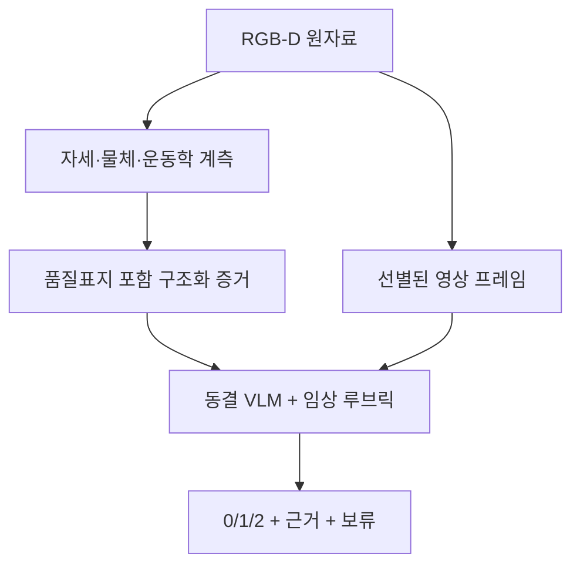

# 뇌졸중 재활 운동 평가에서 VLM을 도입할 학술적 당위성과 한계

> **핵심 결론:** 고정된 0/1/2 점수를 가장 정확하게 예측하는 것이 유일한 목적이라면, 소수의 검증된 운동학 변수에 정규화 로지스틱 회귀·순서형 회귀를 적용하는 편이 대체로 더 타당하다. 현재의 범용 VLM을 “전통 모델보다 정확한 측정기”로 주장할 근거는 부족하다. VLM의 설득력 있는 역할은 **영상, 외부에서 계산한 운동학 수치, 정상 기준, 임상 루브릭을 한 문맥에서 결합하고, 판정의 관찰 근거를 구조화해 제시하는 동결형(frozen) 멀티모달 평가자**이다.

---

## 1. 연구 질문을 먼저 바로잡아야 한다

이 연구에서 입증해야 할 명제는 다음처럼 잡는 것이 안전하다.

> “범용 VLM이 과제 특화 분류기보다 본질적으로 정확하다”가 아니라, **“별도 가중치 학습 없이도 VLM이 이질적인 임상 증거를 통합할 수 있으며, 운동학 수치와 정상 기준을 명시적으로 제공했을 때 RGB 영상만 제공한 경우보다 점수 일치도와 근거의 충실도가 향상되는가”**를 검증한다.

즉, VLM은 깊이 카메라나 자세 추정기를 대체하는 계측기가 아니라, 계측 결과와 평가 규칙을 소비하는 **추론·보고 계층**이어야 한다.



### 전통 모델과 VLM의 실제 차이

| 항목 | 경량 분류·회귀 모델 | 3D-CNN/LSTM 등 과제 특화 딥러닝 | 범용 VLM |
|---|---|---|---|
| 기본 목적 | 고정된 입력에서 고정된 점수 예측 | 영상·센서 패턴에서 고정된 라벨 학습 | 영상·텍스트·수치·규칙에 조건화된 생성·판정 |
| 임상 데이터로 학습할 파라미터 | 적음 | 많음 | 동결 사용 시 없음; 대신 프롬프트·예시가 설계 변수 |
| 소표본 적합성 | 저차원 변수가 잘 정의되면 높음 | 일반적으로 낮음 | 라벨 효율은 높을 수 있으나 임상 정확도가 보장되지는 않음 |
| 새 과제·루브릭 변경 | 재학습 또는 새 모델 필요 | 재학습 필요 | 지시문과 예시 변경으로 빠른 전환 가능 |
| 산출물 | 점수·확률 | 점수·확률 | 점수, 관찰 요약, 근거, 결측·불확실성 서술 |
| 강점 | 안정성, 비용, 보정, 재현성 | 시공간 패턴을 과제에 맞게 최적화 | 개방형 문맥 통합, 라벨 없는 전이, 언어 인터페이스 |
| 핵심 위험 | 비선형 영상정보 손실 | 과적합·도메인 이동 | 시각 환각, 프롬프트 민감성, 미보정 확신, 그럴듯한 사후 합리화 |

---

## 2. N=10–30에서 zero-shot/few-shot VLM이 실제로 우월한가?

### 짧은 답: **가능성은 있지만, 우월하다고 전제하면 안 된다**

대규모 사전학습 VLM은 웹 규모의 시각·언어 사전지식을 임상 데이터에 가져오므로, 작은 임상 코호트에서 수백만 개의 가중치를 새로 추정하는 3D-CNN보다 과적합 위험이 낮다. Flamingo는 일반 벤치마크에서 몇 개의 문맥 예시만으로 대량의 과제별 학습 데이터를 사용한 모델을 능가한 사례를 보였다. 그러나 이는 일반 VQA·캡셔닝 벤치마크의 결과이지, 뇌졸중 손가락 운동이나 FMA 채점의 근거는 아니다. [Flamingo, NeurIPS 2022](https://arxiv.org/abs/2204.14198)

의료 영역의 성공 사례도 대개 “범용 VLM을 그대로 사용”한 결과가 아니다.

- Med-Flamingo는 OpenFlamingo를 의학 논문·교과서의 이미지–텍스트로 **추가 사전학습**한 뒤 few-shot 의료 VQA와 rationale 생성을 평가했다. [Med-Flamingo](https://arxiv.org/abs/2307.15189)
- LLaVA-Med는 일반 웹 기반 VLM이 생의학 영상을 충분히 이해하지 못한다고 명시하고, PubMed Central의 그림–캡션과 의료 지시 데이터로 정렬했다. [LLaVA-Med](https://arxiv.org/abs/2306.00890)
- BiomedCLIP의 zero/few-shot 성능도 1,500만 개의 생의학 이미지–텍스트 쌍으로 사전학습한 결과다. [BiomedCLIP](https://www.microsoft.com/en-us/research/publication/biomedclip-a-multimodal-biomedical-foundation-model-pretrained-from-fifteen-million-scientific-image-text-pairs/)

따라서 “대규모 사전학습” 자체보다 **사전학습 분포가 목표 과제와 얼마나 맞는가**가 중요하다. 웹 캡션의 “컵을 잡는다”와 임상 루브릭의 “엄지가 검지 측면에 실제 접촉했는가, 완전 신전이 가능한가”는 감독 신호의 해상도가 전혀 다르다.

### 2026년 뇌졸중 재활 직접 근거

가장 직접적인 최신 연구는 20명 건강인과 51명 뇌졸중 환자의 60/100 fps, 2시점 영상을 이용해 Qwen2.5-VL, LLaVA-OneVision, LLaVA-NeXT-Video, InternVL, NVILA 등 6개 계열 15개 VLM을 평가했다. 결과는 다음과 같다. [Li et al., *PLOS Digital Health*, 2026](https://pmc.ncbi.nlm.nih.gov/articles/PMC13336467/)

| 평가 내용 | 주요 결과 | 해석 |
|---|---:|---|
| 일반 재활 동작의 primitive 횟수 | 모든 VLM의 상대 계수 오차가 65% 이상 | 영상이 없는 Markov 기준선보다 겨우 나은 수준 |
| 구조화 과제 + crop + prompt + smoothing | 전체 상대 계수 오차 약 40%; 일부 primitive 약 25% | 강한 과제 제약과 후처리가 있어야 개선 |
| 중증도 영향 | 중증 환자에서 성능 저하 | 건강인/경증에서의 성공을 중증군에 외삽할 수 없음 |
| FMA 손상 정량화 | Qwen2.5-VL-72B 예측이 중증도 전반에서 거의 일정 | 항상 1점을 내는 비정보적 기준선과 유사 |
| 대표 실패 | 큰 물체 편향, 좌우 손 혼동, 손목 회전 누락, 접촉 환각 | 범용 의미 인식과 임상 미세운동 판정의 간극 |

이 연구는 “모델이 더 크면 해결된다”는 가정도 지지하지 않는다. 72B 모델까지 포함했지만 세밀한 운동 정량화와 FMA 채점은 실패했다. 반면 고수준 활동 분류와 큰 움직임·파지의 존재 탐지는 어느 정도 가능했다. 결론적으로 VLM의 장점은 현재 **정밀도보다는 훈련 없는 과제 전환성**에 있다.

다만 이 결과가 현재 연구의 실패를 미리 결정하지는 않는다. 선행연구는 VLM이 영상에서 FMA를 직접 판정하도록 했지만, 현재 연구의 0/1/2는 표준 FMA 점수가 아니라 `Formation–Hold–Release`를 합친 **연구용 task-performance score**이고 A3에는 외부에서 계산한 운동학과 비장애인 참조가 추가된다. 바로 이 차이가 현재 연구의 검증 가능한 novelty다.

### 현재 표본 설계에 대한 통계적 의미

현재 계획은 개발용 비장애인 4명, 참조분포용 비장애인 15명, 뇌졸중 환자 15명이며 환자별 4과제×8회 반복이다. 관측 trial 수는 많아도 A3−A1의 임상적 일반화를 지탱하는 주 분석 단위는 **환자 15명**이다. 비장애인 15명은 참조분포를 만드는 집단이지 환자 성능의 독립 검증 표본이 아니다. 같은 사람의 반복 시행을 독립 표본처럼 취급하면 성능과 신뢰구간이 과도하게 낙관적이 된다.

- 분할·재표집 단위는 trial이 아니라 **participant**여야 한다.
- 프롬프트·예시·임계값을 조정했다면 그것도 학습이다. 테스트 참가자를 보며 프롬프트를 수정하면 zero-shot이 아니다.
- few-shot 예시는 테스트 참가자와 완전히 분리하고, 가능하면 내부 LOSO 또는 별도 개발 참가자에서 고정해야 한다.
- 신뢰구간은 trial 단순 bootstrap이 아니라 환자 단위 cluster bootstrap을 권장한다.
- 비장애인 15명에서 계산한 중앙값·Q1·Q3도 불확실하다. 가능하면 참조집단 bootstrap으로 A3 결과가 참조값 변동에 얼마나 민감한지 보조 분석한다.

### 0/1/2 점수만 필요하다면

파지 간격, 관절각, 속도, 평활도, 품질지표처럼 소수의 해석 가능한 수치가 이미 있다면 L2 정규화 다항 로지스틱 회귀, 순서형 로지스틱 회귀 또는 제한된 트리 모델이 더 유리할 가능성이 높다. 이들은 계산비용이 작고, 확률 보정과 특성 기여 분석이 쉽고, 출력 형식이 흔들리지 않는다.

따라서 경량 모델을 “약한 baseline”으로 취급해서는 안 된다. **고정 점수 예측에서는 오히려 정답에 가까운 귀무모델**이다. VLM이 이 기준선을 이기지 못하면 “VLM이 점수화에 필요하다”는 명제는 기각되어야 한다.

---

## 3. 자연어 임상 근거의 실제 가치와 오해

### 가치가 생기는 지점

자연어 출력의 장점은 문장이 사람처럼 보인다는 데 있지 않다. 다음과 같은 **구조화된 사용 목적**이 있을 때 가치가 있다.

1. **판정 분해:** “파지 실패” 한 줄 대신 형성–유지–해제 중 어느 단계가 문제였는지 기록한다.
2. **수치의 임상 번역:** 예를 들어 “최대 aperture가 정상 기준보다 38% 작고 형성 시간이 길어 불완전 파지로 판정”처럼 측정값과 루브릭을 연결한다.
3. **감사 추적:** 임상의가 모델의 점수가 틀렸을 때 어떤 관찰 또는 규칙 적용이 틀렸는지 분류할 수 있다.
4. **불일치 발견:** 영상은 성공처럼 보이지만 깊이 기반 간격이나 관절각은 실패를 가리키는 경우를 명시한다.
5. **결측·보류:** 가림, 낮은 landmark 신뢰도, 깊이 누락 때문에 판단 불가임을 보고하고 사람 검토로 넘긴다.
6. **과제 확장:** 같은 기반 모델에 새로운 과제 설명과 루브릭을 제공해 별도의 분류 헤드를 만들지 않고 탐색적 평가를 수행한다.

의료 VLM에서 rationale 생성 가능성은 이미 보고됐지만, 앞서 본 Med-Flamingo처럼 의료 데이터 정렬과 의사 평가가 수반됐다. 자연어를 생성할 수 있다는 사실 자체는 임상 타당성을 뜻하지 않는다. [Med-Flamingo](https://arxiv.org/abs/2307.15189)

### 자연어 근거는 자동으로 ‘설명’이 아니다

생성된 문장은 모델의 실제 인과적 의사결정 과정을 충실히 보여주는 것이 아니라, 답을 낸 뒤 그럴듯하게 정당화한 **post-hoc rationale**일 수 있다. 언어모델의 chain-of-thought가 편향 단서의 영향을 숨기고 잘못된 답을 합리화할 수 있다는 실험 결과가 있다. [Turpin et al., 2023](https://arxiv.org/abs/2305.04388)

따라서 논문에서는 `explainability`를 단정하기보다 다음 용어가 정확하다.

- **evidence-grounded clinical rationale**: 제공된 증거에 근거한 임상 판정 요약
- **auditable decision trace**: 사람이 검토할 수 있는 판정 기록
- 피해야 할 표현: “모델의 내부 추론을 설명한다”, “설명 덕분에 신뢰할 수 있다”

### 권장 출력 스키마

자유로운 장문 생성보다 다음 필드를 고정하는 것이 좋다.

```json
{
  "score": 0,
  "phase_evidence": {
    "formation": "관찰 사실만",
    "hold": "관찰 사실만",
    "release": "관찰 사실만"
  },
  "numeric_evidence": [
    {"metric": "max_aperture_mm", "value": 31.2, "reference": 47.8}
  ],
  "rubric_link": "어떤 규칙이 점수에 연결됐는지",
  "quality_flags": ["index_tip_depth_missing"],
  "unsupported_or_missing": ["contact_force_not_measured"],
  "decision": "판정 근거의 짧은 요약",
  "abstain": false
}
```

모델에 숨은 사고과정을 길게 쓰게 하기보다 **관찰 가능한 사실, 제공된 수치, 적용한 규칙, 결측**만 요구해야 한다. 가능하면 점수와 근거를 VLM이 모두 자유 생성하게 하지 말고, VLM이 선택한 구조화 근거를 정해진 템플릿으로 문장화하는 편이 안전하다.

### rationale를 별도 종결점으로 검증해야 한다

| 평가축 | 권장 지표 |
|---|---|
| 시각·수치 근거성 | 임상의가 각 주장에 `supported / contradicted / not verifiable` 표시; supported precision |
| 수치 충실도 | 입력값 복사 오류율, 부호·단위 오류율, 정상 기준과의 차이 계산 오류율 |
| 루브릭 충실도 | 점수와 적용 규칙의 일치율, 필수 기준 누락률 |
| 환각 | 입력 어디에도 없는 동작·접촉·보상전략 주장 비율 |
| 안정성 | 동일 입력 반복 시 점수 일치도와 핵심 근거 일치도 |
| 반사실 민감도 | 영상 고정 후 수치·정상 기준을 교환했을 때 올바른 방향으로 판정이 변하는지 |
| 임상 효용 | 임상의 판정 시간, 정정 횟수, 유용성 평점; 정확도와 별도 보고 |

모델의 자기보고 confidence는 보정된 확률이 아니다. 보류 기능은 별도 품질지표와 검증 자료를 이용해 설계해야 한다.

---

## 4. 왜 VLM은 1–2 mm 접촉·미세 떨림·깊이에 약한가?

### 4.1 물리적으로 영상에 정보가 없거나 모호할 수 있다

단안 RGB 영상에서 투영된 손가락 윤곽이 같아도 실제 3차원에서는 접촉했을 수도, 깊이 방향으로 몇 mm 떨어져 있을 수도 있다. 접촉력은 더 근본적으로 영상에 직접 관측되지 않는 잠재 변수다. 피부 변형, 물체 움직임, 그림자 같은 간접 단서는 조명·재질·시점에 따라 사라진다.

또한 손가락–물체 경계는 다음 조건에 매우 취약하다.

- 손과 물체의 자기 가림
- 손가락 굵기보다 큰 motion blur와 압축 artefact
- 피부색과 배경색의 낮은 대비
- RGB–depth 정렬 오차와 깊이 경계의 flying pixel
- 실제 접촉과 근접 상태가 동일한 2D 투영을 만드는 경우

따라서 “프롬프트를 더 자세히 쓰는 것”만으로는 관측되지 않은 물리량을 복원할 수 없다.

### 4.2 원본 픽셀은 VLM 내부에서 압축된다

Qwen2.5-VL은 가변 해상도를 지원해 기존 고정 resize 모델보다 유리하지만, 영상을 14×14 patch로 나누고 인접한 네 patch를 합쳐 언어모델에 전달하며, 비디오에서는 연속 두 프레임도 묶는다. 즉 native resolution이 곧 픽셀 단위 계측을 뜻하지 않는다. [Qwen2.5-VL Technical Report](https://arxiv.org/html/2502.13923v1)

예를 들어 crop 후 손 폭 90 mm가 180 pixel이라면 1 mm는 약 2 pixel이다. 14-pixel patch는 이 예에서 약 7 mm 폭을 포함하고, 2×2 공간 병합 뒤 하나의 언어 토큰은 더 넓은 영역의 특징을 운반한다. 이것이 엄격한 해상도 절단선은 아니다. patch 특징 안에 세부 경계가 일부 남을 수 있기 때문이다. 그러나 blur, resize, patch embedding, 공간 병합을 연속으로 거치면서 **1–2 mm의 작은 차이가 의미 토큰에서 보존되리라는 보장은 없다**.

CLIP 계열 시각표현이 사람이 쉽게 구분하는 시각 패턴을 동일하게 취급하고, 그 결과 최신 MLLM이 오답과 환각 설명을 생성하는 현상도 보고됐다. [Eyes Wide Shut?/MMVP, CVPR 2024](https://arxiv.org/abs/2401.06209)

### 4.3 시간 토큰 예산은 미세운동을 희생한다

비디오는 프레임마다 많은 시각 토큰을 소비하므로 모델은 보통 프레임 수, 해상도, 시간 문맥 중 하나를 줄인다. 뇌졸중 직접 연구도 낮은 sampling FPS와 짧은 문맥 사이의 trade-off가 미세동작과 stabilize/transport 구분을 손상한다고 결론냈다. [Li et al., 2026](https://pmc.ncbi.nlm.nih.gov/articles/PMC13336467/)

현재의 `형성 6 + 유지 2 + 해제 6 = 14프레임`은 단계별 대표 장면을 보여주기에는 적절하지만 다음을 정량화하기에는 부적절하다.

- 떨림의 주파수·진폭
- 속도 peak와 submovement 수
- SPARC 또는 jerk 기반 평활도
- 수십 ms 수준의 첫 접촉 시점

특히 단계별로 뽑은 14개 프레임은 균일한 원시 시계열이 아니므로 주파수 분석이나 미분 기반 운동학에 사용하면 안 된다. 이 지표들은 원본 30/60 fps 좌표 시계열에서 외부 알고리즘으로 계산하고 VLM에는 요약값과 품질지표를 제공해야 한다.

TempCompass는 동일한 정적 내용이지만 속도·방향 등이 다른 충돌 비디오를 이용했을 때 8개 Video LLM과 3개 Image LLM의 시간 지각이 현저히 낮음을 보였다. [TempCompass, ACL 2024](https://arxiv.org/abs/2403.00476) MotionBench와 FAVOR-Bench도 최신 VLM의 fine-grained motion 이해가 낮고, 더 높은 프레임률과 전용 학습 데이터가 성능을 높이지만 큰 격차가 남는다고 보고했다. [MotionBench, CVPR 2025](https://arxiv.org/abs/2501.02955), [FAVOR-Bench](https://arxiv.org/abs/2503.14935)

### 4.4 사전학습 목표가 임상 계측과 다르다

대부분의 VLM은 캡션, VQA, OCR, 객체 grounding, 일반 비디오 설명에 맞춰 학습된다. Qwen2.5-VL의 공개된 학습 구성도 이러한 데이터가 중심이며, 뇌졸중 경직 손, 관절별 움직임, mm급 접촉, 미세 떨림의 정답 신호는 명시돼 있지 않다. [Qwen2.5-VL Technical Report](https://arxiv.org/html/2502.13923v1)

그 결과 모델은 픽셀에 약한 증거가 있을 때도 언어적 상식을 사용한다. “손이 컵 가까이 있음 → 컵을 잡았을 것”이라는 전형적 사건을 완성한다. 실제 2026년 뇌졸중 연구에서 VLM은 손이 물체 위에 떠 있는 근접 상태를 물리적 접촉으로 해석했고, 중증 환자가 거의 움직이지 않았는데도 과제 성공을 환각했다. [Li et al., 2026](https://pmc.ncbi.nlm.nih.gov/articles/PMC13336467/)

### 4.5 깊이는 별도 문제다

일반 RGB VLM에는 카메라 내부 파라미터, metric scale, 깊이의 신뢰구간이 없다. 깊이 맵을 컬러 이미지처럼 보여주는 것도 mm 계측을 보장하지 않는다. RGB-D의 깊이는 카메라 모델로 deprojection하고, landmark 주변의 유효 픽셀·중앙값·분산·edge distance를 계산한 뒤 **숫자와 품질표지로 전달**하는 것이 타당하다.

3D-LLM, PointLLM, LLaVA-3D처럼 point cloud나 3D 위치 embedding을 언어모델에 결합하는 연구가 진행되고 있지만, 이들은 3D 장면 설명·질의응답을 개선하려는 모델이며 임상적 mm 정확도의 인증이 아니다. [3D-LLM](https://arxiv.org/abs/2307.12981), [LLaVA-3D](https://arxiv.org/abs/2409.18125)

---

## 5. 이른바 ‘Contact Blindness’를 극복하는 연구 방향

`Contact blindness`는 아직 표준화된 진단명이나 단일 벤치마크 용어라기보다, **미세 hand–object contact-state 인식 실패**를 묘사하는 표현으로 쓰는 편이 정확하다. 논문에서는 이를 측정 가능한 오류로 조작화해야 한다.

- near-contact를 contact로 판단한 false-contact rate
- 실제 접촉을 놓친 contact-miss rate
- 접촉 시작·종료 timing error
- 가림 수준별 성능
- 손가락/물체 종류별 혼동행렬

### 현재 학계의 접근

| 접근 | 무엇을 개선하는가 | 남는 한계 |
|---|---|---|
| 손 중심 고해상도 crop·tiling·동적 해상도 | 작은 손가락이 차지하는 픽셀 수 증가 | 깊이 모호성·가림·힘은 해결하지 못함 |
| motion-aware frame sampling·고FPS·optical flow | 짧은 접촉·방향·떨림 정보 보존 | 원본 fps와 노출 한계를 넘지 못함 |
| 손/물체 detector·segmenter·pose·object tracker | VLM이 볼 영역과 주체를 명시 | 각 도구의 오차가 누적됨 |
| 접촉 전용 head와 hard negative 학습 | “가까움”과 “접촉”을 직접 구분 | 접촉 정답 수집이 어렵고 도메인 이동 존재 |
| RGB-D·point cloud·3D hand/object model | 깊이와 기하 제약 추가 | 가림·깊이 edge noise·연조직 변형 문제 |
| 촉각·압력·힘·정전용량 센서 | 실제 물리 접촉을 직접 측정 | 장비 부착과 생태타당도 trade-off |
| 도메인 instruction tuning/LoRA | 임상 용어와 비정상 손 형태 적응 | N=10–30만으로는 과적합 위험이 큼 |
| tool-augmented VLM | 정밀 계측은 도구, 통합 판정은 VLM이 담당 | 도구 품질과 근거 연결 검증 필요 |

접촉 데이터셋들도 일반 캡션만으로 해결하지 않는다. 100DOH는 100,000개 프레임에 손 위치·좌우·접촉 상태·접촉 물체를 명시적으로 주석했다. [Understanding Human Hands in Contact at Internet Scale](https://arxiv.org/abs/2006.06669) ContactPose는 50명이 25개 물체를 잡은 2,306개 고유 grasp와 290만 장 이상의 RGB-D 이미지를 수집하면서 **열영상으로 접촉 지도**를 얻었다. [ContactPose, ECCV 2020](https://arxiv.org/abs/2007.09545) 이는 접촉이 일반 RGB 캡션이 아니라 전용 센싱·주석을 요구하는 물리 상태임을 보여준다.

### 이 연구에 가장 현실적인 해법

1. **측정 먼저, 추론 나중:** 원본 RGB-D와 pose에서 aperture, 관절각, 속도, smoothness, 가림·깊이 품질을 계산한다.
2. **접촉이 핵심 종결점이면 직접 계측:** 얇은 force/pressure/capacitive sensor 또는 instrumented object를 최소한 validation subset에 사용한다. 물체 움직임 시작은 보조 proxy일 뿐 접촉 자체의 완전한 정답은 아니다.
3. **VLM에는 근거를 제공:** 원본 프레임, 손 ROI, 계산된 수치, 정상 기준, 품질표지, 루브릭을 함께 넣는다.
4. **불확실하면 보류:** `depth invalid`, `fingertip occluded`, `contact not directly measured` 조건에서는 점수를 강제하지 않는다.
5. **접촉 hard negative를 별도 평가:** 실제 접촉과 1–5 mm 근접 상태를 의도적으로 포함해 proximity shortcut을 검출한다.

---

## 6. 현재 A0–A4 설계에 적용한 권장 해석

현재 설계의 강점은 VLM을 계측기로 가정하지 않고, 정보 제공 방식의 증분 가치를 분리할 수 있다는 점이다.

| 조건 | 입력 | 답하는 질문 |
|---|---|---|
| A0 | 운동학 수치 → L2 다항 로지스틱 | 고정 0/1/2 점수에 VLM이 실제로 필요한가? |
| A1 | RGB/영상 + 과제 지시 | 범용 VLM의 영상 단독 prior는 어디까지 가능한가? |
| A2 | A1 + 운동학 수치·품질 | 외부 정밀 계측이 시각 한계를 보완하는가? |
| A3 | A2 + 건강인 기준 | 개인의 수치를 참조분포에 놓아 주면 임상 판정이 개선되는가? |
| A4 | 수치·품질·기준, 영상 제외 | A3의 향상이 실제 영상 때문인가, 숫자·기준만으로 충분한가? |

### 권장 주가설

- **H1:** A3는 A1보다 전문가 합의 점수와의 일치도(QWK)와 MAE를 개선한다.
- **H2:** A3는 A1보다 근거 지지율을 높이고, 환각·수치 모순을 줄인다.
- **H3:** A3–A4 차이는 영상이 구조화 수치 이상의 정보를 추가하는지를 나타낸다.
- **비열등/현실 가설:** A0가 A3와 같거나 더 좋을 수 있다. 이 경우 “고정 점수 예측에는 경량 모델이 충분하다”가 정직한 결론이다.

### 점수와 rationale의 평가를 분리한다

**점수 종결점**

- 1차: 현재 계획대로 환자별 `ΔMAE = MAE(A3) − MAE(A1)`; 네 과제 동일 가중
- 2차: quadratic weighted kappa, macro-F1, 클래스별 민감도, confusion matrix
- 환자 단위 bootstrap 95% CI
- 모델·프롬프트 선택을 했다면 participant-level nested validation

**근거 종결점**

- 임상의가 문장별 근거성 평가
- unsupported claim rate와 numeric contradiction rate
- score–rationale rule consistency
- 동일 입력 반복 안정성
- 영상 제거, 수치 shuffle, 정상 기준 교환 등 반사실 시험

### 꼭 포함할 민감도 분석

1. **수치 shuffle:** 다른 참가자의 운동학 값을 붙였을 때 점수와 근거가 그 방향으로 바뀌는가?
2. **영상 blank:** 영상 없이도 같은 답이면 모델이 실제 영상을 쓰지 않은 것이다.
3. **정상 기준 swap:** 건강 기준 변화에 합리적으로 반응하는가?
4. **가림·깊이 품질 층화:** 품질 저하 구간에서 환각이 증가하는가?
5. **중증도 층화:** 중증군에서 성능 붕괴가 가려지지 않는가?
6. **모델 크기 비교:** 더 큰 모델이 항상 낫다고 가정하지 않는다.

### 14프레임 입력의 올바른 주장

- 가능: 단계별 자세·파지 형태·명백한 성공/실패의 **정성적 증거** 제공
- 불가능: 이 14프레임 자체에서 tremor, jerk, SPARC, submovement, 정확한 접촉 시점을 계측
- 권장: 모든 시계열 지표는 전체 프레임에서 계산하고, 14프레임은 VLM의 시각 문맥으로만 사용

---

## 7. 논문에서 방어 가능한 주장과 피해야 할 주장

### 방어 가능한 표현

> 본 연구는 범용 VLM이 과제 특화 모델보다 본질적으로 정확하다고 가정하지 않는다. 동결된 VLM을 라벨 효율적인 멀티모달 평가자로 사용하고, 외부에서 계산한 운동학 및 건강인 참조정보가 RGB 단독 조건보다 전문가 점수 일치도와 근거 충실도를 개선하는지 검증한다.

> VLM의 자연어 출력은 내부 의사결정의 인과적 설명이 아니라, 입력 증거와 임상 루브릭 사이의 연결을 사람이 감사할 수 있도록 구조화한 판정 요약으로 취급한다.

> mm급 운동학과 접촉은 VLM이 영상에서 직접 측정하지 않으며, 보정된 RGB-D/pose/접촉 센서 파이프라인에서 산출해 품질지표와 함께 제공한다.

### 피해야 할 표현

- “소표본이므로 VLM이 전통 모델보다 우수하다.”
- “zero-shot이므로 임상 라벨이나 외부 검증이 필요 없다.”
- “자연어 rationale가 모델을 설명하고 신뢰성을 보장한다.”
- “고해상도 VLM은 1–2 mm 접촉과 깊이를 판별한다.”
- “더 큰 VLM이면 fine-grained motion 문제가 해결된다.”

---

## 8. 최종 판단

이 프로젝트에서 VLM 도입의 학술적 당위성은 **점수 분류기의 성능 우위**가 아니라 다음 세 가지의 결합에 있다.

1. 작은 코호트에서 새 대형 영상모델을 학습하지 않고 과제·루브릭을 바꿀 수 있는 **label-efficient transfer**
2. 영상, 정량 운동학, 품질지표, 건강 기준을 함께 해석하는 **multimodal evidence integration**
3. 점수만이 아니라 판정 근거·결측·모순을 기록하는 **auditable reporting**

다만 이 셋은 모두 검증해야 할 가설이지 VLM의 기본 속성으로 보장되는 장점이 아니다. 현시점의 직접 임상 근거는 범용 VLM이 영상만으로 미세한 뇌졸중 운동이나 FMA 점수를 신뢰성 있게 정량화하지 못한다는 쪽에 가깝다. 따라서 가장 강한 연구 설계는 **정밀 측정은 센서와 전용 알고리즘, 임상적 통합과 보고는 VLM, 최종 정확도 기준은 경량 수치모델과 전문가 평가**로 역할을 분리하는 것이다.

---

## 핵심 참고문헌

1. Li V, et al. [Vision-language models for human motion understanding: Lessons from stroke rehabilitation](https://pmc.ncbi.nlm.nih.gov/articles/PMC13336467/). *PLOS Digital Health*. 2026.
2. Alayrac J-B, et al. [Flamingo: a Visual Language Model for Few-Shot Learning](https://arxiv.org/abs/2204.14198). NeurIPS 2022.
3. Moor M, et al. [Med-Flamingo: a Multimodal Medical Few-shot Learner](https://arxiv.org/abs/2307.15189). 2023.
4. Li C, et al. [LLaVA-Med](https://arxiv.org/abs/2306.00890). 2023.
5. Bai S, et al. [Qwen2.5-VL Technical Report](https://arxiv.org/html/2502.13923v1). 2025.
6. Hong W, et al. [MotionBench](https://arxiv.org/abs/2501.02955). CVPR 2025.
7. Tu C, et al. [FAVOR-Bench](https://arxiv.org/abs/2503.14935). 2025.
8. Liu Y, et al. [TempCompass](https://arxiv.org/abs/2403.00476). ACL 2024.
9. Tong S, et al. [Eyes Wide Shut? Exploring the Visual Shortcomings of Multimodal LLMs](https://arxiv.org/abs/2401.06209). CVPR 2024.
10. Brahmbhatt S, et al. [ContactPose](https://arxiv.org/abs/2007.09545). ECCV 2020.
11. Shan D, et al. [Understanding Human Hands in Contact at Internet Scale](https://arxiv.org/abs/2006.06669). CVPR 2020.
12. Turpin M, et al. [Language Models Don't Always Say What They Think](https://arxiv.org/abs/2305.04388). NeurIPS 2023.
13. Hong Y, et al. [3D-LLM](https://arxiv.org/abs/2307.12981). NeurIPS 2023.
14. Zhu C, et al. [LLaVA-3D](https://arxiv.org/abs/2409.18125). 2024.
