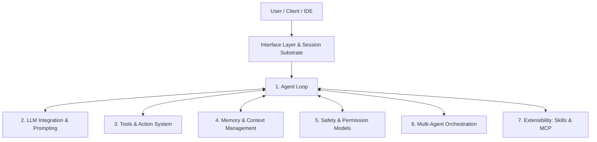

# Comprehensive Paper Review: Harness Engineering (arXiv:2609.00006)

**Title**: Harness Engineering: Anatomy, Architecture, and Evolution of Coding Agents — A Source-Code Study of Eleven Systems  
**Authors**: Paul Barbaste, Tristan Darrigol, Germain Vu, Tom Wiltberger  
**Date**: September 2026 (Revision of April 2026 benchmark study)  
**Categories**: Software Engineering (`cs.SE`), Multi-Agent Systems (`cs.MA`)  
**Paper Link**: [arXiv:2609.00006](https://arxiv.org/abs/2609.00006) | [arXiv HTML](https://arxiv.org/html/2609.00006v1) | [PDF](https://arxiv.org/pdf/2609.00006)  
**Artifact Slug**: `harness-engineering-study`

---

## 1. Summary Assessment

*Harness Engineering* is the most exhaustive, technically rigorous, and empirical source-code study of LLM-powered coding agent architectures published to date. Across approximately **four million lines of code** in Python, TypeScript, and Rust, the authors dissect eleven production-grade coding agent runtimes ("harnesses")—spanning four major foundation-model vendor systems (**Claude Code**, **Codex CLI**, **Gemini CLI**, **Mistral Vibe**) and seven representative open-source implementations (**OpenHands**, **Aider**, **Mini-SWE-Agent**, **Hermes**, **Pi**, **OpenCode**, **OpenClaw**), alongside the first meta-harness (**Omnigent**).

The paper formalizes the discipline of **Harness Engineering** ("an agent is a model plus a harness"), defines its **seven canonical subsystems**, extracts **13 cross-cutting empirical observations**, catalogs **29 recurring architectural patterns**, provides **18 concrete design recommendations**, and offers a **90-line Minimum Viable Harness (MVH)** scaffold.

The central thesis of the paper is both provocative and empirically grounded: **in the first half of 2026, the coding agent harness completed a fundamental structural transition from a terminal tool to an extensible software platform.**

---

## 2. Theoretical Foundation: What Is a Harness?

### 2.1 The Definition
The paper defines a harness as:
> *"The runtime system that couples a Large Language Model to the external computing environment through an execution loop, tools, context management, safety boundaries, orchestration, and extension surfaces."*

While the model provides raw cognitive inference, the harness translates intent into verified filesystem edits, bash executions, and pull requests.

### 2.2 The Seven Canonical Subsystems

Every coding agent runtime must take an architectural stance across seven core subsystems:

1. **Agent Loop (§6)**: Manages inference-action iteration, termination conditions, cost/turn caps, and stuck detection.
   - *Minimal*: Mini-SWE-Agent's 50-line linear while loop.
   - *Maximal*: OpenHands' event-sourced state engine; Codex's Tokio asynchronous state machine.
2. **LLM Integration (§7)**: Protocol abstraction, prompt assembly, prompt cache boundaries, reasoning effort, and provider routing.
   - *Minimal*: Single LiteLLM call with a static Jinja template.
   - *Maximal*: Hermes (5 custom HTTP/WebSocket transports, 29 provider profiles); Codex (remote server-delivered model catalogs).
3. **Tools & Actions (§8)**: Tool schemas, dispatch mechanics, sandboxing, and file editing strategies.
   - *Minimal*: Single bash tool.
   - *Maximal*: Claude Code (43 typed tools with deferred loading); Codex (V8-executed JavaScript actions).
4. **Memory & Context Management (§9)**: Context-window rationing, threshold compaction, session trees, and persistent cross-session memory.
   - *Minimal*: Unbounded linear message history.
   - *Maximal*: Codex (background memory extraction sub-agent); Gemini CLI (graph-based context distillation).
5. **Safety & Permissions (§10)**: Approval tiers, execution policies, LLM verification, and OS sandboxing.
   - *Minimal*: Step limits and timeout caps.
   - *Maximal*: Codex (Starlark execution policy + Guardian LLM reviewer + 3-platform native OS sandbox: Bubblewrap / Seatbelt / Windows restricted tokens).
6. **Orchestration (§11)**: Subagent spawning, context forking, inter-agent communication, and coordination hierarchies.
   - *Minimal*: None (Aider is strictly single-agent by design).
   - *Maximal*: Claude Code (recursive agent composition & context forking); Omnigent (meta-harness orchestrating multiple vendor runtimes).
7. **Extensibility (§12)**: Plugins, skills (`SKILL.md`), hooks, configuration, and MCP servers.
   - *Minimal*: Python structural typing protocols.
   - *Maximal*: Pi (everything-is-an-extension runtime); Codex (marketplace-distributed plugins).

---

## 3. The 11 Audited Systems & Contrast Points

| System | Vendor / Org | Lang | Scale | Tool Count | Multi-Agent | OS Sandbox | Signature Architectural Feature |
| :--- | :--- | :---: | :---: | :---: | :---: | :---: | :--- |
| **Claude Code** | Anthropic | TypeScript | Large | 43 | Yes | Opt-in runtime | Deferred tool loading; Blake2b prompt-cache boundary (`SYSTEM_PROMPT_DYNAMIC_BOUNDARY`). |
| **Codex CLI** | OpenAI | Rust | Very Large | 25–30 | Yes | Native (Linux, macOS, Win) | Starlark execution policy; Guardian LLM reviewer; background cross-session memory agent. |
| **Gemini CLI** | Google | TypeScript | Very Large | 35+ | Yes | Native (Linux, macOS, Win) | Model routing as runtime scheduling; 4 approval modes; native A2A (Agent-to-Agent) protocol. |
| **Mistral Vibe** | Mistral AI | Python | Small | 12+ | Yes | Worktree opt-in | Composable middleware-pipeline loop; session rewind exposed over ACP. |
| **OpenHands** | All-Hands AI | Python | Medium | 25+ | Yes | Docker / Apptainer | Event-sourced conversation engine; hosts rival harnesses as ACP backends. |
| **Aider** | Paul Gauthier | Python | Small | 13 fmt | No | None | 13 polymorphic edit formats; tree-sitter RepoMap with PageRank-style symbol ranking. |
| **Mini-SWE-Agent** | Princeton NLP | Python | Tiny (~100 L) | 1 | No | Docker+ | The minimal floor: proves loop complexity does not dictate benchmark performance. |
| **Hermes** | Nous Research | Python | Very Large | 69 | Yes | 6 backends | Self-improving skill loop; lineage compaction (session rotation); verify-on-stop guard. |
| **Pi** | Mario Fusco | TypeScript | Medium | 7 | Ext-based | None (by design) | Everything-is-an-extension architecture; session-tree version control. |
| **OpenCode** | OpenCode AI | TypeScript | Large | 17 | Yes | None (policy) | Client/server architecture; tree-sitter syntax-aware command permissioning. |
| **OpenClaw** | OpenClaw Team | TypeScript | Large | 109+ | Yes | None | Multi-channel gateway (28+ channels); Active-Memory subagent before every response. |
| **Omnigent** *(Meta)* | Databricks | Python | Large | Meta | Meta | Containerized | Orchestrates 11 vendor harnesses behind a unified OpenAI-compatible API. |

---

## 4. The "Twin Absences": What Production Systems Never Use

The paper documents two profound negative findings across the entire 4-million-line corpus:

### Absence 1: Zero Agentic Frameworks
**Not a single production coding harness imports LangChain, LangGraph, AutoGen, CrewAI, LlamaIndex, Pydantic AI, Genkit, Google ADK, or Semantic Kernel.**
- Every system builds its loop using native language primitives (`asyncio`, `Tokio`, `Promise` async-iterators).
- Tool registries rely on native schema builders (`Pydantic`, `Zod`, `TypeBox`, Rust enums).
- Prompts use standard string templates or Jinja2.
- *Reasoning*: General-purpose agentic frameworks introduce opaque abstractions, unpredictable prompt overhead, difficult-to-control latency, and tight coupling that hinders performance at scale.

### Absence 2: Zero Vector RAG for Code
**0 out of 11 systems use vector embeddings or vector databases for retrieving code.**
- Vector embeddings appear exclusively for conversational history (e.g., OpenClaw's optional `sqlite-vec` memory).
- For code retrieval, 100% of production harnesses rely on **deterministic, lexical, structural, and language-server tools**:
  1. `ripgrep` for regex and keyword searches.
  2. `glob` and filesystem directory traversals.
  3. `tree-sitter` for AST parsing and symbol definitions.
  4. Language Server Protocol (LSP) diagnostics.
  5. Context discovery via hierarchical markdown files (`AGENTS.md`, `CLAUDE.md`, `GEMINI.md`).
- *Reasoning*: Code possesses deterministic syntactic and semantic structures (file trees, imports, type definitions) that semantic vector similarity fails to capture accurately. Furthermore, codebases change rapidly during a session, rendering pre-computed embeddings immediately stale.

---

## 5. Catalog of Key Architectural Patterns (29 Patterns)

The paper categorizes 29 recurring patterns across the systems. Key highlights include:

1. **Deferred Tool Loading**: When tool schemas exceed context budgets (~15+ tools), tools are hidden behind a BM25 or keyword-search tool (`ToolSearchTool`), reducing initial prompt bloat by ~40% (Claude Code, Codex, Hermes).
2. **Hierarchical JIT Repo Context**: Auto-discovering markdown rules from repository root to working directory (`AGENTS.md`, `CLAUDE.md`, `.cursorrules`), injecting top-level rules initially and nested files just-in-time when tools access their subtree.
3. **Threshold Compaction**: Triggering context summarization when remaining tokens fall below a fixed buffer (e.g., 13K tokens), preserving a verbatim recent tail, and merging summaries incrementally.
4. **Policy-as-Code with an Unbreakable Floor**: Codifying permission rules into declarative configurations (Codex Starlark, Gemini TOML). In Hermes, 12 destructive patterns survive even `--yolo` mode by freezing bypass flags at module import.
5. **Exact Substring vs. Fuzzy File Editing**: Frontier models perform best with exact unique-search-and-replace (`search_replace`), whereas weaker models require fuzzy matching cascades. Line-number editing is universally avoided due to drift.
6. **Agent-Maintained Memory**: Background sub-agents periodically inspect git diffs and session history to write persistent memory snippets without human intervention (Codex, Gemini CLI).
7. **The Skills Standard (`SKILL.md`)**: Skills have surpassed MCP in harness adoption (**9/11 vs. 8/11**). Progressive disclosure loads YAML frontmatter first, reading full skill instructions only upon activation.

---

## 6. The Platform Turn (§14)

The paper's primary thesis details the transition of harnesses from CLI utilities into development platforms:
1. **The CLI as a Service Surface**: Runtimes now expose HTTP/WebSocket APIs, OpenAPI schemas, and SDKs (e.g., OpenCode, OpenHands). The CLI is simply one client among many (IDE plugins, web GUIs, CI/CD runners).
2. **The Harness–Framework Merger**: Instead of harnesses adopting frameworks, harnesses *became* the frameworks. Orchestration layers (such as Databricks Omnigent) import `claude-agent-sdk` and `openai-agents` as foundational dependencies.
3. **Platform Economics & Marketplaces**: Registries and app-store mechanics have emerged for tools and skills, accompanied by switching costs, on-disk state importers (Codex importing Claude Code states), and enterprise MDM governance.
4. **ACP (Agent Client Protocol) Elevation**: ACP has transcended its original editor-integration brief, now serving as a harness-hosting protocol where platforms like OpenHands run Claude Code, Codex, or Gemini CLI as interchangeable backends.

---

## 7. The 18 Practitioner Design Recommendations & The 90-Line MVH

### Core Recommendations Summary
1. **Loop**: Start with a simple linear `while` loop; graduate to middleware pipelines only when orthogonal policies multiply.
2. **Provider**: If building for your own foundation model, couple tightly with generic fallback; if multi-provider, manage per-model compatibility flags centrally.
3. **Tools**: Start with only `bash`. Add `read_file`, `write_file`, and `search_replace` only when truncation or diff wastage demands it.
4. **Deferred Tools**: Adopt deferred tool loading once tool counts exceed ~15.
5. **Editing**: Use exact unique-substring replacement for frontier models; never rely on line numbers.
6. **Context**: Auto-discover hierarchical markdown files (`AGENTS.md`) from root to cwd.
7. **Compaction**: Implement threshold compaction at a fixed buffer; keep the verbatim recent tail.
8. **Retrieval**: **Do NOT build vector RAG over code.** Use `ripgrep`, `glob`, `tree-sitter`, and LSP.
9. **Safety (Dev)**: Provide 3 approval modes (`PLAN`, `DEFAULT`, `YOLO`).
10. **Safety (Enterprise)**: Enforce OS-level sandboxing (Bubblewrap / Seatbelt / Windows tokens) with policy-as-code.
11. **Safety Floor**: Ensure dangerous command blacklists survive even `YOLO` mode.
12. **Orchestration**: Stay single-agent until a concrete parallel exploration requirement proves context isolation is necessary.
13. **Protocol**: Ship an ACP server for host integration; keep internal sub-agents in-process.
14. **Extensibility**: Prioritize `SKILL.md` for procedural recipes and `MCP` for external SaaS integrations.
15. **Anti-Pattern 1**: Do not use LangChain / AutoGen / CrewAI in the core runtime.
16. **Anti-Pattern 2**: Do not use vector embeddings for code search.
17. **Anti-Pattern 3**: Do not wrap every external SaaS API as a 1:1 tool.
18. **Anti-Pattern 4**: Do not over-engineer stuck detection; use simple turn and repetition caps.

### The 90-Line Minimum Viable Harness (Listing 3)
The authors synthesize these findings into a concise, functional Python scaffold:
- Uses a linear async loop.
- Exposes 4 tools: `bash`, `read_file`, `write_file`, and `search_replace`.
- Auto-discovers hierarchical `AGENTS.md` context files.
- Executes exact substring edits with uniqueness checks.
- Implements threshold-based history compaction with recent-tail preservation.
- Uses zero framework dependencies and zero vector databases.

---

## 8. Critical Review & Critique

### Strengths
- **Unprecedented Empirical Scope**: Auditing ~4M lines across 11 major production systems provides concrete grounding that theoretical surveys lack.
- **Debunking Industry Myths**: Demolishing the assumptions that production agents require complex multi-agent frameworks or vector code RAG is a major contribution.
- **Actionable Blueprints**: The 18 recommendations and 29 cataloged patterns offer immediate, high-value guidance for agent developers.
- **Longitudinal Perspective**: Re-auditing 8 systems after 90 days captures the velocity of platform convergence in real time.

### Weaknesses & Limitations
- **SWE-Bench Confounding**: Comparing benchmark scores across systems with different base models, sampling parameters, and dates makes rigorous performance attribution difficult.
- **Source Snapshots vs. Closed Binaries**: Commercial systems (like Claude Code) were audited via circulated source snapshots, which may deviate from live production binaries.
- **Evaluation Outside SWE**: The study focuses predominantly on software engineering; whether the "Twin Absences" hold equally true in multimodal, scientific, or web-agent domains remains an open empirical question.

---

## 9. Recommendation & Verdict

- **Rating**: **5.0 / 5.0 (Must-Read / Foundational)**
- **Target Audience**: AI researchers, systems engineers, and practitioners building LLM agents, developer tools, or autonomous runtime scaffolds.
- **Verdict**: *Harness Engineering* establishes the definitive taxonomy and architectural benchmark for modern coding agents. It should be required reading for anyone architecting LLM runtime systems.
